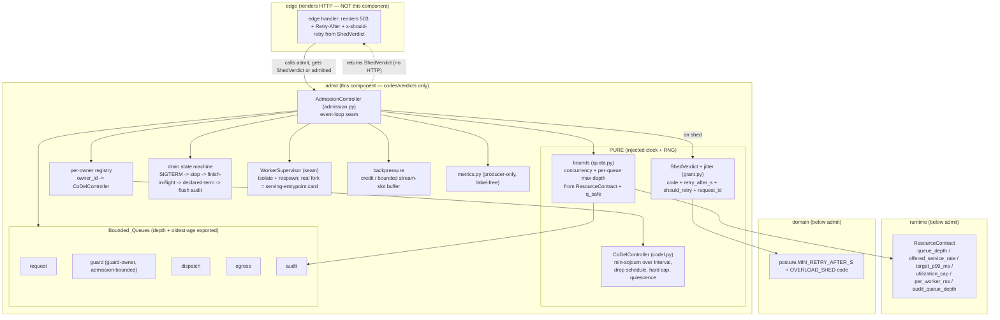

# Design Document

## Overview

This design adds an **admission-control component** to the v3 backend-rewrite tree
(`gateway_v2/gateway_v2/admit/`), implementing correction-register items **R2-07, R2-08 and R2-18**
(runbook card **GW19**). It makes behaviour under overload *explicit and bounded* instead of
emergent: per-owner CoDel admission, admitted work answered late and never abandoned, an explicit
HTTP 503 overload response with a jittered Retry-After ≥ 1 s and `x-should-retry: false`, bounded
queues everywhere with exported depth and age, a graceful drain state machine on SIGTERM, isolated
worker-crash recovery, slow-consumer backpressure, and bounded post-heal latency recovery.

The component is **pure logic plus thin event-loop seams**. The CoDel math, the per-owner
registry, the queue bounds, the shed verdict, the drain state machine, the Retry-After jitter, and
the recovery drain are all pure and driven by an **injected clock** (`Callable[[], float]`,
mirroring `KillSwitchSnapshot` / `IdentityCache`) and an **injected RNG** (`random.Random`), so
every acceptance target is locally reproducible under `asyncio.run` without a cloud fleet.

### What this component does NOT do (layer rule)

Admission **never constructs HTTP responses.** Per `gateway_v2/gateway_v2/domain/posture.py`
(verbatim: "`HTTPException` and `JSONResponse` are forbidden outside `edge`/`resolve`"), and per the
import-linter `layers` contract in `pyproject.toml`:

```
edge > admit > plan > detect > resolve > dispatch > egress > audit > runtime > contracts > domain
```

`admit` sits directly below `edge`. It MAY import `runtime` (`ResourceContract`,
`CapacityUnavailable`, `CapacityUnset`) and `domain` (`posture.MIN_RETRY_AFTER_S`,
`posture.*_UNAVAILABLE` codes) — both are *below* `admit`. It MUST NOT import `edge`, `plan`,
`detect`, `resolve`, `dispatch`, `egress`, or `audit`. (The R2-06 design doc previously misstated a
layer direction and the executor caught it; this list is read directly from
`gateway_v2/pyproject.toml` `[[tool.importlinter.contracts]]` → `layers`, and is correct as stated.)

Consequence: the admission component produces a **frozen `ShedVerdict` value** (an overload *code*
+ `retry_after_s` + `should_retry` + `request_id`), never a 503 object. `edge` renders the 503,
the `Retry-After` header, and the `x-should-retry` header from that verdict. This is the same
code-vs-render split `posture.py` already enforces for `SHARED_STATE_UNAVAILABLE` etc.

### Scope boundary (no cloud resources)

In local scope and fully verifiable: the CoDel state machine, per-owner queue accounting and
fairness, the shed decision and Retry-After / `x-should-retry` semantics, bounded-queue invariants,
the drain state machine, worker-crash isolation *logic* (a supervisor abstraction + injectable
seam), backpressure, and the injected-clock post-heal recovery. All proven by unit tests,
seeded-`random.Random` property tests (≥ 10,000 iterations, no `hypothesis` — house idiom per
`tests/domain/test_lgw04.py` and `tests/detect/test_lgw12b_holdback.py`), and the in-process
open-loop `Load_Harness`.

Explicitly **deferred cloud/scale gates** (out of local scope, represented by local equivalents):
the full live fleet 3×-`q_safe` run (LGW19-1 at real scale), the GW20 live `q_safe` measurement
feeding this card, gate **G-06** against the real OpenAI SDK, and gate **G-15** live post-heal
recovery. Real OS process supervision and the removal of the inert `--worker-connections` flag /
deprecated uvicorn worker class are a **declared dependency on the serving-entrypoint card**
(Requirement 3.4, 9); the serving entrypoint in the rewrite tree may be a stub, so this component
defines the *contract and the injectable seam* and leaves real `fork`/respawn to that card.

## Research & Key Findings

Findings that shaped the design, drawn from the ground-truth source (re-read and confirmed before
designing):

- **`ResourceContract` is the only capacity-literal holder** (`runtime/resources.py`). It exposes
  `queue_depth(service_rate) -> int`, `offered_service_rate() -> float`, `target_p99_ms`,
  `utilization_cap`, `per_worker_rss`, `stream_buffer_bytes(active_streams)`, and
  `audit_queue_depth(drain_rate_per_s, bytes_per_record)`. Below-minimum bounds raise
  `CapacityUnavailable`; a bound depending on an unknown signal raises `CapacityUnset`. The
  admission component holds **no** capacity literal; every bound is a call into this contract.
- **`q_safe` is injected, never hardcoded** (Requirement 4). It is the *service rate* argument fed
  to `ResourceContract.queue_depth(q_safe)` and the base of the shed threshold. The contract's own
  `offered_service_rate()` is the deployment-derived rate; `q_safe` is the *measured guard* rate
  from GW20 and is distinct. If `q_safe` is unset the component refuses to start
  (`CapacityUnset`-style), mirroring `ResourceContract._guard_pool()`.
- **`MIN_RETRY_AFTER_S = 1.0` already exists** in `domain/posture.py` with the exact R2-08
  docstring. The design **reuses** it as the Retry-After floor and does not redefine it. The
  posture codes (`KILL_SWITCH_UNAVAILABLE`, `SHARED_STATE_UNAVAILABLE`, `PLAN_UNAVAILABLE`,
  `BUDGET_UNAVAILABLE`) are codes only; a new `OVERLOAD_SHED` code is added there (it belongs to the
  one shared posture vocabulary) rather than invented inside `admit`.
- **Convention** (from `killswitch.py` / `identity.py`): injectable `Callable[[], float]` clock
  defaulting to `time.monotonic`; frozen slotted dataclasses for immutable reads
  (`KillSwitchView`, `CacheStats`); `StrEnum` for states (`KillSwitchState`); applier/adopter
  function factories that bind a stateful object to a round shape; fail-closed on any ambiguity
  (`StoreDataUnavailable`). The admission component follows all five.
- **Metrics are producer-only** (`runtime/holdback_metrics.py`): a fixed, **label-free** series set
  (no tenant label — R2-10 measured 500s from per-org series), counters as real zeros from the
  first snapshot, O(1) observe, percentiles computed on read, and a separate publisher (GW14d) owns
  exposition. Queue depth/age and admission counters follow this split exactly.
- **Test idiom**: no `hypothesis`; property tests are seeded `random.Random` loops ≥ 10,000
  iterations with the seed logged in the assertion message; async driven by a local
  `_run[T](coro) = asyncio.run(coro)` helper (no `pytest-asyncio` for these non-conformance tests).
  Confirmed in `tests/domain/test_lgw04.py`, `tests/detect/test_lgw12b_holdback.py`,
  `tests/egress/test_lgw12b_stream.py`.
- **Sibling stubs**: `egress/backpressure.py` ("Credit-based flow control — empty until GW13") and
  `egress/stream.py`'s injectable `StreamPipeline`. Admission does not reach into `egress` (layer
  rule); it owns the *admission-side* bounded stream-slot accounting and cross-references the egress
  stub as the eventual real transport.

## Architecture

### Module split (within `admit/`, justified against the layer contract)

| Module | Responsibility | Purity |
| --- | --- | --- |
| `admit/codel.py` (**new**) | The pure per-owner CoDel state machine: tracks min sojourn over `Interval`, the drop schedule / backoff control law, hard-cap short-circuit, quiescence reset. No event loop, no I/O. | **Pure** (injected clock) |
| `admit/grant.py` (**fill**) | `ResourceGrant` + the frozen `ShedVerdict` value type (code + `retry_after_s` + `should_retry` + `request_id`) and the Retry-After jitter helper. Reserved by the card for "what this request may consume". | **Pure** |
| `admit/quota.py` (**fill**) | The bounds derivation: concurrency bound and each `Bounded_Queue`'s max depth, all from `ResourceContract` + injected `q_safe`. Refuse-to-start if `q_safe` unset. (Card reserves it for "Local GCRA + shared lease".) | **Pure** |
| `admit/admission.py` (**new**) | The `AdmissionController` component that ties CoDel + the derived bounds + the bounded queues + the drain state machine + supervisor seam + backpressure together, and produces `ShedVerdict`s. The only module that touches the event loop (enqueue/await). | **Thin seam** (injected clock + loop) |
| `admit/metrics.py` (**new**) | Producer-only, label-free queue-depth/age + admission-outcome series (depth, oldest-item age, admitted/shed totals, FAIL_OPEN counter pinned at 0). Mirrors `runtime/holdback_metrics.py`. | **Pure producer** |

Rationale for the split: `codel.py` is a pure state machine that must be property-tested in
isolation (Properties 1, 2, 6), so it holds no queues and no clock-advancing side effects — it is a
fold over `(now, sojourn)` observations. `quota.py`/`grant.py` are filled rather than replaced
because the card explicitly reserves them. `admission.py` is the single event-loop owner so the
pure core stays trivially testable. `metrics.py` keeps the producer/publisher split and avoids any
tenant label. Everything imports only `runtime` and `domain`; nothing imports a sibling layer above
`admit`, so the import-linter `layers` and `forbidden` contracts stay green.

### Component diagram



Pure vs event-loop boundary: everything in the `pure` and `Bounded_Queues` logic (CoDel math,
bound derivation, verdict construction, depth/age accounting) is deterministic given the injected
clock and RNG. Only `AdmissionController` awaits the loop (enqueue, await in-flight completion,
drain timers). This is why the harness can drive the whole thing with a fake clock.

## Components and Interfaces

### `CoDelController` (`admit/codel.py`) — pure per-owner state machine

```python
@dataclass(frozen=True, slots=True)
class CoDelParams:
    target_ms: float = 5.0        # Requirement 1.5 (owner-signed)
    interval_ms: float = 100.0    # Requirement 1.5
    hard_cap_ms: float = 60.0     # Requirement 1.5

class CoDelController:
    def __init__(self, params: CoDelParams, *, clock: Callable[[], float]) -> None: ...
    def observe_and_decide(self, sojourn_ms: float, *, now: float | None = None) -> CoDelDecision: ...
    def reset(self) -> None: ...   # quiescence
```

`CoDelDecision` is a frozen slotted value: `admit: bool`, `reason: CoDelReason` (StrEnum:
`ADMIT`, `SHED_BACKOFF`, `SHED_HARD_CAP`), and the current `next_drop_at` for observability. One
instance **per owner**; the registry owns the mapping.

### Per-owner registry (`admit/admission.py`)

`owner_id -> CoDelController`, lazily created. The **guard owner** gets a `CoDelController` from the
same factory as every other owner (Requirement 1.7) — there is no special global path. Fairness
(Property 3) is structural: owner A's sojourn observations and drop state live only in A's
controller, so A saturating cannot advance B's `next_drop_at` or raise B's shed count. The guard
*queue* is itself one of the `Bounded_Queue`s and is admission-bounded like the rest (Req 1.7, 7).

### Bounds derivation (`admit/quota.py`)

```python
@dataclass(frozen=True, slots=True)
class AdmissionBounds:
    concurrency: int                 # Req 3.3, 4.1
    request_depth: int
    guard_depth: int
    dispatch_depth: int
    egress_depth: int
    audit_depth: int

def derive_bounds(
    contract: ResourceContract,
    *,
    q_safe: float | None,
    audit_drain_rate_per_s: float,
    audit_bytes_per_record: int,
) -> AdmissionBounds:
    if q_safe is None or q_safe <= 0:
        raise CapacityUnset("q_safe is unset; refuse to start")   # Req 4.5, 13.(start)
    concurrency = contract.queue_depth(q_safe)                     # Req 4.1 (uses measured rate)
    ...
    audit_depth = contract.audit_queue_depth(audit_drain_rate_per_s, audit_bytes_per_record)  # Req 7.5
```

Mapping queue → contract method (Requirement 7.5):

| Queue | Bound source |
| --- | --- |
| request | `contract.queue_depth(q_safe)` — the measured guard rate is the service rate |
| guard | `contract.queue_depth(q_safe)` (guard-owner share; same rule as every owner, Req 1.7) |
| dispatch | `contract.queue_depth(q_safe)` |
| egress | `contract.stream_buffer_bytes(active_streams)` → slot count; depth from `queue_depth(q_safe)` for slot admission, byte bound for memory |
| audit | `contract.audit_queue_depth(audit_drain_rate_per_s, audit_bytes_per_record)` (Req 7.5; this is deliberately not `queue_depth`, per the contract docstring) |

No literal appears here; every number is a contract call. An uncomputable bound raises
`CapacityUnavailable` (propagated as refuse-to-admit / refuse-to-start, Req 13.3).

### `ShedVerdict` + jitter (`admit/grant.py`)

```python
@dataclass(frozen=True, slots=True)
class ShedVerdict:
    code: str              # posture.OVERLOAD_SHED  (code, not HTTP)
    retry_after_s: float   # >= MIN_RETRY_AFTER_S, jittered; never 6-11 ms
    should_retry: bool     # always False on a shed (Req 6.3)
    request_id: str        # Req 5.3

def shed_retry_after_s(rng: random.Random, *, floor_s: float = MIN_RETRY_AFTER_S,
                       jitter_frac: float = 0.5) -> float:
    # floor + U(0, jitter_frac*floor); deterministic given rng. Result >= 1.0 s always,
    # so it can never land in [0.006, 0.011] s (Req 6.4 / Property 5).
    return floor_s + rng.random() * jitter_frac * floor_s
```

`code` is `posture.OVERLOAD_SHED` (added to `domain/posture.py`, codes-only). `edge` maps this
verdict to `status 503`, header `Retry-After: ceil(retry_after_s)`, header `x-should-retry: false`,
and echoes `request_id`. Admission constructs **no** HTTP object.

### `AdmissionController` (`admit/admission.py`) — the event-loop seam

```python
class AdmissionController:
    def __init__(self, *, bounds: AdmissionBounds, params: CoDelParams,
                 clock: Callable[[], float] = time.monotonic,
                 rng: random.Random, supervisor: WorkerSupervisor,
                 metrics: AdmissionMetrics, drain_window_s: float) -> None: ...

    async def admit(self, owner_id: str, request_id: str, enqueued_at: float
                    ) -> Admitted | ShedVerdict: ...        # Req 1, 2, 5, 13
    def queue_report(self) -> QueueReport: ...               # depth + oldest-age (Req 7.3/7.4)
    async def drain(self) -> DrainReport: ...                # Req 8
```

`admit` computes sojourn = `now - enqueued_at` in ms, consults the owner's `CoDelController`, and
either enqueues (admitted — never dropped thereafter, Req 2) or returns a `ShedVerdict`. Enqueue is
gated by the `Bounded_Queue` depth check: if enqueue would exceed the declared max it sheds at the
door (Req 7.2) rather than exceed the bound (Property 4). Any path that cannot reach a decision
sheds (Req 13.1).

### `WorkerSupervisor` seam (`admit/admission.py`)

A small injectable abstraction: `on_worker_exit(worker_id) -> respawn()`; `isolate(worker_id)`
removes the crashed worker's slots from the shared accounting without touching peers (Req 9.1/9.3).
The *real* process `fork`/respawn is injected (`Callable[[], Worker]`) and defaults to a stub that
records intent — real supervision is the serving-entrypoint card's job (declared dependency, Req
3.4 / 9). Locally the seam is driven with a fake worker that "crashes" by raising; the test asserts
isolation + respawn-called + peers keep admitting.

### `AdmissionMetrics` (`admit/metrics.py`) — producer-only, label-free

Fixed series, no tenant label (R2-10): `amf_admit_queue_depth{queue}` would carry a *queue* label
only (fixed finite set, not tenant-derived — allowed), oldest-item age per queue, `admitted_total`,
`shed_total{reason}` (fixed reason set), and `fail_open_total` pinned at `0` from the first
snapshot (Req 13.2). O(1) observe, percentiles on read, separate publisher (GW14d) owns exposition.

## Data Models

- `CoDelParams(target_ms, interval_ms, hard_cap_ms)` — frozen, injected owner-signed values.
- `CoDelDecision(admit, reason, next_drop_at)` — frozen; `reason ∈ {ADMIT, SHED_BACKOFF, SHED_HARD_CAP}`.
- `AdmissionBounds(concurrency, request_depth, guard_depth, dispatch_depth, egress_depth, audit_depth)` — frozen, all from `ResourceContract`.
- `ShedVerdict(code, retry_after_s, should_retry, request_id)` — frozen; the overload-response payload (not HTTP).
- `Admitted(owner_id, request_id, admitted_at)` — frozen marker that a request passed the door.
- `QueueReport(mapping queue_name -> (depth, oldest_age_s))` — frozen read for metrics (Req 7.3/7.4).
- `DrainState` — `StrEnum`: `ACCEPTING`, `DRAINING`, `TERMINATING`, `FLUSHED`, `EXITED`.
- `DrainReport(duration_s, declared_terminations, audit_flushed)` — frozen; published (Req 8.5).
- `CoDelReason`, `DrainState` are `StrEnum` (convention from `KillSwitchState`).

### The exact CoDel algorithm (implementable spec)

State per owner (held in `CoDelController`): `first_above_at: float | None` (when sojourn first
rose above target in the current excursion), `dropping: bool`, `drop_next_at: float`, `count: int`
(drops in the current overload episode), `last_below_at: float`.

```
observe_and_decide(sojourn_ms, now):
    # Hard cap short-circuits CoDel entirely (Req 1.4 / Property via Req 1.4)
    if sojourn_ms >= hard_cap_ms:
        return SHED_HARD_CAP

    if sojourn_ms <= target_ms:
        # below target: clear the excursion; CoDel quiescent (Req 1.2 / Property 6)
        first_above_at = None
        if dropping: dropping = False     # recovery/reset
        last_below_at = now
        return ADMIT

    # sojourn above target
    if first_above_at is None:
        first_above_at = now
        return ADMIT                      # not yet a full Interval above target
    if now - first_above_at < interval_ms:
        return ADMIT                      # min-sojourn has NOT stayed above target a full Interval

    # min sojourn has stayed above target for a full Interval -> enter/continue dropping
    if not dropping:
        dropping = True
        count = 1
        drop_next_at = now + interval_ms          # first drop one Interval out
        return SHED_BACKOFF                        # shed this one at the door
    if now >= drop_next_at:
        count += 1
        # control law: the drop interval contracts as sqrt(count) under sustained overload
        drop_next_at = now + interval_ms / sqrt(count)
        return SHED_BACKOFF
    return ADMIT                                   # between scheduled drops, still admit
```

Key points mapped to acceptance criteria:
- **Min-sojourn over a sliding Interval** is tracked by `first_above_at`: as long as *every*
  observed sojourn in the window stayed above target (`first_above_at` never cleared), the window
  minimum is above target. Any sample ≤ target clears it → the minimum is at/below target and no
  shed can fire (Req 1.2, Property 6: quiescence).
- **First drop** fires exactly when the min has stayed above target for a full `Interval`
  (Req 1.3).
- **Backoff contraction**: `drop_next_at = now + interval / sqrt(count)` — the classic CoDel
  control law; the longer overload persists (higher `count`), the shorter the inter-drop gap, so
  shedding grows more aggressive under sustained overload (Req 1.3, Property 2).
- **Hard cap** at 60 ms short-circuits regardless of backoff state (Req 1.4).
- **Recovery/reset**: a single sojourn ≤ target clears `dropping` and `first_above_at`, so the
  controller returns to admitting the moment delay drains (Req 1.2, Property 9 locally).
- The clock is the injected `Callable[[], float]`; `now` is passed through so tests advance time
  deterministically (Req 1.6).

### Per-owner fairness model (Property 3)

Admission state is keyed strictly per `owner_id` inside the registry; there is no shared
`first_above_at`/`dropping`/`count`. A saturating owner's observations only ever mutate its own
controller and consume its own share of the per-owner queue capacity. The guard owner's shared
queue is itself a `Bounded_Queue` with its own CoDel controller, so even the guard owner cannot
exceed its admission share. Therefore one owner's arrival pattern cannot raise another owner's shed
rate above that owner's own fair share — fairness is an invariant of the keying, not an emergent
property of a global FIFO (which is exactly what R2-07 removes).

### Overload-response boundary (Requirement 5, 6)

Admission → `ShedVerdict(code=OVERLOAD_SHED, retry_after_s, should_retry=False, request_id)`.
`edge` → `503` + `Retry-After` + `x-should-retry: false`. Admission constructs no HTTP response
object; this is the `posture.py` codes-vs-render split applied to overload. The verdict is emitted
*at admission, before* admitted-request p99 can exceed target (Req 5.4), because the shed decision
is made before service begins (Req 2.2).

### Retry-After jitter (Requirement 6)

`retry_after_s = MIN_RETRY_AFTER_S + rng.random() * jitter_frac * MIN_RETRY_AFTER_S`, with
`MIN_RETRY_AFTER_S` imported from `domain.posture` (not redefined). Because the floor is 1.0 s, the
result is always ≥ 1.0 s and can never fall in the 6–11 ms band (Req 6.4 / Property 5). `rng` is an
injected `random.Random` so the jitter is deterministic and testable. `x-should-retry: false` is
always set on a shed so a retrying SDK does not amplify (Req 6.3, Property 8).

### Bounded queues (Requirement 7)

Each of request/guard/dispatch/egress/audit is a `Bounded_Queue` with a declared max depth from
`AdmissionBounds` (table above). Enqueue rule: `if depth >= max: shed at the door` (Req 7.2,
Property 4 — depth never exceeds max). Each queue exports current depth and the age of its oldest
item (Req 7.3/7.4) via the producer-only `AdmissionMetrics` (label-free). The egress queue also
carries the byte bound from `stream_buffer_bytes` so total streaming memory stays bounded (Req 10).

### Drain state machine (Requirement 8)

```
ACCEPTING --SIGTERM--> DRAINING          # stop accepting new requests (8.1)
DRAINING: finish in-flight within Drain_Window (8.2)
DRAINING --now - drain_start >= Drain_Window--> TERMINATING
TERMINATING: send Declared_Termination terminal frame to each unfinished stream (8.3)
TERMINATING/DRAINING(complete) --> FLUSHED   # flush audit queue before exit (8.4)
FLUSHED --> EXITED; publish DrainReport.duration_s (8.5)
```

All timing reads the injected clock (Req 8.6), so the state machine is deterministic: a test with a
fake clock drives SIGTERM, advances past `Drain_Window`, and asserts a `Declared_Termination` per
unfinished stream (never a truncated frame — Property 7), audit flushed, and a published duration.

### Worker-crash isolation + respawn (Requirement 9)

The `WorkerSupervisor` seam isolates a crashed worker's slots and calls the injected respawn
callable; peers keep admitting (Req 9.3). Real OS supervision is the serving-entrypoint card's
responsibility — the component defines the contract and the seam and marks the dependency (Req
3.4). Locally verified with a fake crashing worker.

### Backpressure (Requirement 10)

Credit-based bounded buffering of stream slots: a slow consumer's buffered bytes are capped by the
egress byte bound (`stream_buffer_bytes`), so a slow consumer stops being fed once its credit is
exhausted rather than growing unbounded. Total streaming memory stays bounded across any number of
slow consumers (Req 10.2); fast consumers draw from their own credit and are unaffected (Req 10.3).
The real SSE transport + credit wiring is `egress/backpressure.py` / `egress/stream.py` (GW13);
admission owns only the *admission-side* slot bound and cross-references those stubs (layer rule
keeps admission out of `egress`).

### Post-heal recovery (Requirement 11 / R2-18 / G-15 local)

After an injected store heal, the overload backlog drains because CoDel resets the moment sojourn
falls back to/below target (one `ADMIT` with `sojourn <= target` clears `dropping`), so admitted
latency returns within target within 10 s on the injected clock (Req 11.1, Property 9). Of the
runbook's candidate causes — lease-refill storm, cold identity caches, audit backlog — this
component **owns** the admission backlog drain and the bounded audit queue; the **lease refill
storm** belongs to GW06 (budget/lease component — note `posture.BUDGET_UNAVAILABLE` reserved for
it) and **cold identity caches / store re-hydration** belong to GW05 (`IdentityCache` single-flight
+ re-hydrator). The local recovery test drives only the admission-owned portion with an injected
clock; full live G-15 is deferred.

## Error Handling

| Condition | Behaviour | Requirement |
| --- | --- | --- |
| `q_safe` not supplied / ≤ 0 | **Refuse to start**, report "q_safe unset" (`CapacityUnset`) | 4.5, 13 |
| Any `Bounded_Queue` bound uncomputable (`CapacityUnavailable`) | **Refuse to start** (startup) or **refuse to admit** (runtime) — never enqueue without a bound | 13.3, 7 |
| CoDel cannot reach a decision (internal error) | **Shed** (fail closed), never admit without a decision | 13.1 |
| Enqueue would exceed declared max depth | **Shed at the door** | 7.2, Property 4 |
| Any admission path exception | **Shed**; increment `shed_total`; `fail_open_total` stays 0 | 13.1, 13.2 |

There is **no FAIL_OPEN path**: every error branch resolves to refuse-to-start or shed. The
`fail_open_total` counter exists as a real zero so "no fail-opens" is observable and the
overload-burst test asserts it stayed 0 (Req 13.2).


## Correctness Properties

*A property is a characteristic or behavior that should hold true across all valid executions of a
system — essentially, a formal statement about what the system should do. Properties serve as the
bridge between human-readable specifications and machine-verifiable correctness guarantees.*

PBT **applies** to this feature: the CoDel controller is a pure state machine, the bounds
derivation is pure arithmetic over the `ResourceContract`, the shed verdict / jitter is a pure
function of an injected RNG, and the drain / queue invariants hold "for all" input sequences. These
are driven in-process with an injected clock and injected service rate, so 10,000-iteration seeded
loops are cheap and reveal edge cases.

**Property reflection.** The prework surfaced several criteria that reduce to the same invariant:
no-abandonment (2.1/2.2/2.3) is one property; shedding-under-overload with bounded admitted p99
(1.3/5.4/12.2) is one property; the Retry-After floor/jitter/should-retry/no-6–11 ms band
(5.2/5.3/6.1/6.2/6.3/6.4) is one property; queue-depth bound and overfull-shed and backpressure
memory bound (7.1/7.2/10.1/10.2) are one property; the error conditions (4.5/13.1/13.2/13.3) are one
property. Consolidated to the 10 invariants below; each provides unique validation value.

### Property 1: No abandonment

*For all* admitted requests across any arrival sequence, a response is eventually produced; no
admitted request is dropped after admission (responses may be late but never absent), and shedding
occurs only at admission before service begins.

**Validates: Requirements 2.1, 2.2, 2.3**

### Property 2: Shedding under sustained overload with bounded admitted p99

*For all* offered loads sustained above the admission bound, the shed set is non-empty AND admitted
p99 stays within the Target budget; increasing overload does not push admitted p99 above budget.

**Validates: Requirements 1.3, 5.4, 12.2**

### Property 3: Per-tenant fairness

*For all* pairs of owners and all arrival patterns of a saturating owner, the saturating owner
cannot push another owner's shed rate above that other owner's own fair share; per-owner CoDel
state is isolated.

**Validates: Requirements 1.1, 1.7**

### Property 4: Queue-depth bound

*For all* bounded queues at every step of any enqueue/dequeue sequence (including slow-consumer
backpressure buffers), current depth ≤ the queue's declared maximum depth, and an enqueue that would
exceed the max sheds at the door instead.

**Validates: Requirements 7.1, 7.2, 10.1, 10.2**

### Property 5: Retry-After floor and should-retry

*For all* shed responses, `retry_after_s ≥ MIN_RETRY_AFTER_S` (1 s), `should_retry` is `False`, and
a `request_id` is present; no shed carries a Retry-After in the 6–11 ms band.

**Validates: Requirements 5.2, 5.3, 6.1, 6.2, 6.3, 6.4**

### Property 6: CoDel quiescence

*For all* owners and all sojourn streams whose minimum stays at or below Target for a full Interval,
the CoDel controller admits every request and never sheds.

**Validates: Requirements 1.2**

### Property 7: Drain terminal guarantee

*For all* in-flight streams on drain, each is terminated within the Drain_Window with a
Declared_Termination terminal frame; no stream ends in a truncated frame.

**Validates: Requirements 8.2, 8.3**

### Property 8: Retry-amplification bound

*For all* shed-then-retry sequences under the local SDK-retry-semantics simulation, the total load
produced stays below the G-06 amplification bound — in contrast to the 6–11 ms baseline that triples
load.

**Validates: Requirements 6.5**

### Property 9: Post-heal recovery bound

*For all* pre-heal backlog states, after an injected store heal admitted latency returns to within
the SLO within 10 s on the Injected_Clock.

**Validates: Requirements 11.1**

### Property 10: Error conditions fail closed

*For all* error conditions — missing `q_safe`, an uncomputable queue bound, and an undecidable
admission — the component fails closed (refuse-to-start or shed) and never fails open; the
`fail_open_total` counter stays 0 across the overload-burst test.

**Validates: Requirements 4.5, 13.1, 13.2, 13.3**

### Prompt-size independence (metamorphic, folded into Properties 1/2)

*For all* sojourn streams, holding the sojourn fixed and varying prompt size yields identical
admission decisions (Requirement 3.1). Asserted as a focused metamorphic check alongside the CoDel
property tests.

## Testing Strategy

### Dual approach

- **Property tests** (seeded `random.Random`, ≥ 10,000 iterations, no `hypothesis`; seed logged in
  each assertion message; async via a local `_run[T](coro) = asyncio.run(coro)` helper — the house
  idiom from `tests/domain/test_lgw04.py` and `tests/detect/test_lgw12b_holdback.py`) cover the 10
  universal invariants above.
- **Unit / example tests** cover the concrete owner-signed constants (1.5), clock/`q_safe` injection
  wiring (1.6, 4.2), the no-12 ms-bound assertion (3.2), each queue→contract-method derivation
  (3.3, 4.1, 7.5), queue depth/age export (7.3, 7.4), the drain transitions and ordering (8.1, 8.4,
  8.5, 8.6), worker-crash isolation/respawn (9.1, 9.2, 9.3), and the 503/header rendering boundary
  (5.1 — asserted at the `edge` seam).
- **AST/grep gate** (12.4, 4.4): assert no numeric capacity literal in `admit/` except via a
  `ResourceContract` call, mirroring the existing capacity-literal discipline.

Each property test is tagged with a comment: `# Feature: admission-control, Property {n}: {text}`
and configured for ≥ 100 iterations (we use 10,000 per the house idiom).

### Property-based testing library

No from-scratch PBT and no `hypothesis` — the project idiom is seeded `random.Random` loops, so each
property is a single loop ≥ 10,000 iterations with the seed logged for reproducibility.

### Local acceptance via the `Load_Harness` (Requirement 12)

The in-process open-loop `Load_Harness` drives `AdmissionController` directly with an injected clock
and injected service rate (12.1), mapping to the runbook §0.2 shape (admitted p99 ≈ 17.8 ms under a
4.3× burst; 0 FAIL_OPEN; recovery ≈ 5 s):

| Local gate | What it drives | Requirement |
| --- | --- | --- |
| LGW19-1 (local) | 3× injected `q_safe`: explicit shedding, admitted p99 within budget, no unbounded memory | 12.2 / Props 2, 4 |
| LGW19-2 | open-loop arrival-rate ramp; record highest-passing + first-failing rate | 12.3 |
| LGW19-4 | concurrency cap binds and is observable (not inert as v1) | 12.6 |
| LGW19-5 | injected guard rate halved mid-run; shedding rises, queue age bounded | 12.4 |
| LGW19-6 | slow consumers on 50% of streams; backpressure, bounded memory, fast consumers unaffected | 12.5 / Props 4, (10.3) |
| LGW19-3 (drain) | SIGTERM drain state machine on injected clock; declared terminations | 8 / Prop 7 |
| G-06 (local) | SDK-retry-semantics simulation; amplification below bound vs 6–11 ms baseline | 6.5 / Prop 8 |
| G-15 (local) | injected-clock post-heal recovery within 10 s | 11.1 / Prop 9 |

**Deferred cloud/scale gates (out of local scope, documented):** the full live fleet 3×-`q_safe`
run at real scale, the GW20 live `q_safe` measurement feeding this card, gate G-06 against the real
OpenAI SDK, and gate G-15 live post-heal certification (Req 12.7, 11.2, 3.4). Real OS process
supervision is the serving-entrypoint card's responsibility.

### Test file layout (under `gateway_v2/tests/admit/`)

| File | Covers |
| --- | --- |
| `tests/admit/test_lgw19_codel.py` | CoDel pure state machine: Properties 2, 6; constants 1.5; clock 1.6; hard cap 1.4; prompt-size independence 3.1 |
| `tests/admit/test_lgw19_fairness.py` | Property 3 (per-owner isolation), guard-owner parity 1.7 |
| `tests/admit/test_lgw19_bounds.py` | `derive_bounds` from `ResourceContract` + `q_safe` (3.3, 4.1, 7.5); refuse-to-start 4.5; AST literal gate 4.4 |
| `tests/admit/test_lgw19_verdict.py` | `ShedVerdict` + jitter: Property 5; no-abandonment seam |
| `tests/admit/test_lgw19_queues.py` | Property 4 (depth bound, overfull shed), depth/age export 7.3/7.4 |
| `tests/admit/test_lgw19_admission.py` | `AdmissionController.admit`: Property 1 (no abandonment), Property 10 (fail-closed, FAIL_OPEN=0), 13.1/13.3 |
| `tests/admit/test_lgw19_drain.py` | Drain state machine: Property 7; 8.1/8.4/8.5/8.6 |
| `tests/admit/test_lgw19_supervisor.py` | Worker-crash isolation + respawn seam: 9.1/9.2/9.3 |
| `tests/admit/test_lgw19_backpressure.py` | Slow-consumer backpressure: 10.1/10.2/10.3 (LGW19-6) |
| `tests/admit/test_lgw19_harness.py` | `Load_Harness` acceptance: LGW19-1/-2/-4/-5, SDK-retry sim (Prop 8), post-heal recovery (Prop 9) |

### Verification gate

`pytest gateway_v2/tests/admit/ -q` (targeted) plus the full offline suite, `mypy --strict`, `ruff`,
and `import-linter` (both the `layers` and the `forbidden` contracts must stay green — the admission
component must import only `runtime` and `domain`). The AST capacity-literal gate must pass.

## Dependencies and open items

- **Serving-entrypoint card** (declared dependency, Req 3.4 / 9): removal of the inert
  `--worker-connections` flag, migration off the deprecated uvicorn worker class, and real OS
  process supervision. This component provides the `WorkerSupervisor` seam and the observable
  concurrency cap only.
- **GW20** (deferred): live `q_safe` measurement feeding this component's injected rate.
- **GW06** (cross-component): the lease/budget component owns the lease-refill-storm portion of
  post-heal recovery (`posture.BUDGET_UNAVAILABLE` reserved there).
- **GW05** (cross-component): cold identity caches / store re-hydration portion of post-heal
  recovery (`IdentityCache` single-flight + re-hydrator).
- **GW13 / `egress`** (cross-layer): the real SSE transport + credit-based backpressure wiring
  (`egress/backpressure.py`, `egress/stream.py`); admission owns only the admission-side slot bound
  and does not import `egress` (layer rule).
- **`domain/posture.py` addition**: a new `OVERLOAD_SHED` code (codes-only), added to the single
  shared posture vocabulary rather than invented inside `admit`.
