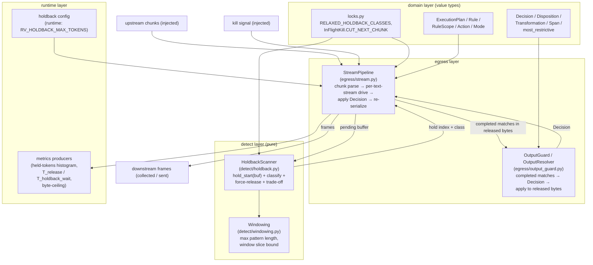
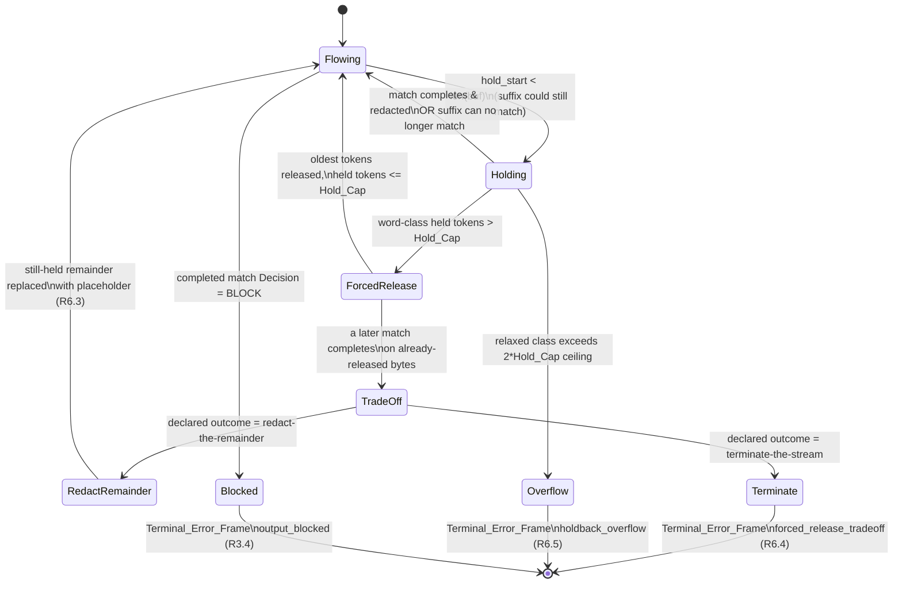

# Design Document

## Overview

This design implements correction-register item **R2-06 (CRITICAL)** / card **GW12b ("Bounded holdback")** in the active rewrite tree `gateway_v2/gateway_v2/`. It makes the owner-signed streaming-output holdback bound — "no more than 3 upstream tokens held" — real, measured, and testable.

The defect is that the streaming output-redaction path holds any trailing suffix that could still grow into a sensitive match until the next upstream token arrives, with no cap: a UUID was held for 36 upstream tokens, a sha256 for 34, a URL for 15, base64 blobs whole, and the per-chunk rescan blocked 17 ms at 16 KB chunks. The fix holds only the minimal suffix, bounds how long and how many tokens it is held, bounds per-chunk rescan work to a window, publishes a held-tokens histogram with separated latency accounting, and carries an explicit documented trade-off for patterns longer than the cap.

### Scope split: what GW12b builds now vs. what it depends on

The nominal pipeline stubs — `egress/stream.py`, `egress/output_guard.py`, `egress/backpressure.py`, `egress/strict.py`, `detect/windowing.py`, `detect/base.py` — are gated behind GW13 (full SSE pipeline) and GW07/GW08 (detector stack), **neither of which is built yet**. GW12b therefore delivers:

1. **The pure holdback scanner** in a new dedicated module `gateway_v2/gateway_v2/detect/holdback.py`. It depends only on `gateway_v2.domain` and `gateway_v2.detect.windowing`, so it is unit- and property-testable in complete isolation with no provider, no SSE transport, and no GW07/GW08 detector.
2. **The window-bounding helpers** in `gateway_v2/gateway_v2/detect/windowing.py` (filling the stub): longest-bounded-pattern length, window-slice bound, FPR-free deterministic bounds. Depends only on `domain`.
3. **A minimal, injectable streaming harness** `StreamPipeline` in `gateway_v2/gateway_v2/egress/stream.py` sufficient to drive and test the scanner end-to-end locally. It is deliberately thin: upstream chunks and the output-decision function are **injected**, so tests do not need a real provider, a real SSE socket, or the GW13 coalescer. GW13 later wires this harness to the real SSE state machine and backpressure; GW12b leaves `backpressure.py`/`strict.py` as stubs and does not require them.
4. **The output-decision application** glue in `gateway_v2/gateway_v2/egress/output_guard.py`: a protocol (`OutputResolver`) that maps completed matches in released bytes to a `Decision`, plus the function that applies that `Decision` (`Disposition`/`Transformation`/`Span`/`most_restrictive`) to released bytes. GW12b provides a minimal in-process resolver sufficient to test; GW08's real resolver drops in behind the same protocol.
5. **Metrics producers** for the held-tokens histogram and the separated `T_release_processing` / `T_holdback_wait` series, following the gateway_v2 producer-vs-publisher split (producers here, GW14d publishes).

A `detect/base.py` minimal `Finding`/`FindingStatus` are **already** provided by `gateway_v2.domain.finding`; GW12b imports those and does **not** redefine them. The `detect/base.py` stub stays as-is (its real detector protocol is GW07/GW08).

### Requirements coverage map

| Requirement | Where addressed |
|---|---|
| R1 Configurable hard hold cap | Token counting model, Config, Force-release state machine |
| R2 Engages only under enforcing output rule | Enforcing-output-rule gating |
| R3 Minimal pattern-aware holdback | HoldbackScanner, StreamPipeline release path |
| R4 Bounded window + per-chunk latency | Windowing, window-bounded work, Observability |
| R5 Held-tokens observability | Observability (metrics producers) |
| R6 Documented detector trade-off | Force-release + trade-off state machine, trade-off table |
| R7 In-flight kill (CUT_NEXT_CHUNK) | In-flight kill handling |
| R8 Local replay benchmark (L12b-1) | Testing strategy |
| R9 Local detector regression (L12b-3) | Testing strategy |
| R10 Local concurrency + deferred cloud gates | Testing strategy |
| Properties 1–8 | Correctness Properties |

## Architecture

The holdback mechanism is split so that all pattern logic is pure and layered below the transport. This matches the import-linter layer contract in `gateway_v2/pyproject.toml` (`egress` above `detect` above `runtime`/`domain`): `detect.holdback` and `detect.windowing` import only from `gateway_v2.domain`; `egress.stream` imports from `detect`, `domain`, and `runtime`.



Control flow per upstream chunk:

1. `StreamPipeline` receives an upstream chunk and extracts each text stream (per `TEXT_CHANNELS`, output channels only).
2. Before the first chunk, it has already determined whether the pinned `ExecutionPlan` has an enforcing OUTPUT rule (R2). If not, chunks pass through unheld. If the plan is unresolved, it withholds and errors (R2.4).
3. For each text stream, it appends the new text to that stream's pending buffer and calls `HoldbackScanner.scan(buf, final)`.
4. The scanner returns a `ScanResult`: the hold index (earliest byte whose suffix could still match, bounded by the window), the classification of what is being held (word-class vs relaxed), and whether the token cap forced an early release.
5. Bytes before the hold index are "released". Completed matches ending inside the released bytes are sent to `OutputGuard` for a `Decision`; the pipeline applies redaction `Transformation`s and checks for BLOCK before writing any byte.
6. The pipeline records per-chunk timings (release processing vs holdback wait) and updates the per-stream max held-token count.

## Components and Interfaces

### HoldbackScanner (`detect/holdback.py`, new, pure)

Adapts the reference `hold_start(buf)` (from `rvproto/detect/holdback.py`) into gateway_v2 types and adds the token-cap force-release + classification the reference lacks. It is a pure function surface — no I/O, no clock, no transport — so it is directly property-testable.

```python
# detect/holdback.py  (imports only from gateway_v2.domain + detect.windowing)

HOLD_CLASS_WORD      # a sensitive class NOT in RELAXED_HOLDBACK_CLASSES
HOLD_CLASS_RELAXED   # a class in RELAXED_HOLDBACK_CLASSES

@dataclass(frozen=True, slots=True)
class ScanResult:
    hold_index: int            # earliest held byte in buf; buf[:hold_index] is releasable
    held_class: str | None     # pattern class forcing the hold, or None if nothing held
    is_relaxed: bool           # held_class in RELAXED_HOLDBACK_CLASSES
    forced_release: bool       # token cap forced hold_index forward past the minimal suffix
    forced_release_index: int  # the minimal (unbounded) hold index, for trade-off accounting

def hold_start(buf: str) -> int: ...
    # earliest index i such that buf[i:] could still grow into a match; len(buf) if none.
    # Word-class runs (email with >=2 '@' special case), numeric runs (card bounded by
    # _CARD_MAX_CHARS), PEM-header prefix (bounded by _PEM_MAX), generic-secret keyword tail
    # (regex over a 64-char window). Adapted verbatim-in-spirit from the reference.

def classify_hold(buf: str, hold_index: int) -> tuple[str | None, bool]: ...
    # which pattern class the held suffix belongs to, and whether it is relaxed.

def scan(buf: str, *, final: bool, hold_cap_tokens: int,
         token_index: TokenIndex, window: int) -> ScanResult: ...
    # 1. if final: hold_index = len(buf) is NOT used; final means release everything,
    #    hold_index = len(buf) handled by caller. For non-final:
    # 2. minimal = hold_start(buf) clamped to the last `window` bytes of buf.
    # 3. count held tokens = token_index.tokens_in(buf[minimal:]).
    # 4. classify the held suffix.
    # 5. if held class is WORD and held tokens > hold_cap_tokens:
    #       advance hold_index to the oldest-token boundary s.t. held tokens <= cap
    #       (force-release); set forced_release=True, forced_release_index=minimal.
    #    if held class is RELAXED and held tokens > 2*hold_cap_tokens (the ceiling):
    #       signal overflow (caller raises HoldbackOverflow).
    #    else hold_index = minimal.
```

The reference's `hold_start` is adopted as-is (adapted import of `PEM_HEADERS`); the material additions are `classify_hold`, token-aware force-release against `hold_cap_tokens`, and the relaxed-class ceiling. These additions are what turn the reference's "hold the minimal suffix forever" into R1's bounded hold.

### Windowing (`detect/windowing.py`, fills stub, pure)

```python
# detect/windowing.py  (imports only from gateway_v2.domain)

MAX_PATTERN_BYTES_FLOOR = 1
MAX_PATTERN_BYTES_CEIL  = 65536

def max_pattern_length() -> int: ...
    # the longest bounded output pattern length across the known pattern set;
    # this is the Window (R4.2). Constant, bounded to [1, 65536] (R4.1).

def window_slice(buf: str, window: int) -> tuple[str, int]: ...
    # returns (buf[max(0, len(buf)-window):], offset) so the scanner inspects at most
    # `window` trailing bytes (R4.2); if fewer than window bytes exist, returns all of
    # them and does NOT wait (R4.3). The offset lets the scanner translate a local hold
    # index back to a buffer-absolute index.
```

`windowing.py` holds the single definition of `Window`; `holdback.scan` takes `window` as a parameter so the scanner stays a pure function of its inputs (property-testable with arbitrary windows).

### StreamPipeline (`egress/stream.py`, fills stub, thin + injectable)

Adapts the reference `rvproto/egress/stream.py` into gateway_v2, keeping its per-text-stream structure (`_Text` pending/released/held_since) but removing the hard dependency on `aiohttp`/`orjson`. GW12b's harness takes injected sources so it is drivable from tests.

```python
# egress/stream.py  (imports: detect.holdback, detect.windowing, domain, runtime config/metrics)

Send = Callable[[DownstreamFrame], Awaitable[None]]       # injected sink
ChunkSource = AsyncIterator[UpstreamChunk]                 # injected source
KillSignal  = Callable[[], bool]                           # injected; True => org killed

class OutputBlocked(Exception): ...        # carries the Decision
class HoldbackOverflow(Exception): ...     # relaxed-class ceiling reached
class TradeOffUndefined(Exception): ...    # over-cap pattern with no declared outcome
class ScanFailure(Exception): ...          # scanner raised
class EnforcementUndetermined(Exception):  # plan unresolved before first chunk

@dataclass(slots=True)
class _Text:
    pending: str = ""
    held_since_ns: int = 0
    released: int = 0
    max_held_tokens: int = 0
    max_unbroken_run_bytes: int = 0
    hits: list[Finding] = field(default_factory=list)

@dataclass(slots=True)
class StreamStats:
    upstream_chunks: int = 0
    frames_out: int = 0
    max_held_tokens: int = 0            # over all text streams, for the histogram sample
    max_unbroken_run_bytes: int = 0     # R5.5
    release_processing_ns: int = 0
    holdback_wait_ns: int = 0
    done: bool = False
    incomplete: bool = False            # R5.2 abnormal-termination flag
    error: str | None = None

class StreamPipeline:
    def __init__(self, *, scanner: HoldbackScanner, resolver: OutputResolver,
                 cfg: HoldbackConfig, metrics: HoldbackMetrics,
                 enforcing_output: bool, window: int, clock=time.perf_counter_ns): ...
    async def run(self, chunks: ChunkSource, send: Send, killed: KillSignal) -> StreamStats: ...
```

`run` is the one public entry point. It:
- Checks `enforcing_output` was resolvable; if the caller passed the "undetermined" sentinel, it raises `EnforcementUndetermined` **before** reading the first chunk and sends no content frame (R2.4).
- For each chunk, first checks `killed()` at the chunk boundary — `InFlightKill.CUT_NEXT_CHUNK` means cease emission no later than the next chunk boundary (R7.1/R7.2), discard un-passed held bytes (R7.3), terminate within the loop iteration (R7.4). If the kill arrives after the final chunk was already released, the stream completes normally (R7.5).
- Drives each text stream through the scanner, releases, applies the `Decision`, records metrics.
- On the final chunk, flushes all held bytes through the `Decision` and releases them (R3.5).

### OutputGuard / OutputResolver (`egress/output_guard.py`, fills stub)

```python
# egress/output_guard.py  (imports: domain)

class OutputResolver(Protocol):
    def decide(self, matches: Sequence[Finding]) -> Decision: ...
        # maps completed matches to one Decision using the pinned plan's OUTPUT rules;
        # disposition = most_restrictive(per-finding dispositions).

def enforcing_output_rules(plan: ExecutionPlan) -> tuple[Rule, ...]: ...
    # the OUTPUT (or BOTH) rules whose mode is ENFORCE and action in {REDACT, BLOCK, REWRITE}
    # — i.e. Enforcing_Output_Rule (R2). Empty tuple => no enforcement => no holdback.

def apply_decision(released: str, decision: Decision, base_offset: int) -> str: ...
    # applies decision.transformations (Transformation.span relative to base_offset) to the
    # released slice, replacing each Redacted_Span with Transformation.replacement. Raises
    # OutputBlocked if decision.disposition is Disposition.BLOCK.
```

GW12b ships a minimal in-process `OutputResolver` (a declarative pattern→disposition map keyed off the trade-off table) sufficient for the harness and all local tests. GW08's real resolver implements the same protocol and drops in without touching `stream.py`.

## Data Models

### Token counting model

**`Upstream_Token`** is defined precisely for the cap and the histogram as follows: an upstream token is a maximal run of characters from the holdback **word set** (`_WORD = [A-Za-z0-9._%+@/=-]`) OR a maximal run of other characters delimited by that word set. Concretely, `token_index.tokens_in(s)` counts the number of word-set runs in `s` that are adjacent to the held suffix boundary — this is the quantity the owner contract bounds, because the pathological holds (UUID 36, sha256 34, URL 15) were all word-set runs continuing to grow one upstream delta at a time.

```python
# detect/holdback.py
class TokenIndex:
    """Counts Upstream_Tokens in a buffer slice. Pure, deterministic, O(len(slice))."""
    @staticmethod
    def tokens_in(s: str) -> int: ...
        # number of maximal _WORD runs in s (a UUID is 1 run; "a b c" is 3).
    @staticmethod
    def token_boundaries(s: str) -> list[int]: ...
        # start indices of each _WORD run, so the force-release can drop the OLDEST tokens.
```

**Cap → byte-index mapping.** The scanner expresses the cap in tokens but acts on a byte index. When the held suffix is a word-class pattern and `tokens_in(buf[minimal:]) > hold_cap_tokens`, the scanner takes `token_boundaries(buf[minimal:])` and advances `hold_index` to the boundary that leaves exactly `hold_cap_tokens` tokens held — i.e. it force-releases the **oldest** held tokens (R1.4). Relaxed classes (`uuid`, `sha256`, `url`, `base64`) are permitted to exceed the cap by up to `hold_cap_tokens` more (ceiling `2 * hold_cap_tokens`, R1.5); beyond the ceiling the scanner signals overflow (R6.5).

### Config

`RV_HOLDBACK_MAX_TOKENS` is wired through the same env→dataclass+logs pattern as `runtime/resources.py::load_contract`.

```python
# runtime/ (holdback_config.py, new, or folded into an existing runtime config loader)
_DEFAULT_HOLD_CAP = 3
_MIN_HOLD_CAP = 1
_MAX_HOLD_CAP = 100

@dataclass(frozen=True, slots=True)
class HoldbackConfig:
    hold_cap_tokens: int           # validated into [1, 100], else default 3
    relaxed_ceiling_tokens: int    # 2 * hold_cap_tokens (R1.5)

def load_holdback_config(env: dict[str, str] | None = None
                        ) -> tuple[HoldbackConfig, tuple[str, ...]]:
    # reads RV_HOLDBACK_MAX_TOKENS; non-integer / <1 / >100 => default 3 + a warning log line
    # naming the rejected value (R1.6). Returns (config, logs) exactly like load_contract.
```

Default when unset = 3 (R1.2); valid range 1–100 inclusive (R1.1); invalid → default + warning (R1.6).

### Downstream frame / upstream chunk

To keep the harness provider-free, GW12b models the transport minimally and leaves the OpenAI-SSE serialization to GW13:

```python
@dataclass(frozen=True, slots=True)
class UpstreamChunk:
    text_deltas: tuple[tuple[str, str], ...]   # (channel_name, delta_text) per text stream
    final: bool                                 # carries the final token (R3.5)

@dataclass(frozen=True, slots=True)
class DownstreamFrame:
    text_deltas: tuple[tuple[str, str], ...]
    error_code: str | None = None               # Terminal_Error_Frame when set
```

A `Terminal_Error_Frame` is a `DownstreamFrame` with `error_code` set and no further content frames emitted after it.

## Force-release + trade-off state machine

Per text stream the pipeline holds a minimal, pattern-aware suffix. When the token cap forces release of bytes that later complete a match, the pattern's declared `Trade_Off_Outcome` applies.



- **Redact-the-remainder (default, R6.3):** the still-held remainder of the match is replaced with a redaction placeholder (`Transformation` over the remainder `Span`) before any further byte of the remainder is released. The already-released prefix was already redacted at its own release point by the normal path, so no unredacted sensitive byte reaches `Released_Bytes` (Property 1).
- **Terminate-the-stream (R6.4):** emit a `Terminal_Error_Frame` with code `forced_release_tradeoff`; no further content frames.
- **Relaxed-class overflow (R6.5):** when the held buffer reaches the contract byte ceiling for a relaxed pattern, emit a `Terminal_Error_Frame` code `holdback_overflow`, release no held bytes of the in-progress match.
- **Undefined trade-off (R6.6):** if an over-cap pattern has no declared outcome at evaluation time, emit a `Terminal_Error_Frame` code `undefined_tradeoff` — fail-closed, never release.

### Per-pattern trade-off table (R6.1 — exactly one outcome per pattern)

| Pattern class | Hold category | Can exceed cap? | Declared `Trade_Off_Outcome` |
|---|---|---|---|
| AWS access/secret key | word-class | no (cap-bounded) | redact-the-remainder |
| API token (generic bearer/`api_key`) | word-class | no (cap-bounded) | redact-the-remainder |
| JWT | word-class | no (cap-bounded) | terminate-the-stream |
| Email address | word-class | no (cap-bounded) | redact-the-remainder |
| Payment card number | numeric-class | no (cap-bounded) | terminate-the-stream |
| `uuid` | relaxed | yes (to ceiling) | redact-the-remainder |
| `sha256` | relaxed | yes (to ceiling) | redact-the-remainder |
| `url` | relaxed | yes (to ceiling) | redact-the-remainder |
| `base64` | relaxed | yes (to ceiling) | redact-the-remainder |

Every row has exactly one outcome and none has zero or two (R6.1). JWT and card are declared `terminate-the-stream` because a partially-released JWT or card prefix is itself disclosive; the others redact the remainder. The relaxed classes carry the documented trade-off because they are the owner-signed exceptions to the cap (`RELAXED_HOLDBACK_CLASSES`). This table lives in `detect/holdback.py` as a frozen mapping and is the single source consulted by both the scanner (classification) and the resolver (outcome).

## Enforcing-output-rule gating

Holdback adds latency only when the pinned plan actually enforces output (R2).

- `enforcing_output_rules(plan)` returns the OUTPUT/BOTH rules whose `mode is Mode.ENFORCE` and `action in {Action.REDACT, Action.BLOCK, Action.REWRITE}`. A non-empty result means the stream engages the cap and byte-ceiling (R2.1); an empty result means every chunk passes through within 10 ms, holding nothing (R2.2).
- The pipeline computes and records this **once, before the first upstream chunk** (R2.3), and stores it as `enforcing_output: bool`.
- If the plan cannot be resolved — the caller passes `PlanUnavailable`/`PlanUnknownTenant` or an undetermined sentinel — the pipeline raises `EnforcementUndetermined`, withholds the stream, returns the error indication, and releases **no** bytes downstream (R2.4). This is fail-closed: an undetermined enforcement state never defaults to pass-through.

## Window-bounded work

Per-chunk rescan work is proportional to the `Window`, not the stream length (R4, Property 3).

- `Window = windowing.max_pattern_length()`, a constant in `[1, 65536]` (R4.1), equal to the longest bounded output pattern.
- Each scan calls `windowing.window_slice(pending, window)` so the scanner inspects at most `Window` trailing bytes (R4.2); fewer bytes means inspect all available and never block (R4.3).
- Released bytes are dropped from `pending` immediately (`_Text.pending = buf[hold_index:]`), so `pending` is bounded by `Window + one chunk` regardless of how many bytes already streamed. Per-chunk compute therefore does not grow with `released` — the R4.4 bound (< 10% increase between a stream that released 1 KB and one that released 10 MB at the same window/chunk size) is a direct consequence and is asserted by the replay benchmark.
- **Chunk-split invariance** (R9.1/R9.4, Property 5): because the scanner operates on the accumulated `pending` buffer and the hold index is a pure function of buffer content (not of chunk boundaries), the set of completed matches and their outcomes is independent of how text is split into chunks. The one-char carry-over context (`_Text` keeps the last released char as left-context) preserves matches that straddle the release boundary.

## In-flight kill (CUT_NEXT_CHUNK)

The only kill semantics are `InFlightKill.CUT_NEXT_CHUNK` (imported from `domain.locks`). The pipeline checks `killed()` at each chunk boundary:

- On kill, cease emission no later than the next chunk boundary (R7.1), emit zero additional upstream chunks after the cut boundary (R7.2).
- Discard all held bytes that have not already passed the output `Decision`; do not release them (R7.3).
- Terminate within 1 second of observing the kill and signal the caller that termination was by kill action, via a `DownstreamFrame` error code `killed` (R7.4). (In the harness the bound is trivially met since the check is synchronous at the boundary; the 1 s is the contractual ceiling GW13 must honor against a real socket.)
- If the kill is observed only after the final chunk already passed the `Decision` and was released, complete normally and retract nothing (R7.5).

## Observability

Metrics follow the gateway_v2 **producer-vs-publisher split** (as in `audit/metrics.py` and `runtime/state_metrics.py`): GW12b emits a **fixed, label-free** series set with **no tenant-derived label**; GW14d owns fleet publication and `# TYPE` exposition. Loss/counters use real zeros, never absence.

```python
# runtime/ (holdback_metrics.py, new; producer only)
PREFIX = "amf_holdback"

@dataclass(frozen=True, slots=True)
class HoldbackReading:
    held_tokens_hist: Histogram      # R5.1 one integer sample per completed stream
    release_processing_ms: Histogram # R5.3 T_release_processing, separate
    holdback_wait_ms: Histogram      # R5.3/R4.7 T_holdback_wait, SEPARATE series
    unbroken_run_bytes_max: int      # R5.5 byte ceiling for the longest unbroken run
    incomplete_streams_total: int    # R5.2 streams that ended abnormally
    overflow_total: int              # relaxed-class ceiling hits
    forced_release_total: int        # word-class cap force-releases

class HoldbackMetrics:  # O(1) per observation, reads nothing
    def observe_stream_complete(self, stats: StreamStats) -> None: ...
    def observe_stream_incomplete(self, stats: StreamStats) -> None: ...
    def snapshot(self) -> HoldbackReading: ...
```

- **Held-tokens histogram (R5.1/R5.4):** one integer sample = `stats.max_held_tokens` per completed stream. For word-class streams the histogram must report p50 ≤ 2 and p99 ≤ 3 tokens over ≥ 1,000 completed streams (R5.4) — asserted by the replay benchmark and a histogram-aggregation test.
- **Incomplete flag (R5.2):** abnormal termination records the max held tokens observed up to termination and increments `incomplete_streams_total` so the sample is distinguishable from a clean completion.
- **Separated latency (R5.3, R4.6, R4.7, Property 8):** `release_processing_ms` and `holdback_wait_ms` are two distinct series. `T_release_processing` is `t_sent - t_ready` (gateway compute after the bytes arrived) and its p99 must be < 20 ms (R4.6). `T_holdback_wait` is `t_ready - oldest_arrival` (time a released byte waited for disambiguating upstream bytes) and is published separately (R4.7). `T_release_lag = T_release_processing + T_holdback_wait` is the decomposition Property 8 checks — the pipeline records all three so the identity is directly verifiable.
- **Byte ceiling for unbroken runs (R5.5):** `unbroken_run_bytes_max` publishes the maximum byte count held for the longest unbroken run per stream, a non-negative integer.

## Error Handling

Every error path is **fail-closed**: the pipeline never releases unredacted sensitive bytes. Each raises inside `run`, which converts it to a `Terminal_Error_Frame` and stops the stream.

| Condition | Trigger | Behavior |
|---|---|---|
| Scan failure (R3.6) | `HoldbackScanner.scan` raises | retain all pending as held, emit `Terminal_Error_Frame` code `scan_failure`, release nothing |
| Holdback overflow (R6.5) | relaxed class exceeds `2 * hold_cap` ceiling | `Terminal_Error_Frame` code `holdback_overflow`, release no held bytes of the in-progress match |
| Output block (R3.4) | completed match `Decision.disposition is Disposition.BLOCK` | withhold all unreleased bytes, `Terminal_Error_Frame` code `output_blocked`, stop |
| Undefined trade-off (R6.6) | over-cap pattern with no table entry | `Terminal_Error_Frame` code `undefined_tradeoff`, stop |
| Invalid config (R1.6) | `RV_HOLDBACK_MAX_TOKENS` non-integer / <1 / >100 | fall back to default 3 + warning log; stream proceeds safely |
| Enforcement undetermined (R2.4) | plan unresolved before first chunk | withhold stream, error to caller, release no bytes |

The redact-the-remainder path is itself fail-closed by construction: if applying the redaction `Transformation` cannot cover every byte of the still-held match remainder, the pipeline escalates to terminate-the-stream rather than release a partially-redacted match.

## Testing Strategy

**Test layout (verified).** gateway_v2 tests live under `gateway_v2/tests/<layer>/test_lgw<card>_*.py` and run with `pytest` from `gateway_v2/` (`pyproject.toml` sets `pythonpath=["."]`, `testpaths=["tests"]`). New files:
- `gateway_v2/tests/detect/test_lgw12b_holdback.py` — scanner unit + property tests
- `gateway_v2/tests/detect/test_lgw12b_windowing.py` — window bound tests
- `gateway_v2/tests/egress/test_lgw12b_stream.py` — pipeline, trade-off, kill, error paths
- `gateway_v2/tests/egress/test_lgw12b_replay_benchmark.py` — L12b-1
- `gateway_v2/tests/egress/test_lgw12b_detector_regression.py` — L12b-3
- `gateway_v2/tests/egress/test_lgw12b_concurrency.py` — L12b-2 local equivalent
- `gateway_v2/tests/runtime/test_lgw12b_config.py` — config parse/validation
- `gateway_v2/tests/runtime/test_lgw12b_metrics.py` — producer series + histogram aggregation

**Property-based testing library (verified).** gateway_v2 does **not** depend on `hypothesis` (not in `pyproject.toml` `dev` extras, and no `@given`/`import hypothesis` anywhere in the tree). The established property-testing idiom here is a **seeded `random` loop of ≥ 10,000 iterations** (see `tests/domain/test_lgw04.py`, which fuzzes stage-fold determinism over 10,000 random cases with `random.Random(seed)`). GW12b follows that idiom: each correctness property is one test driving a seeded `random.Random` generator over ≥ 10,000 generated streams/chunk-splits/content-classes, with the seed logged for reproduction. **Do not add hypothesis** unless the owner elects to add the dependency; the seeded-loop pattern is the house style and keeps the dependency set unchanged. Each property test carries a tag comment:
`# Feature: bounded-holdback, Property N: <property text>`.

### Dual approach

- **Unit / example tests:** specific split offsets, each trade-off outcome, each error code, config boundary values (0, 1, 3, 100, 101, "abc"), the final-chunk flush, the enforcing-rule gate on/off, the kill-after-final case.
- **Property tests:** the 8 correctness properties below, each as a seeded ≥ 10,000-iteration loop.

### L12b-1 — Replay benchmark (R8)

`test_lgw12b_replay_benchmark.py` replays each of the 8 content classes (prose, URL, UUID, sha256, paths, JSON, code, base64) at each of the 3 chunk sizes (2 KB, 8 KB, 16 KB) → all 24 combinations (R8.1). For each: assert max observed hold ≤ `Hold_Cap` for word-class classes (R8.2), fail with offending class/chunk-size/hold on violation (R8.3); assert max per-chunk holdback-loop block ≤ 0.5 ms (R8.4), fail with the measured value on violation (R8.5/R4.8). Local-only, aggregate pass only when all 24 satisfy both bounds (R8.6). Latency is measured with `time.perf_counter_ns` around the per-chunk holdback loop; to keep CI stable the benchmark measures the pure-compute block (scanner + release) excluding injected I/O.

### L12b-3 — Detector regression (R9)

`test_lgw12b_detector_regression.py` splits real AWS keys, API tokens, JWTs, emails, and payment card numbers across chunk boundaries at ≥ 3 offsets (first byte, a middle byte, last byte) (R9.3). Asserts byte-identical `Trade_Off_Outcome` across every split offset for a given pattern (R9.4) and that a single-chunk delivery produces the same outcome (R9.1). Patterns split so no single chunk holds a complete match are buffered until assembled and produce the declared outcome rather than leaking bytes (R9.2). Runs < 300 s on one local host, no cloud/fleet/multi-zone (R9.5).

### L12b-2 local equivalent (R10)

`test_lgw12b_concurrency.py` runs a heavy base64-16KB or UUID-heavy stream concurrently with exactly one co-running stream on the local host and asserts the co-running stream's median per-chunk latency rises by ≤ 0.5 ms vs its no-concurrent-heavy baseline (R10.1), local-host only, no network (R10.2). Fails with the measured degradation and the 0.5 ms threshold if exceeded (R10.3); fails if either stream produces no measurable chunk (R10.4). The pure-compute, window-bounded scanner makes this bound achievable without shared mutable state between streams.

**Deferred cloud gates (out of local scope, R10.5).** The full **200 RPS fleet capacity run (L12b-2)** and the **GW20b fleet certification** require cloud/fleet infrastructure and are explicitly out of local scope. This design and the feature docs record both by gate identifier (`L12b-2`, `GW20b`); the local concurrency test above is the scaled-down equivalent, not a substitute.

### Property test configuration

- Minimum 10,000 iterations per property (seeded `random.Random`), exceeding the 100-iteration floor and matching the house idiom.
- Each property test references its design property via the tag comment above.
- One property ↔ one property-based test.

## Correctness Properties

*A property is a characteristic or behavior that should hold true across all valid executions of a system — a formal statement about what the system should do. Properties bridge human-readable specification and machine-verifiable correctness.*

The 8 requirements-document properties restated as design-level invariants, each with how it is enforced and how it is tested.

### Property 1: No unredacted sensitive release (safety invariant)

*For all* generated streams and chunk splits, no completed sensitive match ever appears in `Released_Bytes` in unredacted form.

**Enforced by:** matches completing inside released bytes are redacted via `apply_decision` before any byte is written; force-release followed by match completion triggers redact-the-remainder or terminate; every error path is fail-closed. **Tested by:** seeded loop generating streams with embedded sensitive values at random chunk splits; assert no raw sensitive value is present in concatenated `Released_Bytes`.
**Validates: Requirements 3.3, 3.4, 6.3, 6.4, 6.5, 6.6**

### Property 2: Word-class hold cap

*For all* streams whose only held pattern is a word-class pattern, the held `Upstream_Token` count never exceeds `Hold_Cap`.

**Enforced by:** `scan` force-releases oldest tokens when `tokens_in(held) > hold_cap_tokens` for word-class holds. **Tested by:** seeded loop over word-class content and random chunk sizes; assert `stats.max_held_tokens ≤ hold_cap_tokens`.
**Validates: Requirements 1.3, 1.4**

### Property 3: Window-bounded work (metamorphic)

*For all* chunks, the number of buffer bytes the scanner inspects is ≤ `Window`, independent of total released bytes.

**Enforced by:** `window_slice` caps the inspected slice; released bytes are dropped from `pending`. **Tested by:** instrument the scanner to record inspected-byte count; seeded loop asserting the count ≤ `Window` for streams of growing released length, and per-chunk compute does not grow with `released` (< 10% between 1 KB and 10 MB released).
**Validates: Requirements 4.2, 4.3, 4.4**

### Property 4: Released equals input minus redacted (reconstruction)

*For all* streams, the concatenation of `Released_Bytes` equals the concatenation of input text with every `Redacted_Span` replaced by its placeholder — no extra bytes, none dropped outside redaction.

**Enforced by:** the pipeline releases `buf[:hold_index]` and on final flush releases all remaining held bytes; redaction only substitutes within `Transformation.span`. **Tested by:** seeded loop reconstructing expected output (input with redactions applied) and asserting byte-equality with concatenated released frames.
**Validates: Requirements 3.2, 3.5**

### Property 5: Chunk-split invariance (metamorphic / confluence)

*For all* input texts, the set of completed matches and their declared outcomes is independent of how the text is split into upstream chunks.

**Enforced by:** hold index and classification are pure functions of accumulated buffer content with one-char left-context carry; not of chunk boundaries. **Tested by:** seeded loop generating one text, splitting it two different random ways, asserting identical match set + outcomes + released bytes.
**Validates: Requirements 9.1, 9.4**

### Property 6: Trade-off completeness (error-condition completeness)

*For all* over-cap sensitive matches, every completed match produces exactly its declared `Trade_Off_Outcome`.

**Enforced by:** the single frozen trade-off table gives each pattern exactly one outcome; undefined → fail-closed terminate. **Tested by:** seeded loop over all table patterns forced over cap at random splits; assert the produced outcome equals the table's declared outcome, and that no pattern yields zero or two outcomes.
**Validates: Requirements 6.1, 6.2**

### Property 7: Idempotent re-scan (idempotence)

Re-scanning an already-released, already-redacted buffer prefix produces no additional release or redaction.

**Enforced by:** released bytes leave `pending`; left-context is a single char, never re-emitted. **Tested by:** seeded loop that re-invokes `scan` on the post-release state and asserts zero new released bytes and zero new transformations: `f(x) == f(f(x))`.
**Validates: Requirements 3.2, 3.5**

### Property 8: Separate latency accounting (latency decomposition invariant)

*For all* released pieces, `T_release_lag == T_release_processing + T_holdback_wait`, with the two accounted separately.

**Enforced by:** the pipeline records `t_ready`, `t_sent`, and `oldest_arrival`, publishing `release_processing_ms` and `holdback_wait_ms` as distinct series and `release_lag` as their sum. **Tested by:** seeded loop with a controllable injected clock; assert the decomposition identity holds per released piece and that the two series are populated independently.
**Validates: Requirements 4.6, 4.7, 5.3**

## Design Decisions and Rationale

- **Pure scanner in `detect/holdback.py`, thin injectable harness in `egress/stream.py`.** Keeps GW12b independent of unbuilt GW13/GW07/GW08 while respecting the import-linter layer contract (`egress` → `detect` → `domain`), and makes the scanner directly property-testable with no transport.
- **Window owned by `detect/windowing.py`, passed into `scan`.** Keeps the scanner a pure function of its inputs; the single `Window` definition lives in one place (R4.1).
- **Seeded `random` loops, not hypothesis.** Matches the verified house idiom (`test_lgw04.py`) and leaves the dependency set unchanged; adding hypothesis is deferred to an owner decision.
- **Frozen single-source trade-off table.** One mapping consulted by scanner and resolver guarantees R6.1 (exactly one outcome per pattern) and makes trade-off completeness (Property 6) checkable by enumeration.
- **Metrics producer-only, label-free.** Follows `audit/metrics.py`/`state_metrics.py` to avoid the tenant-cardinality defect (R2-10); GW14d publishes.
- **Everything fails closed.** No error path can release an unredacted sensitive byte — the governing safety invariant (Property 1).
