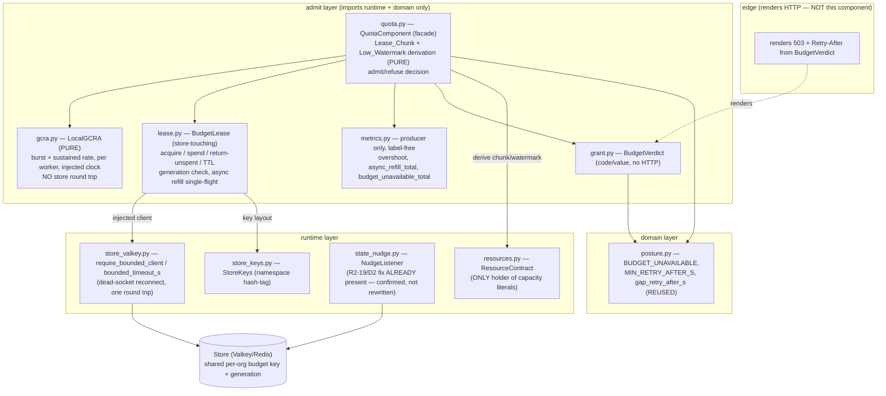

# Design Document

## Overview

This feature adds the **org-level token budget as a shared lease spent locally**, plus the
**per-worker Local GCRA** for burst and rate, to the v3 backend-rewrite tree
(`gateway_v2/gateway_v2/`). It implements correction-register item **R2-09** (budget-lease refills
run off the request path), folds in **R2-14** (retry one idempotent store read on a TCP RTO
timeout), and **R2-19** (the store-connection boundary D1/D2 fixes plus a 45 s partition regression
test), all delivered by the v3 amendment to card **GW06** — "build the admission layer with bounded
shared state and one round trip".

The problem the lease removes: in the RC2 prototype a lease refill was a **synchronous store read
on the request path**, so a store partition failed large prompts from +0.15 s with 211 × HTTP 503
`shared_state_unavailable`, *inside* the declared 5 s RAM window the posture was supposed to ride
out. The fix is to make the org token budget a chunk a worker acquires from the store and then
**spends locally**, topped up by a **Low_Watermark Async_Refill that runs off the request path**.
During a store outage, budget spends the Remaining_Lease and then refuses **only quota** with the
narrower `budget_unavailable` code (never the global `shared_state_unavailable`); identity, kill
switch and plan stay RAM-served for the declared window by *other* components.

### Design decisions and rationale

- **Module split, not an extension of `quota.py`.** `admit/quota.py` today holds only
  `derive_bounds` + `AdmissionBounds` (GW19). The lease state machine (store-touching, async
  refill, generation, TTL) plus the GCRA (pure, per-worker) are a large body of new logic. The
  admission build already factored `admission.py` into `queues.py` / `supervisor.py` to stay under
  the size gate (`tests/gates/test_check_sizes.py`: ≤ 800 lines/module, ≤ 120 lines/function). The
  same reasoning applies: this design puts the **pure GCRA in `admit/gcra.py`**, the
  **store-backed lease state machine in `admit/lease.py`** (store client injected), and keeps
  **`quota.py` as the façade** that ties GCRA + lease into one admit/refuse decision and derives
  the Lease_Chunk from the `ResourceContract`. `derive_bounds` stays in `quota.py` unchanged.
- **One shared store key is the single source of budget.** N workers draw from one pool; the lease
  is the thing that stops Replica_Multiplication. The acquire and the return are each **one round
  trip** (an atomic `EVAL`/Lua compare-and-decrement), consistent with GW06's "one round trip"
  objective and the `store_valkey.py` fixed-command discipline.
- **Reuse the posture vocabulary.** `BUDGET_UNAVAILABLE`, `MIN_RETRY_AFTER_S` and
  `gap_retry_after_s` already exist in `domain/posture.py`; this design **reuses** them and defines
  no second budget-outage code (Req 5.5).
- **The listener is not rewritten.** `runtime/state_nudge.py` already carries the R2-19/D2 fix (the
  three dead-connection signatures, `FAST_NONE_LIMIT=3`, keepalive-error-not-silence,
  reconnect-after-backoff). R2-19 here is scoped to (a) **confirm** that boundary and (b) **add the
  45 s partition regression test** that pins it. The working `NudgeListener` is left intact.

## Architecture

The component lives entirely in the `admit` layer (which imports only `runtime` + `domain`, per the
import-linter `layers` contract in `pyproject.toml`). The store client is **injected**, so all
store-touching logic is testable with `fakeredis`.



### Purity boundaries (PURE vs store-touching vs injected-clock)

| Concern | Module | Nature |
| --- | --- | --- |
| Lease_Chunk + Low_Watermark derivation | `quota.py` | **PURE** — a function of `ResourceContract` + injected `q_safe`; no store, no clock |
| GCRA burst + rate math | `gcra.py` | **PURE** over state; reads an **injected `Callable[[], float]` clock** |
| Lease acquire / spend / return / TTL reclaim | `lease.py` | **store-touching** (injected client) + injected clock for watermark timing of refills |
| Async refill scheduling | `lease.py` | injected clock + injected `asyncio` task spawner; single-flight |
| admit/refuse decision | `quota.py` | **PURE** composition of GCRA result + Remaining_Lease; store only reached via `lease.py` off-path |
| metrics | `metrics.py` | producer only, no I/O, no clock on the hot path |

The request path (`QuotaComponent.evaluate`) issues **no store call**: GCRA is local, and the lease
spend is a local decrement of `Remaining_Lease`. The only store calls are `lease.acquire()` (at
construction and from the off-path refill task) and `lease.return_unspent()` (at shutdown).

## Components and Interfaces

### `admit/gcra.py` — `LocalGCRA` (pure)

Per-worker Generic Cell Rate Algorithm for the Org burst allowance and sustained rate (Req 1.1).
No store round trip, ever (Property 8). Frozen slotted params; a small mutable TAT (theoretical
arrival time) carrier that reads an injected clock.

```python
@dataclass(frozen=True, slots=True)
class GcraParams:
    rate_per_s: float          # sustained rate the Org is allowed
    burst: int                 # Local_Burst_Limit (per worker)

class LocalGCRA:
    def __init__(self, params: GcraParams, *, clock: Callable[[], float]) -> None: ...
    def admit(self) -> bool:   # True if within burst+rate at clock() now; advances TAT only on admit
```

- `rate_per_s` and `burst` are **derived by the façade** from the `ResourceContract` (and the
  per-org share), never literals here (Req 2.2, 2.3; Property 9). `gcra.py` holds no capacity
  literal (the `admit/` capacity-literal gate covers it).
- The decision is a function of the injected clock only (Req 1.4). It never blocks and never reads
  the store (Req 1.3).

### `admit/lease.py` — `BudgetLease` (store-backed state machine)

Holds one worker's Remaining_Lease for one Org, acquires chunks from the shared store key, and
refills off the request path. The store client is injected (Req 1.5); it is never constructed here.

```python
@dataclass(frozen=True, slots=True)
class LeaseConfig:
    org: str
    chunk: int             # Lease_Chunk, derived from the contract (passed in; never a literal)
    low_watermark: int     # derived from chunk (Req 4.5)
    ttl_s: float           # Lease_TTL, enforced on the STORE's clock (Req 3.4)

class BudgetLease:
    def __init__(
        self,
        client: Any,                       # injected store client (fakeredis in tests)
        config: LeaseConfig,
        *,
        clock: Callable[[], float],
        spawn: Callable[[Awaitable[None]], None],  # injected task spawner (asyncio.ensure_future)
        keys: StoreKeys = KEYS,
        metrics: QuotaMetrics,
    ) -> None: ...

    async def acquire(self, generation: int) -> bool:    # one round trip; store-touching
    def try_spend(self, cost: int, generation: int) -> SpendResult:  # LOCAL; may schedule refill
    async def return_unspent(self) -> None:              # one round trip; shutdown
```

- `try_spend` is **local and synchronous** (no `await`): it decrements `Remaining_Lease`, and when
  the result is at or below `low_watermark` it schedules an Async_Refill via the injected `spawn`
  and returns immediately (Req 4.1–4.3). It **never** issues a store read (Req 4.2, Property 5).
- `acquire` runs only at construction and from the refill task — never from `try_spend`.
- A refill is **single-flight**: a boolean/`asyncio` guard ensures at most one refill is in flight;
  a `try_spend` that fires the watermark while a refill is already running schedules nothing new and
  keeps serving from `Remaining_Lease` (Req 4.3).

### `admit/quota.py` — `QuotaComponent` (façade) + `derive_bounds` (unchanged)

The façade ties GCRA + lease into one decision and owns the **pure** chunk/watermark derivation.

```python
def derive_lease_chunk(contract: ResourceContract, *, q_safe: float) -> int:
    """Lease_Chunk from the contract's measured inputs. Pure. Refuse-to-start on uncomputable."""

def derive_low_watermark(chunk: int) -> int:
    """Low_Watermark as a function of chunk (Req 4.5). Pure."""

class QuotaComponent:
    def __init__(self, gcra: LocalGCRA, lease: BudgetLease, *, generation_source, metrics): ...
    def evaluate(self, cost: int) -> BudgetVerdict | Admitted:
        # 1. GCRA burst+rate (local)         -> refuse (rate) if over
        # 2. generation check                -> re-acquire under current gen if stale
        # 3. lease.try_spend(cost, gen)       -> admit, or budget_unavailable if exhausted & store down
```

`evaluate` is the request-path entry point and performs **no store I/O** (Req 1.3). The façade owns
the composition order (GCRA first, then budget) and the fail-closed outcome (Req 13.1).

### `admit/grant.py` — `BudgetVerdict` (code/value, no HTTP)

Mirrors the existing `ShedVerdict` pattern (same code-vs-render split). A refused budget request
returns a frozen value carrying `code = posture.BUDGET_UNAVAILABLE`, a `retry_after_s` from
`gap_retry_after_s`, `should_retry = False`, and `request_id`. `edge` renders the HTTP 503 +
`Retry-After` + `x-should-retry` (Req 5; the component constructs **no** HTTP object).

### `admit/metrics.py` — producer additions (label-free)

Following the existing `AdmissionMetrics` producer pattern (fixed, label-free, real zeros): a
`QuotaMetrics` producer (or additions to the admit producer) exporting three fixed series seeded to
zero at construction (Req 12.3, 12.4):

- `amf_quota_lease_overshoot` — the declared aggregate overshoot (Req 7.4).
- `amf_quota_async_refill_total` — count of Async_Refills.
- `amf_quota_budget_unavailable_total` — count of `budget_unavailable` refusals.

No tenant-derived label (no org / owner), ever (Req 12.2). GW14d publishes.

### `runtime/store_valkey.py` + `runtime/state_nudge.py` — Store_Connection_Boundary (confirmed, not rewritten)

`require_bounded_client` + `bounded_timeout_s` are retained unchanged (Req 9.3); the lease store
client is validated at start-up with `below_s` = the refresh period so a per-op timeout stays below
it. `state_nudge.NudgeListener` already carries the D2 fix (Req 9.1/9.4). This design adds the
regression test, not new listener code.

## Data Models

### Store key layout (new budget-lease family)

The lease adds a key family under the existing namespace hash-tag (`{rv2}`) so every op stays in one
slot (cluster-safe) and the atomic script touches only keys in that slot. New entries extend
`store_keys.StoreKeys` (the one module that owns the layout):

| Key | Type | Holds |
| --- | --- | --- |
| `{rv2}:budget:<org>:remaining` | string (int) | the Org's remaining shared token budget pool |
| `{rv2}:budget:<org>:generation` | string (int) | the current `Budget_Generation` for the Org |
| `{rv2}:budget:<org>:lease:<worker_id>` | string (int) w/ TTL | a worker's outstanding (unreturned) chunk — the TTL-reclaim record |

`StateKind.BUDGET` already exists and is hash-stored for the published *config*; this lease family is
the **live counter**, distinct from the published budget config record. Keys are added as methods on
`StoreKeys` (e.g. `budget_remaining(org)`, `budget_generation(org)`, `budget_lease(org, worker_id)`).

### The atomic acquire (one round trip, compare-and-decrement with generation + TTL)

Acquire is a single `EVAL` (Lua) so the generation check, the pool decrement, and the per-worker
lease record + TTL are **atomic and one round trip** (Req 3.1; GW06 one-round-trip objective). In
pseudocode:

```
-- KEYS: remaining, generation, lease:<worker>   ARGV: want_gen, chunk, ttl_s
if tonumber(GET generation) ~= tonumber(want_gen) then return {-1, <current_gen>} end  -- stale
local pool = tonumber(GET remaining) or 0
local grant = min(pool, chunk)                                   -- never over-grant the pool
if grant <= 0 then return {0, <current_gen>} end
DECRBY remaining grant
SET lease:<worker> grant
EXPIRE lease:<worker> ttl_s                                      -- TTL on the STORE's clock
return {grant, <current_gen>}
```

- Returns `-1` ⇒ the caller's generation is stale: discard, re-read generation, re-acquire
  (Req 6.3/6.4; Property 3).
- Returns `0` ⇒ the shared pool is empty: no over-grant; the façade will refuse quota if the local
  Remaining_Lease is also exhausted.
- `grant = min(pool, chunk)` is what makes aggregate admission ≤ limit (the pool), and the only
  excess above the pool is the per-worker in-flight chunk already granted but not yet spent — the
  **declared overshoot** (see Property 1 below).

### Return of unspent budget (one round trip)

On clean shutdown with `Remaining_Lease > 0`, a single `EVAL` adds the unspent amount back to the
pool and deletes the per-worker lease record atomically (Req 3.3). A crashed worker never runs this;
its `lease:<worker>` key **expires on the store's clock**, and a reclaim step (or the control-plane
reconciler) returns the expired amount to the pool, so budget is never permanently lost (Req 3.5,
Property 2).

### In-memory lease state (frozen where possible)

```python
@dataclass(slots=True)
class _LeaseState:          # the only mutable carrier; not frozen (Remaining_Lease changes)
    remaining: int
    generation: int
    refill_in_flight: bool
```

No module-level mutable state anywhere (per conventions). The config, params, and verdict types are
all frozen slotted dataclasses.

## Correctness Properties

*A property is a characteristic or behavior that should hold true across all valid executions of a
system — essentially, a formal statement about what the system should do. Properties serve as the
bridge between human-readable specifications and machine-verifiable correctness guarantees.*

The ten properties below restate the requirements' correctness properties as design-level
invariants, each with how it is enforced and how it is tested. PBT applies: the lease and GCRA are
pure/injected-store logic with universal invariants over arrival patterns, replica counts, and
generation changes.

### Property 1: No replica multiplication

*For all* numbers of in-process replicas sharing one Budget_Lease pool and *for all* arrival
patterns, aggregate admission never exceeds the Org limit plus the declared lease overshoot.

- **Enforced by:** the single shared `{rv2}:budget:<org>:remaining` key; `grant = min(pool, chunk)`
  in the atomic acquire; every worker draws from the one pool, never a per-worker counter. The only
  excess above the pool limit is at most one in-flight chunk per worker, which is the declared
  overshoot published as `amf_quota_lease_overshoot`.
- **Tested by:** `tests/admit/test_lgw06_lease_no_multiplication.py` — N in-process `BudgetLease`
  instances over one `fakeredis`, seeded `random.Random` ≥ 10,000 iters, assert
  `sum(admitted) ≤ limit + overshoot`.

**Validates: Requirements 7.1, 7.2, 7.3**

### Property 2: Unspent budget is always returned

*For all* sequences of acquire / spend / clean-shutdown / crash events, the sum of spent + returned
+ TTL-reclaimed budget equals the acquired budget; no budget is permanently lost.

- **Enforced by:** `return_unspent()` on clean shutdown (atomic add-back + delete) and the
  `lease:<worker>` TTL on the store's clock reclaiming a crashed worker's chunk.
- **Tested by:** `tests/admit/test_lgw06_lease_conservation.py` — random event sequences incl.
  simulated crashes (drop the state without `return_unspent`, advance `fakeredis` TTL), assert
  conservation.

**Validates: Requirements 3.3, 3.4, 3.5**

### Property 3: Stale generation is never spent

*For all* leases, a lease carrying a Budget_Generation older than the current generation is never
spent; after a generation change, admissions draw only from a lease re-acquired under the current
generation.

- **Enforced by:** the generation check in the atomic acquire (`-1` on mismatch) and the
  façade's generation check in `evaluate` before `try_spend`.
- **Tested by:** `tests/admit/test_lgw06_generation.py` — advance generation mid-stream, assert no
  admission draws from the stale lease and a re-acquire under the new generation happens first.

**Validates: Requirements 6.1, 6.2, 6.3, 6.4, 13.4**

### Property 4: Budget outage is narrow

*For all* store-outage windows, budget admission spends only the Remaining_Lease and then returns
`budget_unavailable`, never `shared_state_unavailable`; identity / kill switch / plan stay RAM-served
for the declared window independently of the budget posture.

- **Enforced by:** `evaluate` reusing `posture.BUDGET_UNAVAILABLE`; the budget path owns only its
  narrow posture (identity/kill-switch/plan are other components, cross-referenced not owned here).
- **Tested by:** `tests/admit/test_lgw06_outage_posture.py` — `fakeredis` partition, assert the
  Remaining_Lease is spent then `budget_unavailable` with `shared_state_unavailable` never returned.

**Validates: Requirements 5.1, 5.2, 5.3, 5.4, 5.5, 5.6**

### Property 5: Refill is never on the request path

*For all* request-path admissions, no admission issues a store call to refill the lease; the
Async_Refill is triggered only at the Low_Watermark and runs off the request path. The count of
request-path refill store calls is always zero.

- **Enforced by:** `try_spend` is synchronous and local; refills go through the injected `spawn`
  (off-path) with single-flight; `evaluate` awaits no store call.
- **Tested by:** `tests/admit/test_lgw06_refill_offpath.py` — a counting `fakeredis` wrapper that
  records every call made on the request path, assert that count is 0 across ≥ 10,000 spends,
  including during an in-progress refill.

**Validates: Requirements 4.1, 4.2, 4.3, 4.4, 4.5**

### Property 6: Idempotent read retries at most once

*For all* store timeouts, an Idempotent_Read retries at most once, and a non-idempotent operation is
never retried on timeout.

- **Enforced by:** a retry-once wrapper on the idempotent read at the lease/store boundary; the
  atomic acquire (a mutating `EVAL`) is **not** retried; a second timeout surfaces.
- **Tested by:** `tests/admit/test_lgw06_retry_once.py` — a client stub that times out N times,
  assert exactly one retry for reads, zero for the mutating op, and that a second timeout surfaces.

**Validates: Requirements 8.1, 8.2, 8.3, 8.4**

### Property 7: Keepalive timeout is an error, never silence

*For all* keepalive reads, an `ETIMEDOUT` is surfaced as an error and never silently as "no
message", so the push listener cannot spin to unbounded memory.

- **Enforced by:** the existing `state_nudge.NudgeListener` D2 fix (three dead-connection
  signatures, `FAST_NONE_LIMIT=3`, reconnect-after-backoff) — confirmed, not rewritten.
- **Tested by:** the 45 s partition regression test (Property/Req 10) with a keepalive-`ETIMEDOUT` /
  dead-socket simulation, asserting the listener goes dead-and-reconnects and memory does not spin.

**Validates: Requirements 9.1, 9.2, 9.3, 9.4, 10.1, 10.2**

### Property 8: GCRA bounds burst and rate

*For all* local admission windows, admissions never exceed the Local_Burst_Limit plus the sustained
rate the Local_GCRA enforces, independent of lease state.

- **Enforced by:** `LocalGCRA.admit` advancing the TAT only on admit; the decision is a pure
  function of the injected clock and params.
- **Tested by:** `tests/admit/test_lgw06_gcra.py` — seeded `random.Random` arrival streams over an
  injected clock, assert the windowed admission count never exceeds burst + rate × window.

**Validates: Requirements 1.1, 1.3, 1.4**

### Property 9: Lease chunk is contract-derived

*For all* ResourceContracts, the Lease_Chunk and the Low_Watermark are functions of the contract's
measured inputs only; no capacity literal appears in the quota module.

- **Enforced by:** `derive_lease_chunk` / `derive_low_watermark` compute from `ResourceContract`
  (`offered_service_rate` / `target_p99_ms` / `utilization_cap` / injected `q_safe`); refuse-to-start
  on uncomputable (`CapacityUnset`/`CapacityUnavailable`).
- **Tested by:** `tests/admit/test_lgw06_chunk_derivation.py` (random contracts → chunk is a pure
  function; uncomputable → raises) **and** `tests/gates/test_lgw19_admit_capacity_literals.py` (the
  existing gate, which already scans `admit/` incl. `gcra.py` / `lease.py` / `quota.py`).

**Validates: Requirements 2.1, 2.2, 2.3, 2.4, 2.5**

### Property 10: Fail-closed under error

*For all* error conditions — a missing contract-derived chunk, an undecidable budget decision, and a
stale-generation lease — the component fails closed (refuse), never fails open.

- **Enforced by:** refuse-to-start when chunk/watermark are uncomputable; `budget_unavailable` when
  the lease is undecidable under outage; a stale generation is treated as unspendable.
- **Tested by:** `tests/admit/test_lgw06_failclosed.py` — assert each error path refuses and that
  the `fail_open_total` style counter stays 0 across the partition and overload tests (Req 13.2).

**Validates: Requirements 13.1, 13.2, 13.3, 13.4**

## Error Handling

All failures fail **closed** — refuse or `budget_unavailable` — with **zero FAIL_OPEN** (Req 13.2).

| Condition | Detection | Outcome |
| --- | --- | --- |
| Lease_Chunk / Low_Watermark uncomputable | `derive_lease_chunk` raises `CapacityUnset`/`CapacityUnavailable` from the contract | **Refuse to start** (no lease acquired with a guessed chunk) — Req 2.4, 13.3 |
| `q_safe` unset / non-positive | checked in the façade before acquire | **Refuse to start** — Req 2.5 |
| Stale Budget_Generation on acquire | atomic `EVAL` returns `-1` | Discard lease, re-read generation, re-acquire under current gen; never spend — Req 6.3, 13.4, Property 3 |
| Shared pool empty + Remaining_Lease exhausted | `grant == 0` and local remaining `== 0` | Refuse quota with `budget_unavailable` + `gap_retry_after_s` — Req 5.2 |
| Store timeout on idempotent read | per-op timeout from `bounded_timeout_s` | Retry **once**; a second timeout surfaces — Req 8.1, 8.3, Property 6 |
| Store timeout on mutating acquire/return | per-op timeout | **Not retried**; surfaces; refill retried off-path later — Req 8.2 |
| Store partition / outage (window) | repeated store errors | Spend Remaining_Lease, then `budget_unavailable`; refill retried off-path — Req 4.4, 5.1, 5.2, Property 4 |
| Keepalive `ETIMEDOUT` on push socket | `state_nudge` `no_wait`/`silent`/`error` signatures | Connection declared dead, reconnect-after-backoff; never "no message" — Req 9.1, 9.4, Property 7 |
| Dead pooled read socket | `store_valkey` bounded client | Reconnect, never answer 500 — Req 9.2 (confirm existing; add a guard only if a gap is found) |
| Any undecidable budget/quota decision | catch-all in `evaluate` | Refuse (fail closed), never admit without a decision — Req 13.1 |

## Testing Strategy

**Dual approach.** Property-based tests (seeded `random.Random`, ≥ 10,000 iterations, **no
hypothesis**, async via `asyncio.run`, `fakeredis` for the store — all per the house idiom in
`tests/admit/test_lgw19_codel.py`) cover the universal invariants; example/edge tests cover specific
boundaries; the in-process harness reproduces the deferred cloud gates locally. Each property test
carries the tag comment `# Feature: budget-lease, Property N: <text>` and `# Validates:
Requirements X.Y`.

### Property-based tests (one per correctness property)

| Property | Test file (`gateway_v2/tests/admit/`) |
| --- | --- |
| 1 No replica multiplication | `test_lgw06_lease_no_multiplication.py` |
| 2 Unspent budget returned | `test_lgw06_lease_conservation.py` |
| 3 Stale generation never spent | `test_lgw06_generation.py` |
| 4 Budget outage is narrow | `test_lgw06_outage_posture.py` |
| 5 Refill never on request path | `test_lgw06_refill_offpath.py` |
| 6 Idempotent read retries once | `test_lgw06_retry_once.py` |
| 7 Keepalive error not silence | (store-boundary regression — see below) |
| 8 GCRA bounds burst and rate | `test_lgw06_gcra.py` |
| 9 Lease chunk contract-derived | `test_lgw06_chunk_derivation.py` + existing capacity gate |
| 10 Fail-closed under error | `test_lgw06_failclosed.py` |

### Local acceptance equivalents (the in-process harness — Req 11)

- **LGW06-3** (`test_lgw06_harness.py`): N in-process replicas sharing one `fakeredis` lease →
  aggregate admission ≤ limit + declared overshoot; overshoot published; no multiplication by
  replica count.
- **LGW06-5** (`test_lgw06_harness.py` / `tests/runtime/`): inject 200 ms store latency → the op
  stays within `bounded_timeout_s`, the declared posture holds, and the connection pool does not
  grow unbounded.
- **R2-09 partition behaviour** (`test_lgw06_outage_posture.py` + `test_lgw06_refill_offpath.py`):
  `fakeredis` partition → budget spends Remaining_Lease then `budget_unavailable`; refill proven
  off the request path.

### Store-boundary partition regression (R2-19/R2-09, Req 10)

Placed with the store boundary at `gateway_v2/tests/runtime/test_lgw06_partition_regression.py`
(the listener and the bounded client live in `runtime`), covering both defects:

- **D2 (Property 7):** a keepalive-`ETIMEDOUT` / immediate-"no message" simulation over a 45 s
  simulated partition (injected clock) asserts the `NudgeListener` surfaces the timeout as a dead
  signature (`no_wait`/`silent`/`error`), reconnects after backoff, and does **not** spin to
  unbounded memory. The listener is **not** rewritten — this test pins the existing fix.
- **D1:** a dead pooled read socket asserts `store_valkey` reconnects rather than answers 500; if
  the adapter does not already reconnect, a small guard is added (and this test covers it).
- **R2-09:** during the simulated partition, assert budget spends only Remaining_Lease then returns
  `budget_unavailable` (never `shared_state_unavailable`) and that **no** store read is issued on
  the request path to refill the lease (Req 10.2, 10.3, 10.4).

### Example / edge tests

- `derive_low_watermark` is a function of the chunk only (Req 4.5).
- `BudgetVerdict` carries `code = BUDGET_UNAVAILABLE`, `retry_after_s ≥ MIN_RETRY_AFTER_S`,
  `should_retry = False`, constructs no HTTP object (Req 5.6).
- Metrics seeded to zero at construction; the three fixed series present from the first snapshot;
  no tenant label (Req 12.3, 12.4).

### Gates (reused, unchanged)

- `tests/gates/test_lgw19_admit_capacity_literals.py` + `tests/gates/test_check_capacity.py` — no
  capacity literal in `admit/` (now covering `gcra.py` / `lease.py` / `quota.py`).
- `tests/gates/test_check_sizes.py` — ≤ 800 lines/module, ≤ 120 lines/function (the module split is
  what keeps this green).
- `tests/gates/test_check_http.py` — no `HTTPException`/`JSONResponse` in `admit` (`BudgetVerdict` is
  a value).
- `tests/gates/test_import_linter.py` — `admit` imports only `runtime` + `domain`.
- `tests/gates/test_check_frozen.py` / `test_check_mutable.py` — frozen slotted dataclasses, no
  module-level mutable state.

### Deferred cloud / scale gates (explicitly out of local scope)

The full live four-replica fleet quota run (full LGW06-3), the **live store failover (LGW06-6)**,
and the real cross-zone RTO measurement are **deferred cloud/scale gates**, represented locally by
the equivalents above. The R2-14 zone placement (gateways in the store primary's zone) is a
**deployment dependency, not code** — the code requirement is the retry-once-on-timeout (Property 6).
