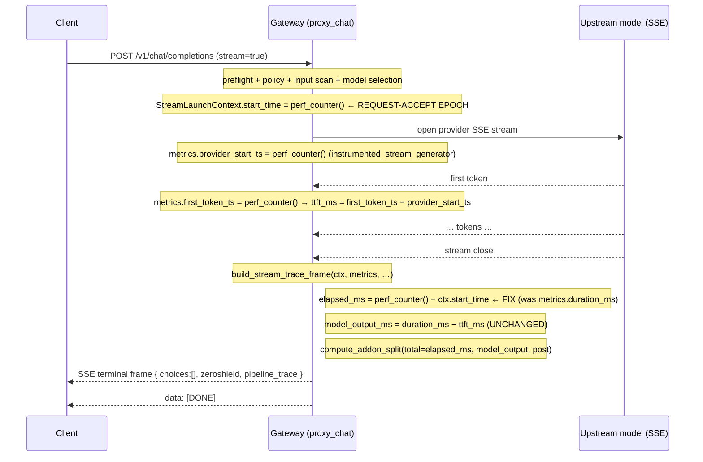

# Design Document

## Overview

The streaming chat path reports a "firewall tax" (`t_addon_pre_ms`) that is supposed to be the latency the gateway adds on top of the model. Today it is anchored on the wrong epoch: the streaming pipeline trace sets `total_latency_ms = metrics.duration_ms`, and `duration_ms` is measured from `provider_start_ts` (when the upstream SSE stream opens), not from the request-accept epoch. Because `model_output_ms` is derived as `duration_ms − ttft_ms` and the addon is `total − model_output − post`, the algebra collapses to the provider's time-to-first-token:

```
total       ≈ duration_ms
model_output ≈ duration_ms − ttft_ms
addon        = total − model_output − post ≈ ttft_ms          (post ≈ 0 on a clean stream)
```

So the benchmarked streaming firewall tax is literally the customer's model TTFT, and the Phase-1 latency gate passes unconditionally.

This design re-bases the streaming `total_latency_ms` on the request-accept epoch (`StreamLaunchContext.start_time`, a `time.perf_counter()` value already captured pre-stream after preflight and model selection). The reported total then spans request-accept → stream close, and because `model_output_ms` and `t_addon_post_ms` are unchanged, the subtraction that produces the addon now yields gateway pre-model time instead of TTFT.

The change is confined to one telemetry computation site (`build_stream_trace_frame` in `gateway/ai_mesh_gateway/stream_orchestration.py`). It is a measurement/telemetry correctness fix only. It MUST NOT change any enforcement decision (block / redact / allow / flag) or any emitted stream byte (Requirement 7). The non-streaming path already anchors on the request wall-clock and is not touched (Requirement 6).

### Scope

**In scope:** re-anchoring the streaming `total_latency_ms` (the `elapsed_ms` variable in `build_stream_trace_frame`) and, transitively, the addon split it drives; preserving `ttft_ms`, `model_output_ms`, and the trace key shape; a synthetic-timing unit test.

**Out of scope (per requirements Introduction):** reconciliation-clamp / residual-histogram changes, a STREAM SSE benchmark harness, microsecond resolution / ran-flag / skip semantics, capacity-vs-tax split, per-stage start/end timestamps, and any non-streaming change.

## Architecture

### Where the fix lives in the stream lifecycle

The streaming request already captures the request-accept epoch (`StreamLaunchContext.start_time`) and the provider stream timing (`StreamRunMetrics.provider_start_ts`, `first_token_ts`). Finalization rebuilds the full pipeline trace and reconciles latency in `build_stream_trace_frame`. The only defect is which epoch `elapsed_ms` is anchored on.



### Timeline of the four epochs

```
  start_time            provider_start_ts        first_token_ts                 stream close
  (request accept)      (provider SSE opens)     (first model token)            (now)
      |------ gateway pre-provider ------|--- ttft ---|------ token generation -------|
      |<-------------------------- total_latency_ms (AFTER fix) --------------------->|
                                         |<---------------- duration_ms ------------->|
                                         |<-- ttft_ms -->|<----- model_output_ms ----->|
```

- **Gateway pre-provider** = `provider_start_ts − start_time`. Today this is excluded from the reported total; after the fix it is included.
- **duration_ms** = `now − provider_start_ts` (provider-stream-only; unchanged).
- **ttft_ms** = `first_token_ts − provider_start_ts` (provider TTFT; unchanged, remains a separate field).
- **model_output_ms** = `duration_ms − ttft_ms` (provider generation; unchanged).

### The fix (precise)

In `build_stream_trace_frame`, `elapsed_ms` is computed once when the frame is built and used for both the zeroshield `processing_time_ms` and the pipeline-trace `total_latency_ms`. The current code is:

```python
elapsed_ms = metrics.duration_ms
if elapsed_ms <= 0 and ctx.start_time:
    elapsed_ms = (time.perf_counter() - ctx.start_time) * 1000
```

The fix inverts the priority so the request-accept epoch is authoritative, with `duration_ms` as the fail-safe fallback:

```python
if ctx.start_time:
    elapsed_ms = (time.perf_counter() - ctx.start_time) * 1000
else:
    elapsed_ms = metrics.duration_ms
```

Everything downstream that consumes `elapsed_ms` (the `processing_time_ms` field, the `_stage_sum` / `_overhead` reconciliation, `pt["total_latency_ms"]`, and the addon split it feeds) then reflects full wall-clock from request accept.

`model_output_ms` continues to be set inside `_rebuilt_stream_trace` as `round(duration_ms − ttft_ms, 1)` — that computation is provider-relative and is deliberately NOT changed (Requirement 4). `ttft_ms` continues to be sourced from `metrics.ttft_ms` (provider timing) and stamped as its own field (Requirement 3).

### Why the addon becomes gateway pre-time (algebra)

`compute_addon_split(metrics, total_ms)` computes `pre = max(0, total − model_output_ms − output_guardrail_ms)`. Let:

- `P` = gateway pre-provider time (`provider_start_ts − start_time`)
- `Y` = provider TTFT (`ttft_ms`)
- `G` = provider generation (`model_output_ms = duration_ms − ttft_ms`)
- `Q` = post-model gateway time (`output_guardrail_ms`, ≈ 0 on a clean stream)

`duration_ms = Y + G` and the true wall-clock is `total = P + Y + G + Q` (ignoring negligible unattributed slack).

**Before the fix** (`total = duration_ms = Y + G`):
```
addon = total − G − Q = (Y + G) − G − 0 = Y      → addon == ttft   (the bug)
```

**After the fix** (`total = P + Y + G + Q`, anchored on start_time):
```
addon = total − G − Q = (P + Y + G + Q) − G − Q = P + Y
```

So after the fix the addon is the gateway pre-provider time **plus** the provider TTFT that occurs before the first token. This is the honest "everything before the model produced usable output" figure and, critically, is `≈ P + Y` which differs from `ttft_ms = Y` by `P` (the gateway pre-model time). Whenever `P` exceeds the 1 ms threshold (Requirement 2.2/2.3), `addon ≠ ttft`.

> Note on TTFT inside the addon: `t_addon_pre_ms` is defined by `compute_addon_split` as "accept → first byte toward the model" (`total − model_output − post`). Provider TTFT falls before the first generated token, so it is part of pre-model latency by that definition; the requirement is that the addon reflects gateway pre-model time and is NOT algebraically equal to `ttft_ms` — satisfied because the addon now carries the `P` term that pure TTFT lacks. The separately-reported `ttft_ms` field lets an operator subtract provider TTFT if they want the gateway-only slice.

### Where the pre-provider time surfaces (overhead reconciliation)

`build_stream_trace_frame` reconciles the trace as:

```
_stage_sum   = sum(stage.latency_ms for stage in pt.stages)
_overhead    = max(0, elapsed_ms - _stage_sum)
pt.total_latency_ms = round(elapsed_ms, 2)
```

The pipeline stages (`auth`, `policy`, `input_scan`, `model_output`, `output_guardrail`, …) are rebuilt from `trace_build_kwargs.stage_metrics`; there is **no stage** representing the raw gateway pre-provider window (connection open, request marshalling before the provider socket). By design this feature does **not** invent a new stage (out of scope). Growing `elapsed_ms` by the pre-provider delta `P` while `_stage_sum` stays fixed means the extra time lands in `overhead_ms` (unattributed gateway time — an acceptable home for it).

The addon does not depend on how the pre-provider time is attributed between a stage and overhead: `compute_addon_split` computes `pre = total − model_output_ms − output_guardrail_ms`, and `model_output_ms` / `output_guardrail_ms` are unchanged. So the whole increase in `total` flows straight into `t_addon_pre_ms` via the subtraction, regardless of the overhead bookkeeping. This keeps the change minimal and the addon honest.

## Components and Interfaces

All components live in `gateway/ai_mesh_gateway/`. Only `build_stream_trace_frame` changes; the others are described for how they interact.

### `build_stream_trace_frame(ctx, metrics, base_zeroshield, *, stream_id, stream_model, error, pipeline_trace_base) -> str`
*(stream_orchestration.py — the single modified function)*

- Builds the terminal SSE frame (`chat.completion.chunk` with `choices: []`, a `zeroshield` object, and `pipeline_trace`).
- **Change:** anchor `elapsed_ms` on `ctx.start_time` (request-accept epoch) instead of `metrics.duration_ms`; fall back to `metrics.duration_ms` when `start_time` is unset/falsy.
- `elapsed_ms` is captured **once** here (via a single `perf_counter()` read) and reused for `zeroshield.processing_time_ms`, the stage/overhead reconciliation, and `pt["total_latency_ms"]`. It must not re-read the clock per use (that would drift `processing_time_ms` from `total_latency_ms`).
- Unchanged: the enforcement/`zeroshield.action` block, the `ttft_ms` stamping (`if metrics.ttft_ms > 0`), the frame shape.

### `_rebuilt_stream_trace(ctx, metrics, pipeline_trace_base) -> dict`
*(stream_orchestration.py — unchanged)*

- Rebuilds the 9-stage trace via `build_pipeline_trace(**kwargs, stage_metrics=sm, response_text=metrics.output_snippet)`.
- Sets `sm["model_output_ms"] = round(duration_ms − ttft_ms, 1)` when `ttft_ms > 0 and duration_ms > ttft_ms`. **Preserved** — this is the provider generation time (Requirement 4.1/4.3).
- Fail-open: returns `pipeline_trace_base` unchanged on any error or missing `trace_build_kwargs`.

### `compute_addon_split(metrics, total_ms) -> dict`
*(pipeline_trace.py — unchanged)*

- Returns `{t_addon_pre_ms, t_addon_post_ms, t_t2_ms}` where `pre = round(max(0, total − model_output_ms − output_guardrail_ms), 1)`.
- Consumes the re-anchored `total`. The `max(0, …)` clamp is the negative-addon fail-safe (Requirement 2.5).
- Invoked inside `build_pipeline_trace`; after the streaming frame overwrites `pt["total_latency_ms"] = elapsed_ms`, the addon keys carried on the rebuilt trace reflect `build_pipeline_trace`'s own `total`. See the note under Data Models on keeping the addon consistent with the re-anchored total.

### `StreamRunMetrics` *(dataclass, stream_orchestration.py — unchanged)*

- `provider_start_ts`, `first_token_ts` (perf_counter epochs set by `instrumented_stream_generator`).
- `ttft_ms` property = `(first_token_ts − provider_start_ts) × 1000`, or `0.0` if either ≤ 0.
- `duration_ms` property = `(perf_counter() − provider_start_ts) × 1000`, or `0.0` if `provider_start_ts ≤ 0`. Because it reads the clock live, callers snapshot it once.

### `StreamLaunchContext` *(dataclass, stream_orchestration.py — unchanged)*

- `start_time: float = field(default_factory=time.perf_counter)` — the request-accept epoch, captured when the launch context is built (pre-stream, after preflight + selection). This is the anchor the fix reads.
- `trace_build_kwargs: dict | None` — captured `build_pipeline_trace` kwargs used by `_rebuilt_stream_trace`.

## Data Models

### `pipeline_trace` latency keys (streaming terminal frame)

All keys are retained under their original names and numeric types (Requirement 5). Only the *value semantics* of `total_latency_ms` (and, transitively, `overhead_ms` and `t_addon_pre_ms`) change.

| Key | Type | Before (anchor = provider_start_ts) | After (anchor = start_time) |
|-----|------|-------------------------------------|-----------------------------|
| `total_latency_ms` | number | `duration_ms` (provider-stream only) | `perf_counter() − start_time` (request-accept → close) |
| `ttft_ms` | number | `first_token_ts − provider_start_ts` | **same** (provider TTFT, separate field) |
| `model_output_ms` | number | `duration_ms − ttft_ms` | **same** (provider generation) |
| `stage_latency_sum_ms` | number | `Σ stage latency_ms` | **same** |
| `overhead_ms` | number | `max(0, duration_ms − stage_sum)` | `max(0, total − stage_sum)` — absorbs pre-provider `P` |
| `t_addon_pre_ms` | number | `≈ ttft_ms` (the bug) | `≈ P + Y` (gateway pre + provider TTFT) |
| `t_addon_post_ms` | number | `output_guardrail_ms` | **same** |
| `t_t2_ms` | number | `tier2_ms` | **same** |

### `zeroshield.processing_time_ms` (terminal frame)

- Before: `round(duration_ms, 2)`.
- After: `round(elapsed_ms, 2)` where `elapsed_ms` is the re-anchored total. Same key, same numeric type; it now agrees with `total_latency_ms`.

### SSE terminal frame shape (unchanged — Requirement 5.5)

```json
{
  "id": "chatcmpl-…",
  "object": "chat.completion.chunk",
  "created": 0,
  "model": "…",
  "choices": [],
  "zeroshield": { "…": "…", "processing_time_ms": 0.0, "ttft_ms": 0.0 },
  "pipeline_trace": { "total_latency_ms": 0.0, "ttft_ms": 0.0, "model_output_ms": 0.0, "…": "…" }
}
```

No top-level key is added, removed, or renamed. `usage` is still attached only when present.

### Keeping the addon consistent with the re-anchored total

`build_pipeline_trace` internally computes its own `total` (from `stage_metrics.total_ms` + overhead) and calls `compute_addon_split(metrics, that_total)` before the streaming frame overwrites `pt["total_latency_ms"] = elapsed_ms`. For the addon keys to reflect the re-anchored total (not `build_pipeline_trace`'s stage-sum total), the streaming frame must ensure the addon split is computed against `elapsed_ms`. The design keeps this minimal: after overwriting `pt["total_latency_ms"]`, recompute the addon keys via `compute_addon_split(pt_metrics, elapsed_ms)` and merge them into `pt` (same keys, same types), so `t_addon_pre_ms` is derived from the honest total. This preserves the existing key set and only corrects the value the addon is computed from.

## Correctness Properties

*A property is a characteristic or behavior that should hold true across all valid executions of a system — essentially, a formal statement about what the system should do. Properties serve as the bridge between human-readable specifications and machine-verifiable correctness guarantees.*

This feature is a pure timing computation over `build_stream_trace_frame` / `_rebuilt_stream_trace` / `compute_addon_split` with an injectable clock, so it is a good fit for property-based testing. Each property is exercised over generated timing inputs (request-accept epoch, provider stream open, first-token, and stream-close instants) using a controlled monotonic clock.

### Property 1: Streaming total is the full wall-clock from the request-accept epoch

*For any* streaming finalization where `StreamLaunchContext.start_time` is set, the reported `total_latency_ms` equals the elapsed time from `start_time` to stream close (within rounding tolerance), and therefore exceeds the provider-only `duration_ms` by exactly the gateway pre-provider delay `provider_start_ts − start_time`.

**Validates: Requirements 1.1, 1.2, 1.3, 1.4**

### Property 2: The addon differs from provider TTFT by the gateway pre-model time

*For any* streaming finalization whose gateway pre-provider time `P` differs from the provider TTFT by more than 1 ms, the reported `t_addon_pre_ms` is not equal to `ttft_ms` (they differ by approximately `P`), so the addon never degenerates to the provider's time-to-first-token.

**Validates: Requirements 2.2, 2.3, 3.4**

### Property 3: The addon split is the total-minus-model algebra

*For any* `total_latency_ms`, `model_output_ms`, and `t_addon_post_ms`, the reported `t_addon_pre_ms` equals `max(0, total_latency_ms − model_output_ms − t_addon_post_ms)`, computed against the request-accept-anchored total.

**Validates: Requirements 2.1, 2.5**

### Property 4: TTFT is the provider delta and is independent of the request-accept epoch

*For any* provider stream timing, `ttft_ms` equals `(first_token_ts − provider_start_ts) × 1000`, and holding the provider timing fixed while varying `start_time` leaves `ttft_ms` unchanged and distinct from `t_addon_pre_ms`.

**Validates: Requirements 3.1, 3.2**

### Property 5: model_output_ms is provider generation time and is invariant under re-anchoring

*For any* provider stream timing with `duration_ms > ttft_ms`, `model_output_ms` equals `duration_ms − ttft_ms`, and holding the provider timing fixed while varying the request-accept epoch (`start_time`) leaves `model_output_ms` unchanged.

**Validates: Requirements 4.1, 4.2, 4.3**

### Property 6: Enforcement and emitted bytes are invariant under the anchoring change

*For any* streaming request, the input and output enforcement decisions (block / redact / allow / flag) and the emitted stream content bytes are identical before and after the anchoring change; the change is confined to latency/telemetry fields.

**Validates: Requirements 7.1, 7.2, 7.3, 7.4**

## Error Handling

All fail-safes keep the stream finalizing without raising, and never substitute one timing source for another silently.

- **Unset request-accept epoch (R1.5):** when `ctx.start_time` is falsy (`0`/`None`), `elapsed_ms` falls back to `metrics.duration_ms`; `total_latency_ms` is set to `duration_ms`, is non-negative, and finalization completes without error.
- **Missing provider stream timing (R3.3):** when `provider_start_ts` or `first_token_ts` is ≤ 0, `metrics.ttft_ms` is `0.0`; the frame stamps `ttft_ms` only when `> 0`, so it is reported as null/absent rather than substituted from `start_time`.
- **Underivable model_output (R4.4):** when `ttft_ms ≥ duration_ms` or either is unavailable, `_rebuilt_stream_trace` does not `setdefault` `model_output_ms`, so it defaults to `0` and the generation time is not fabricated.
- **Negative / uncomputable addon (R2.5):** `compute_addon_split` clamps `pre` to `max(0, …)` and coerces missing/non-numeric `model_output_ms`/`output_guardrail_ms`/`total` to `0.0` inside `try/except`, returning `t_addon_pre_ms = 0` while leaving the remaining latency keys intact.
- **Trace rebuild failure (fail-open):** `_rebuilt_stream_trace` returns the pre-stream `pipeline_trace_base` on any exception or missing `trace_build_kwargs`; `build_stream_trace_frame` wraps the reconciliation in `try/except` and falls back to `pipeline_trace_base` — so the anchoring fix can only add fidelity, never break the stream.
- **Clock read discipline:** `elapsed_ms` is read once per frame build; `processing_time_ms` and `total_latency_ms` are derived from the same snapshot so they cannot drift apart.

## Testing Strategy

### Dual approach

- **Property tests** cover the universal timing algebra (Properties 1–5) over generated timing inputs using an injectable/monotonic clock.
- **Example / edge tests** cover the fail-safe branches (unset `start_time`, missing provider timing, `ttft ≥ duration`, negative addon) and the structural shape assertions (trace key superset, frame top-level keys, `ttft_ms` distinct from `t_addon_pre_ms`).
- **Integration / regression** covers the untouched non-streaming path and the enforcement/byte invariants via the existing suite.

### Property-based testing

PBT applies (pure timing functions with clear input/output over a large input space). Use the target language's standard PBT library (Python: **Hypothesis**) — do not hand-roll a generator. Each property test:

- runs a minimum of **100 iterations**,
- uses a controlled clock: inject synthetic `start_time`, `provider_start_ts`, `first_token_ts`, and a monkeypatched/injected `time.perf_counter` for the stream-close instant, so `duration_ms` (which reads the clock live) is deterministic,
- asserts the timing bounds within **±5 ms** (aligned with Requirement 8),
- is tagged with a comment referencing its design property, format: **Feature: honest-stream-latency-metric, Property {number}: {property_text}**.

Mapping to tests:
- Property 1 → total ≈ `close − start_time`; `total − duration_ms ≈ P` (generator includes near-zero `P` for R1.4).
- Property 2 → with `P` chosen large, `|t_addon_pre_ms − ttft_ms| ≈ P` (> 5 ms) so `addon ≠ ttft`.
- Property 3 → `t_addon_pre_ms == max(0, total − model_output − post)`.
- Property 4 → `ttft_ms == (first_token_ts − provider_start_ts) × 1000`, invariant across `start_time`.
- Property 5 → `model_output_ms == duration_ms − ttft_ms`, invariant across `start_time`.

### The Requirement 8 synthetic-timing test (primary acceptance test)

One property/example test constructs a streaming finalization with a synthetic gateway pre-provider time and a synthetic provider TTFT that differ by **≥ 50 ms**, drives `build_stream_trace_frame` (or `_rebuilt_stream_trace` + `compute_addon_split`) with the injected clock, and asserts within ±5 ms:

1. `total_latency_ms` ≈ full wall-clock (`close − start_time`),
2. `t_addon_pre_ms` ≈ synthetic gateway pre-provider time,
3. `t_addon_pre_ms` differs from `ttft_ms` by more than 5 ms (`addon ≠ ttft`),
4. `model_output_ms` ≈ `duration_ms − ttft_ms`.

On any failed assertion the test reports which timing value diverged (R8.6).

### Unit / edge tests

- `ctx.start_time = 0` → `total_latency_ms == duration_ms`, non-negative, no raise (R1.5).
- `first_token_ts = 0` → `ttft_ms` absent/null, not substituted (R3.3).
- `ttft_ms ≥ duration_ms` → `model_output_ms == 0` (R4.4).
- `model_output_ms > total_latency_ms` → `t_addon_pre_ms == 0`, other keys intact (R2.5).
- Built frame contains all required keys (`total_latency_ms`, `ttft_ms`, `model_output_ms`, `stage_latency_sum_ms`, `overhead_ms`, `t_addon_pre_ms`, `t_addon_post_ms`, `t_t2_ms`), each numeric, none renamed/removed (R5.1–5.4); top-level frame keys and `choices == []` unchanged (R5.5).

### Regression / invariants

- The existing `gateway/ai_mesh_gateway/tests/test_stream_governance_fidelity.py` must still pass — it asserts the enforcement attribution and frame shape, covering the enforcement/byte invariants (R7) and the trace shape (R5).
- Existing non-streaming latency tests must still pass unchanged, confirming the non-streaming path is untouched (R6). No property tests are written for the non-streaming path (it is unchanged external behavior).

### Gate

The full gateway suite must complete with zero failures and zero errors (R8.7):

```
cd gateway && ./.venv/bin/python -m pytest ai_mesh_gateway/tests -q
```

### Documentation / process note

Per the shared-worktree pipeline changelog protocol, the implementing change is logged as one `PIPELINE-NNNN` entry to all four memories in the same commit (Ruflo `pipeline/changes`, repo-root `AGENTS.md` pointer, `.cursor/rules/pipeline-changelog.mdc`, and the canonical `docs/pipeline/CHANGELOG.md`), with a narrow, single-file stage (never `git add -A`). This is a process note only and does not affect the design.
