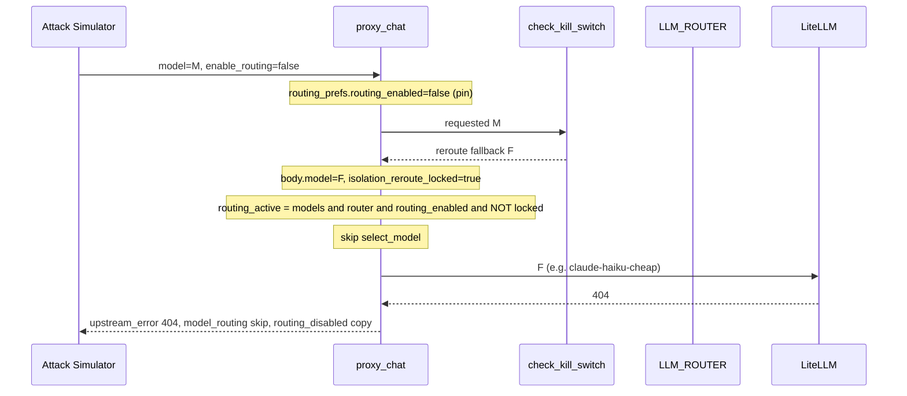
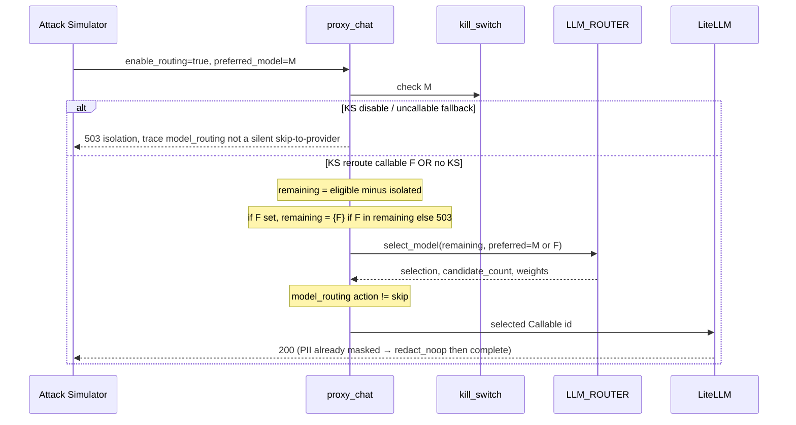

# Design — Routing isolation honesty

**Status:** DRAFT — pair with `requirements.md`. No product code until operator approval.

**For Claude (after approval):** REQUIRED SUB-SKILL: `skill-executing-plans` then `skill-test-driven-development`. Use `skill-verification-before-completion` and `production-live-verification` before handover.

## Overview

Three independent defects compose into the demo failure:

```
Attack Simulator pin (enable_routing:false)
        +
KS isolation_reroute_locked → skip LLM_ROUTER
        +
fallback catalog name with LiteLLM 404
        =
model_routing skip + "Org routing is off" + upstream_error 404
```

The design makes **org `routing_enabled` the source of truth for whether policy runs**, treats kill-switch as a **filter on the candidate set**, treats Attack Simulator’s dropdown as a **preference**, and fail-closes uncallable isolation targets at save and at runtime.

## Current architecture (as shipped)



Relevant sites:

| Layer | File | Behavior |
|---|---|---|
| FE pin | `frontend/src/components/AttackSimulatorPanel.jsx` | `pinnedModelRoutingPreferences` ×3 |
| FE helper | `frontend/src/utils/liveGateway.js` | Pin vs `simulatorRoutingPreferences` |
| FE copy | `frontend/src/utils/routingExplain.js` | `routing_disabled` → “Org routing is off” |
| FE isolation (good) | `IsolationOpsSimulator.jsx` | Already uses org `routing_enabled` |
| GW prefs | `main.py` `_extract_chat_routing_preferences` | Client override wins over org |
| GW KS | `main.py` ~7689–7855 | Reroute sets `isolation_reroute_locked` |
| GW route | `main.py` ~9668–9897 | `routing_active` includes `not isolation_reroute_locked`; skip envelope uses `routing_disabled` |
| GW KS meta | `_build_isolation_reroute_metadata` | Honest KS copy **only if** skip path + audit present |
| Control save | `KillSwitchCreateSerializer` | `is_active` name only |
| Control gap | `ModelStateUpdateSerializer` | No active-connected check |

## Approaches considered

### A — Remove request pin only (frontend)

Stop sending `enable_routing: false` from Attack Simulator.

- **Pros:** Smallest UI diff; Isolation already did this.
- **Cons:** KS still sets `isolation_reroute_locked` and skips the adjudicator (Requirement 2 fails). Dead alias still 404s. Copy still lies for any remaining pin.

### B — KS as hard pin, skip routing (status quo)

Keep lock; only fix copy and save validation.

- **Cons:** User explicitly forbade `model_routing` skip when Dynamic Routing is Enabled.

### C — Isolation as candidate constraint; adjudicator always runs when org-on (chosen)

Drop isolated/killed models; if fallback is Callable, remaining = `{fallback}`; run `select_model`; never skip for org-on unless SDK pin.

- **Pros:** Satisfies “target wins if callable” and “policy runs among remaining.” Trace has weights/`candidate_count`. Fail-closed if remaining empty.
- **Cons:** Slightly more CPU on KS path (already cheap; deterministic scorer, no LLM). Must not double-call LiteLLM.

### D — Ignore SDK `enable_routing: false` whenever org-on

Would make Attack Sim work even if pin remained.

- **Cons:** Breaks documented OpenAI-extra_body pin (`test_s9_enable_routing_false_*`). Rejected. Attack Sim must stop pinning; SDK pin stays.

**Chosen:** C + Attack Simulator switch to `simulatorRoutingPreferences` (A) + save-time Callable checks + runtime 404/401 isolation translation + copy honesty + live KS disable + full MIG bounce.

**PIPELINE-0028:** Module 1.1 currently pins so the dropdown is not overwritten by cheapest-free. This spec **explicitly reverses that for Attack Simulator** because the operator locked preference-hint behavior when 1.5 is Enabled. SDK pin and Model Routing simulator (`enable_routing: true` on purpose) stay.

## Target request flow



## Design details

### 1. Frontend — Attack Simulator

Mirror Isolation Ops:

```javascript
const { config: firewallConfig } = useFirewallConfig();
const orgRoutingEnabled = firewallConfig?.routing_enabled ?? true;
// all chatCompletionBody routingPreferences:
simulatorRoutingPreferences(gatewayModels.selectedModel, { orgRoutingEnabled })
```

Replace all three `pinnedModelRoutingPreferences` call sites. Keep exporting the pin helper for SDK docs / Model Routing simulator when it **intentionally** pins.

How-to copy in `howToUseContent.js` already documents pin vs org; Attack Simulator must match that document (pin is extra_body, not the 1.1 default).

### 2. Gateway — `routing_active` vs isolation

**Today (post-scan, ~9668):**

```python
routing_active = bool(
    inference_models
    and LLM_ROUTER is not None
    and routing_prefs["routing_enabled"]
    and not isolation_reroute_locked
)
```

**After:**

- `routing_active` = models + router + `routing_prefs["routing_enabled"]` (org or request). **Do not** AND `not isolation_reroute_locked`.
- Keep `_drop_isolated_or_killed_candidates` before `select_model` (already present).
- If `isolation_reroute_audit` has a requested fallback:
  - Resolve fallback as **that name only** if Callable (do **not** `chain_next` / `catalog_scan`).
  - If resolved model ∉ remaining → 503, no LiteLLM.
  - If resolved model ∈ remaining → **constrain** `inference_models` (and `preferred_model`) to that model so the target wins, then call `select_model` so the stage is not skip. `candidate_count` may be 1; copy must say constrained, not “best of N.”
- Circuit-breaker silent reroute uses the same lock today (`main.py` ~10263); apply the same constraint+adjudicator rule (do not leave CB as a skip backdoor).
- Stamp `decision_source` from isolation trigger (`kill_switch` / `model_state` / `circuit_breaker`) **on the selection metadata**. Copy `trigger_source` so the kill-switch stage is not “No active kill-switch.”
- `_build_isolation_reroute_metadata` remains for SDK-pin + isolation (routing not active). When routing **is** active, merge `select_model` + audit.
- Isolation 404/401 remap keys off isolation **intent**, not leftover lock (Agent 2). Cover JSON inference sanitizer and pre-SSE; Attack Simulator must not map `upstream` in the message to missing credentials.
- `honestStageAction`: do not treat `model_routing` allow+0ms as skip.

`isolation_reroute_locked` may still exist for allowlist/guard gates that historically treated “already rerouted” as concrete — audit those `not routing_active` branches so org-on + KS does not skip ownership checks incorrectly. Original requested model for 422 `model_not_configured` should remain the **client** model where that contract still applies; after KS, do not 422 the fallback if it is in-catalog.

### 3. Gateway — uncallable fallback at runtime

Before LiteLLM:

- If the selected model has no catalog `model_id` / not in `inference_models`, 503.

After LiteLLM error, **only when** `isolation_reroute_audit` is set (or `decision_source` in `{kill_switch, model_state}`):

- Map provider 404/401 (and gateway `model_not_configured` if it still leaks) to 503 `isolation_target_uncallable` (or reuse `kill_switch_active` with `fallback_reason_code=uncallable`).
- Do not change mapping for ordinary (non-isolation) provider 401 on `gpt-5.2` — that remains a Model Connections credential issue (out of scope).

### 4. Control — Callable at save

Shared helper (new, Django-side), used by:

- `KillSwitchCreateSerializer` (tighten existing `is_active` query)
- `ModelIsolateSerializer` (same)
- `ModelStateUpdateSerializer` (add; current gap)

Callable:

```
LLMModelConfig.objects.filter(
    organization=org,
    model_name=fallback,
    is_active=True,
).exclude(model_id="").exclude(model_id__isnull=True)
```

plus credentials: `encrypted_api_key` nonempty OR `api_key_env_var` nonempty.

plus not `is_platform_managed_llm_model_name`.

Chat-capable: reuse existing control/gateway notion if already on the serializer path; otherwise require the row’s modality/type not embedding-only if that field exists.

Do **not** live-probe Anthropic/OpenAI at save (latency, cost, flaky). Residual 404s → Requirement 3.3.

### 5. UI copy

`summarizeRoutingDecision`:

1. If `org_routing_enabled === true` and `decision_source === 'routing_disabled'`:  
   “This request pinned {model} (`enable_routing: false`). Organization Dynamic Routing is Enabled.”
2. If `org_routing_enabled === false` and `routing_disabled`: keep a true org-off sentence.
3. Kill-switch branch: keep redirection sentence; if `candidate_count > 0` append “Routing policy evaluated {n} remaining eligible model(s).”
4. Never use org-off wording when `org_routing_enabled` is true.

Pass `org_routing_enabled` into the summarizer from `resolveRoutingDecision` / stage (already on `zeroshield.routing`).

### 6. PII path

No scanner pattern change. After isolation/routing honesty, already-masked prompts follow PIPELINE-0012 then hit a Callable model. Public fixture: Sensitive Data Leakage already-masked.

If org policy **blocks** that prompt, 403 is correct — do not weaken blocks. The demo failure was 404 after allow/redact_noop.

### 7. Live ops

Deactivate KS via control API as Task 0 of implementation (admin session). Record JSON. If Redis has orphan keys, `resync_kill_switches` after deactivate.

### 8. Deploy

User constraint: **full MIG bounce** (`mesh-firewall-mig-nws9`).

- Build/push `linux/arm64` images that contain the changed layers (at least `gateway`, `control`, `nginx` SPA).
- Recreate **all** app containers on the MIG (not nginx-only).
- Do not use AWS `make sync-ec2-deploy`.
- Evidence: image tags, `docker compose ps`, public HTML/JS hash if SPA changed.

### 9. Changelog

If `gateway/ai_mesh_gateway/main.py` (or enforcement/trace) changes: PIPELINE-NNNN in four memories same commit when committing.

## Risks

| Risk | Mitigation |
|---|---|
| Constraining remaining to `{fallback}` makes `candidate_count=1` look like “no policy” | Still call `select_model`; emit weights; copy explains isolation constraint |
| Org-on + KS + client asked for isolated model 422 | Validate **original** client model against catalog **or** treat KS rewrite before ownership check; tests must pin the order |
| Mapping all 401s to isolation 503 | Gate on isolation audit only |
| Tight save breaks existing KS rows | Runtime fail-closed still saves demos; save rule applies to new writes; Task 0 deletes the bad live row |
| Full MIG bounce disruption | Bounce only after unit+local gates; maintenance window implicit in user constraint |
| PIPELINE-0028 tests expect Attack pin | Update those tests; Isolation already diverged |

## Test strategy

TDD: failing tests first for `routing_active` without lock; Attack Sim prefs; serializer credentials; routingExplain org-on pin copy; KS uncallable 503 (mock LiteLLM not called).

E2E: Playwright or scripted login against public host after bounce (`production-live-verification`). Store redacted JSON.

## Out of scope

JWT `/api/auth/me/` 401, analytics 503, fixing OpenAI `gpt-5.2` keys, probing providers at KS save, changing smart-mask to block.
