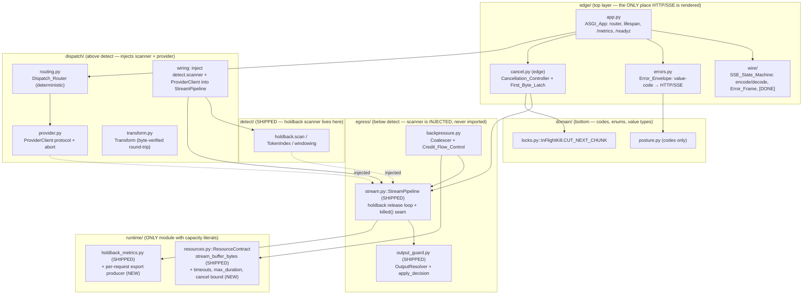

# Design Document

## Overview

GW12 builds the **serving skin** around the already-shipped bounded-holdback engine (GW12b / R2-06). The holdback release loop — `egress/stream.py::StreamPipeline` with its `UpstreamChunk` / `DownstreamFrame` / `StreamStats` value types, the `killed()` kill seam, the C4 split-latency series, and the C25 byte-linearity + held-byte ceiling — is **DONE** and this design wires INTO it without changing it. The producer `runtime/holdback_metrics.py::HoldbackMetrics` and the `egress/output_guard.py` resolver glue are likewise shipped.

What GW12 adds, bottom-up along the import-linter layer contract:

1. **`runtime/resources.py`** — new `ResourceContract` derivations: C27 inter-chunk/idle/write timeouts, C24 `Max_Stream_Duration` + `Max_Cut_Latency` + `Max_Snapshot_Age`, and the R6 cancellation bound. This is the ONLY module permitted capacity-position literals (gated by `lint/check_capacity_literals.py`).
2. **`egress/backpressure.py`** — the bounded `Coalescer` + `Credit_Flow_Control`, high-water derived from `ResourceContract.stream_buffer_bytes(active_streams)`, never a literal.
3. **`dispatch/`** — `provider.py` (`ProviderClient` protocol + abort), `routing.py` (deterministic plan-derived selection), `transform.py` (byte-verified round-trip).
4. **`edge/wire/`** — the SSE codec + state machine: encode `DownstreamFrame` → `data:{json}\n\n`, terminal `data:[DONE]`, `Error_Frame` from `error_code`; decode upstream SSE tolerating split UTF-16 surrogates.
5. **`edge/app.py`** + **`edge/errors.py`** — the ASGI app (router, lifespan, `/metrics`, `/readyz`) and the single `Error_Envelope` that renders value-codes to HTTP/SSE.
6. The **cancellation controller**, the **`First_Byte_Latch`**, **mid-stream provider error-frame scanning**, the **per-request export surface**, and the **C38 serving-loop discipline** — assembled in `edge`/`dispatch` (both above `detect`), which is where the real detect scanner and `ProviderClient` are injected into the harness.

### Grounding in actual code

| Shipped seam | File:symbol | How GW12 uses it |
| --- | --- | --- |
| Holdback release loop | `egress/stream.py::StreamPipeline.run(chunks, send, killed)` | The coalescer feeds `chunks`; the SSE codec is the `send` sink; the cancellation controller drives `killed`. |
| Transport value types | `egress/stream.py::UpstreamChunk` / `DownstreamFrame` / `StreamStats` | The SSE codec serializes `DownstreamFrame`; `StreamStats` feeds per-request exports. Not redefined. |
| Kill seam | `domain/locks.py::InFlightKill.CUT_NEXT_CHUNK` + `StreamPipeline.killed()` | Every in-flight cut (disconnect, kill switch, revocation, plan change, max-duration) reuses this one seam. |
| No-literal high-water source | `runtime/resources.py::ResourceContract.stream_buffer_bytes(active_streams)` | The coalescer's `High_Water_Mark`; the `active_streams × ceiling` export. |
| Metrics split | `runtime/holdback_metrics.py::HoldbackMetrics` | The per-request export surface follows this producer-only, label-free, zeros-not-absence split. |
| Output decision glue | `egress/output_guard.py::OutputResolver` / `apply_decision` | Mid-stream error-frame scanning reuses the injected resolver + `apply_decision` fail-closed path. |
| Codes-only posture | `domain/posture.py` | New value-codes live here; `edge/errors.py` renders them. |

### Critical layer constraint

`egress` sits **below** `detect` in the contract (`pyproject.toml` layers: `edge > admit > plan > detect > resolve > dispatch > egress > audit > runtime > contracts > domain`). Therefore `egress` MUST NOT import `detect`. The scanner and the `ProviderClient` are **injected** into `StreamPipeline` from `dispatch`/`edge`, both of which sit above `detect`. GW12's wiring code honours this exactly as the shipped harness already does (`StreamPipeline.detector: Detector | None`, `scanner: ScanProtocol`).

## Architecture

### Layer map and component placement



The `egress → detect` edge is **forbidden** and absent; the dotted injection edges flow from the wiring layer (`dispatch`/`edge`) down into the harness.

### Data path (request → client)

```mermaid
sequenceDiagram
    participant C as Client (OpenAI SDK)
    participant APP as edge/app.py
    participant R as dispatch/routing
    participant P as dispatch/provider (ProviderClient)
    participant COAL as egress Coalescer + Credit
    participant SP as egress StreamPipeline (holdback)
    participant W as edge/wire SSE codec
    participant S as detect scanner (injected)

    C->>APP: POST /v1/chat/completions (stream=true)
    APP->>R: route(resolved_plan)
    R-->>APP: upstream destination (deterministic)
    APP->>P: open streaming request (abortable)
    loop per upstream chunk
        P-->>COAL: upstream bytes
        Note over COAL: buffer ≤ High_Water_Mark;<br/>credit gates reads
        COAL->>SP: UpstreamChunk (text_deltas)
        SP->>S: scan(whole) via injected detector
        S-->>SP: completed findings
        SP->>W: DownstreamFrame (released, post-decision)
        W->>C: data: {json}\n\n
        C-->>COAL: consume N bytes → grant N credit
    end
    SP->>W: final flush
    W->>C: data: [DONE]\n\n
```

### Control path (cancellation / in-flight kill)

```mermaid
sequenceDiagram
    participant C as Client
    participant RECV as ASGI receive channel
    participant CC as Cancellation_Controller (edge)
    participant P as ProviderClient
    participant SP as StreamPipeline.killed()
    participant M as per-request metrics

    C--xRECV: disconnect (or idle past timeout)
    RECV->>CC: http.disconnect
    CC->>CC: start timer (ResourceContract cancel bound)
    par abort provider
        CC->>P: abort() — stop upstream reads
    and signal guard
        CC->>SP: killed() → true (cut at next chunk boundary)
    end
    Note over CC: Max_Stream_Duration / kill switch /<br/>key revocation / plan change / stale snapshot<br/>all drive killed() the same way
    CC->>CC: measure elapsed ms; release buffer; return credit
    CC->>M: export cancel interval (per cancelled stream)
```

## Components and Interfaces

Each new unit is listed with its module path, the key classes/protocols (frozen-slotted dataclass / `StrEnum` shapes), and the injected dependencies. All clocks are `Callable[[], float]` (seconds) or `Callable[[], int]` (ns, matching the shipped `StreamPipeline` clock) and all randomness is an injected `random.Random` so tests are deterministic.

### 1. `runtime/resources.py` — `ResourceContract` additions (bottom of the build order)

New methods on the shipped frozen `ResourceContract`. All literals stay inside this file (the only module `lint/check_capacity_literals.py` exempts). Each derives from existing fields (`target_p99_ms`, `utilization_cap`, `memory_limit`, `per_worker_rss`) so there is one capacity authority.

```python
# runtime/resources.py — new module-level declared literals (allowed ONLY here)
_INTER_CHUNK_TIMEOUT_MULT = 50.0     # inter-chunk budget = p99 × mult
_IDLE_TIMEOUT_MULT = 150.0           # downstream idle budget
_WRITE_TIMEOUT_MULT = 25.0           # single downstream write budget
_MAX_STREAM_DURATION_MULT = 15000.0  # wall-clock stream lifetime
_MAX_CUT_LATENCY_MULT = 2.0          # cut must complete within p99 × mult
_MAX_SNAPSHOT_AGE_MULT = 1.0         # control-plane snapshot freshness vs p99
_CANCEL_BOUND_MULT = 3.0             # disconnect → full kill budget

class ResourceContract:  # (existing frozen slotted dataclass; methods added)
    def inter_chunk_timeout_s(self) -> float: ...
    def idle_timeout_s(self) -> float: ...
    def write_timeout_s(self) -> float: ...
    def max_stream_duration_s(self) -> float: ...
    def max_cut_latency_s(self) -> float: ...
    def max_snapshot_age_s(self) -> float: ...
    def cancellation_bound_s(self) -> float: ...
```

Derivation formulas (shown fully under Data Models). Each returns seconds derived from `target_p99_ms`, fails closed (`CapacityUnavailable`) below a floor, and is surfaced in `snapshot()` alongside the existing `stream_buffer_bytes`. **No caller outside `resources.py` holds a timeout literal** (R9.5, R10.1); callers invoke the method.

### 2. `egress/backpressure.py` — `Coalescer` + `Credit_Flow_Control`

The bounded per-stream buffer and the credit mechanism. Imports only `runtime` + `domain` (it is below `detect`). **It never names a `Semaphore`/`Queue` with a literal size** — the gate flags `Semaphore(<int>)`, `Queue(<int>)`, and `maxsize=/high_water=/buffer_size=` keyword literals. Bounds come only from `ResourceContract`.

```python
# egress/backpressure.py
@dataclass(frozen=True, slots=True)
class CreditState:
    granted: int = 0          # total credit ever granted (= consumed downstream)
    consumed: int = 0         # credit the stream has spent on upstream reads
    # outstanding = granted - consumed (derived, never stored independently)

@dataclass(frozen=True, slots=True)
class CoalescerVerdict:
    code: str | None          # None = admitted; a posture code = rejected
    high_water: int           # derived per-stream ceiling (bytes)

class Coalescer:
    """Bounded per-stream buffer; high-water from ResourceContract."""
    def __init__(
        self,
        *,
        contract: ResourceContract,
        active_streams: Callable[[], int],   # injected live Active_Streams count
    ) -> None: ...
    def high_water(self) -> int:             # = contract.stream_buffer_bytes(active_streams())
    def admit(self) -> CoalescerVerdict:     # fail-closed if high_water < 1 (R4.5)
    def offer(self, nbytes: int) -> bool:    # False = backpressure (buffered ≥ high_water)
    def release(self, nbytes: int) -> None:  # downstream consumed → shrink buffer, grant credit
    def buffered(self) -> int:               # current unflushed bytes for this stream

class CreditFlowControl:
    """Grant credit ONLY as downstream consumes; conserve granted = outstanding + consumed."""
    def grant_on_consume(self, consumed_bytes: int) -> int: ...  # grant exactly N (R5.2)
    def outstanding(self) -> int: ...        # granted - consumed, never negative
    def may_read(self) -> bool: ...          # outstanding > 0 AND buffered < high_water
```

- **R4.1–4.4**: `high_water()` returns `contract.stream_buffer_bytes(active_streams())`; `offer` refuses once buffered reaches it (backpressure); buffered never exceeds it in a stream's lifetime (invariant tested).
- **R4.5**: when `stream_buffer_bytes` raises `CapacityUnavailable` (ceiling < 1 byte), `admit()` returns a `CoalescerVerdict` carrying a rejection code and buffers zero payload bytes (fail closed).
- **R5.1–5.3, 5.7**: `CreditFlowControl` grants exactly N on consuming N; grants zero when nothing was consumed; conserves `granted == outstanding + consumed` at every observation point.
- **R5.6**: a derived `active_streams × high_water` bound is exported in bytes whenever `active_streams()` changes (via the per-request producer, below).

Injected dependencies: `contract` (ResourceContract), `active_streams` (`Callable[[], int]`). No clock needed here; timing is the controller's job.

### 3. `dispatch/provider.py` — `ProviderClient`

```python
# dispatch/provider.py
@runtime_checkable
class ProviderClient(Protocol):
    """Abortable upstream streaming source the egress loop reads from (R8.1)."""
    def open(self, request: UpstreamRequest) -> AsyncIterator[UpstreamEvent]: ...
    async def abort(self) -> None: ...   # stop reading from upstream for this request (R8.2)

@dataclass(frozen=True, slots=True)
class UpstreamRequest:
    destination: str
    body: Mapping[str, object]           # MappingProxyType at module level if any table

@dataclass(frozen=True, slots=True)
class UpstreamEvent:
    text_deltas: tuple[tuple[str, str], ...]
    final: bool
    error_frame: str | None = None       # a provider mid-stream error frame (R11)

class StubProviderClient:
    """Injectable in-process provider — no real socket (R8.5/R8.6).
    Driven by a seeded random.Random so local tests are deterministic."""
    def __init__(self, *, script: Sequence[UpstreamEvent], rng: random.Random) -> None: ...
```

`StubProviderClient` is what local tests inject (R8.5); the real-socket path is a deferred live gate (R8.6). `abort()` is what the cancellation controller calls.

### 4. `dispatch/routing.py` — `Dispatch_Router`

```python
# dispatch/routing.py
class DispatchRouter:
    """Deterministic plan-derived selection (R8.3): identical plan → identical destination."""
    def select(self, plan: ExecutionPlan) -> str: ...   # pure function of plan inputs
```

Pure and deterministic: no clock, no rng, no I/O — same `plan` always yields the same destination (tested as a property).

### 5. `dispatch/transform.py` — `Transform`

```python
# dispatch/transform.py
class Transform:
    """Byte-verified request/response shaping (R8.4)."""
    def to_provider(self, req: GatewayRequest) -> UpstreamRequest: ...
    def from_provider(self, ev: UpstreamEvent) -> DownstreamFrame: ...
    # round-trip: from_provider(to_provider_echo(x)) ≡ x for well-formed x
```

Round-trip is the property that always accompanies a serializer/transform.

### 6. `edge/wire/` — `SSE_State_Machine` (codec + state machine)

```python
# edge/wire/sse.py  (edge is the ONLY layer allowed to render SSE)
@dataclass(frozen=True, slots=True)
class SSEChunk:
    """SDK-shaped content frame body (choices/delta), serialized to data: {json}\n\n."""
    id: str
    model: str
    choices: tuple[SSEChoice, ...]

@dataclass(frozen=True, slots=True)
class SSEChoice:
    index: int
    delta: Mapping[str, object]
    finish_reason: str | None = None

@dataclass(frozen=True, slots=True)
class SSEErrorFrame:
    """Declared SDK-parseable error shape rendered from DownstreamFrame.error_code (R1.3)."""
    error_type: str
    code: str
    message: str

class SSEEncoder:
    def content(self, frame: DownstreamFrame) -> bytes: ...   # data: {json}\n\n (R1.1)
    def done(self) -> bytes: ...                              # data: [DONE]\n\n (R1.2)
    def error(self, error_code: str) -> bytes: ...            # declared Error_Frame (R1.3)

class SSEDecoder:
    """Decode upstream SSE; buffer split UTF-16 surrogate escapes across chunk
    boundaries and decode the code point once complete (R1.4). Confluence:
    same code points regardless of boundary placement (Property 9)."""
    def feed(self, raw: bytes) -> tuple[DownstreamFrame, ...]: ...   # may buffer partial
    def malformed(self) -> bool: ...                                 # R1.5 fail-closed signal
```

Injected: nothing stateful beyond an internal partial-escape buffer; the decoder is pure over its fed bytes so the round-trip (R1.6) and split-surrogate confluence (R1.4) are directly testable. A set `error_code` on an incoming/outgoing frame means `error()` is emitted and no content frame follows (R1.3).

### 7. `edge/app.py` — `ASGI_App` + `edge/errors.py` — `Error_Envelope`

```python
# edge/app.py
def build_app(
    *,
    contract: ResourceContract,
    provider: ProviderClient,
    scanner: ScanProtocol,          # the real detect scanner, injected HERE (above detect)
    resolver: OutputResolver,
    metrics_registry: MetricsRegistry,
    clock: Callable[[], float],
) -> ASGIApplication:
    """Assemble router + lifespan + /metrics + /readyz; wire the streaming chat route;
    register responses/misc/mcp/rag as registered-for-later placeholders (R2.1–2.3)."""

# /readyz — success when all state deps available; non-success naming the missing dep (R2.4/2.5)
# /metrics — exposition computed OFF the serving loop (R2.6, C38 R13.2)
```

```python
# edge/errors.py — the ONE place HTTP/SSE is rendered from value-codes (R3.1)
_ENVELOPE: Mapping[str, tuple[int, str]] = MappingProxyType({
    # posture/egress/dispatch code -> (http_status, sse_error_type)
    PLAN_UNAVAILABLE: (503, "service_unavailable"),
    KILL_SWITCH_UNAVAILABLE: (503, "service_unavailable"),
    # ... stream-specific codes (timeout, max_duration, scan_failure, output_blocked, killed)
})

def render(code: str, *, as_sse: bool) -> HTTPResponse | bytes:
    """Map a value-code to a declared HTTP status + SSE Error_Frame (R3.2).
    Unmapped code → declared generic error, never raw internal detail (R3.4)."""
```

Only `edge/` (and `resolve/`) may construct `HTTPException`/`JSONResponse` or `status_code=4xx` — `egress`, `dispatch`, `admit`, `runtime`, `contracts`, `domain` return value-codes (R3.3). New stream codes are added to `domain/posture.py` so the vocabulary stays single-spelled.

New posture codes (added to `domain/posture.py`, codes only):

```python
STREAM_INTER_CHUNK_TIMEOUT = "stream_inter_chunk_timeout"
STREAM_IDLE_TIMEOUT = "stream_idle_timeout"
STREAM_WRITE_TIMEOUT = "stream_write_timeout"
STREAM_MAX_DURATION = "stream_max_duration"
STREAM_KEY_REVOKED = "stream_key_revoked"
STREAM_PLAN_CHANGED = "stream_plan_changed"
STREAM_SNAPSHOT_STALE = "stream_snapshot_stale"
STREAM_MALFORMED_UPSTREAM = "stream_malformed_upstream"
STREAM_BUFFER_UNAVAILABLE = "stream_buffer_unavailable"
```

### 8. Cancellation controller — `edge/cancel.py`

Lives in `edge` (ASGI receive channel is an `edge` concern; it also needs to drive the egress `killed()` seam and the provider `abort()`).

```python
# edge/cancel.py
@dataclass(frozen=True, slots=True)
class CancelOutcome:
    elapsed_ms: float
    bound_exceeded: bool          # True → force-released past the derived bound (R6.4)
    released_bytes: int           # == buffered at disconnect (R6.6)

class CancellationController:
    def __init__(
        self,
        *,
        provider: ProviderClient,
        coalescer: Coalescer,
        contract: ResourceContract,
        clock: Callable[[], float],
        metrics: PerRequestExports,
    ) -> None: ...
    async def on_disconnect(self) -> CancelOutcome: ...
```

On `http.disconnect` (or idle past `idle_timeout_s`): start the clock, `provider.abort()` AND set `killed() → True` (both within `contract.cancellation_bound_s()`), stop upstream reads, release the buffer, return credit, measure the elapsed ms, and export it per cancelled stream (R6.1–6.6). If elapsed exceeds the bound, force-release the connection+state and record a bound-exceeded cancellation (R6.4). The same controller drives `killed()` for Max_Stream_Duration, kill switch, key revocation, plan change, and stale-snapshot fail-closed (R10) — one seam, many triggers.

### 9. `First_Byte_Latch`

A one-way latch owned by the stream orchestration in `edge`/`dispatch` (above the egress loop so it can gate retry/fallback before handing off to the provider).

```python
@dataclass(slots=True)
class FirstByteLatch:
    _set: bool = False
    def set_on_release(self) -> None: self._set = True   # first content byte released (R7.2)
    def is_set(self) -> bool: return self._set
    def may_retry(self) -> bool: return not self._set     # retry/fallback only while unset (R7.1/7.3)
```

While unset, a signed safe retry/fallback may run (R7.1); the first released content byte sets it (R7.2); once set, an upstream failure yields clean termination or a declared `Error_Frame` and never a spliced fallback (R7.3); the gateway never concatenates two upstream responses (R7.4, no-splice invariant).

### 10. Mid-stream provider error-frame scanning

Wired in the SSE read loop (`edge`/`dispatch`, above `detect`), reusing the injected `OutputResolver` + `apply_decision`.

- `UpstreamEvent.error_frame is not None` → scan the frame through the injected scanner **before forwarding any byte** (R11.1).
- Decision `redact` → forward with redactions applied via `apply_decision` (R11.2); `block` → withhold, emit declared `Error_Frame` (R11.3); scan raises → withhold, emit declared `Error_Frame` (R11.4, fail closed).
- Scan cost linear in the frame's byte length (R11.5, byte-linearity property).

### 11. Per-request exports — `runtime/holdback_metrics.py` extension

A new producer-only, label-free reading alongside `HoldbackMetrics`, following the identical split (zeros-not-absence, percentiles on read, publisher separate — GW14d).

```python
# runtime/holdback_metrics.py (or sibling runtime/stream_metrics.py)
@dataclass(frozen=True, slots=True)
class PerRequestReading:
    detector_invocations: int     # matches plan-derived detector schedule (R12.2)
    release_lag_ms: Histogram     # upstream-read → downstream-send per byte (R12.1)
    buffer_high_water: int        # max buffered bytes for the stream (R12.1)
    active_stream_memory_bound: int   # Active_Streams × stream_buffer_bytes, bytes (R5.6)

class PerRequestExports:
    def observe_detector_invocation(self) -> None: ...
    def observe_release_lag_ns(self, nanos: int) -> None: ...
    def observe_buffer_high_water(self, nbytes: int) -> None: ...
    def observe_memory_bound(self, nbytes: int) -> None: ...
    def record_withheld(self) -> None: ...   # uncomputable export → withhold, never raw (R12.4)
    def snapshot(self) -> PerRequestReading: ...
```

No tenant label (R12.3) — the trace answers which stream. If any value cannot be computed it is recorded as a withholding and no raw bytes are forwarded to compensate (R12.4).

### 12. C38 serving-loop discipline

- Tokenization and scanning run in a **GIL-releasing executor** (`loop.run_in_executor` with the executor sized by `ResourceContract`, no literal), not inline on the serving loop (R13.1).
- `/metrics` exposition is computed off the serving loop (R13.2) — `snapshot()` is already read-only and O(samples); the handler offloads it.
- A CPU burst injected mid-stream keeps other streams' worst-chunk p99 within the derived budget (R13.3); the forwarding loop runs no single CPU-bound slice longer than the declared slice bound (R13.5).
- Serving-loop lag is treated as an SLO input (R13.4).

## Data Models

### New value types (all frozen slotted dataclasses or StrEnum)

| Type | Module | Shape | Validates |
| --- | --- | --- | --- |
| `CreditState` | `egress/backpressure.py` | `granted:int, consumed:int` (outstanding derived) | R5.7 |
| `CoalescerVerdict` | `egress/backpressure.py` | `code:str\|None, high_water:int` | R4.5 |
| `UpstreamRequest` | `dispatch/provider.py` | `destination:str, body:Mapping` | R8.1 |
| `UpstreamEvent` | `dispatch/provider.py` | `text_deltas:tuple, final:bool, error_frame:str\|None` | R8.1, R11 |
| `SSEChunk` / `SSEChoice` | `edge/wire/sse.py` | SDK-shaped content | R1.1 |
| `SSEErrorFrame` | `edge/wire/sse.py` | `error_type, code, message` | R1.3 |
| `CancelOutcome` | `edge/cancel.py` | `elapsed_ms:float, bound_exceeded:bool, released_bytes:int` | R6.4–6.6 |
| `FirstByteLatch` | `edge` | `_set:bool` (mutable slotted; one-way) | R7 |
| `PerRequestReading` | `runtime` | `detector_invocations, release_lag_ms, buffer_high_water, active_stream_memory_bound` | R12 |
| new posture codes | `domain/posture.py` | module-level `str` constants | R3, R9, R10 |

Module-level tables (`_ENVELOPE`, any disposition map) use `MappingProxyType` (gated by `check_no_module_mutable.py`). `InFlightKill` stays the one `StrEnum` for the cut seam.

### `ResourceContract` method signatures + derivation formulas

All literals (`_*_MULT`) live in `runtime/resources.py`. `p99_s = target_p99_ms / 1000`.

```
inter_chunk_timeout_s()   = p99_s × _INTER_CHUNK_TIMEOUT_MULT
idle_timeout_s()          = p99_s × _IDLE_TIMEOUT_MULT
write_timeout_s()         = p99_s × _WRITE_TIMEOUT_MULT
max_stream_duration_s()   = p99_s × _MAX_STREAM_DURATION_MULT
max_cut_latency_s()       = p99_s × _MAX_CUT_LATENCY_MULT
max_snapshot_age_s()      = p99_s × _MAX_SNAPSHOT_AGE_MULT
cancellation_bound_s()    = p99_s × _CANCEL_BOUND_MULT
```

Each clamps to a derived floor and raises `CapacityUnavailable` if the result is non-positive (fail closed, consistent with the shipped `stream_buffer_bytes`). `stream_buffer_bytes(active_streams)` is unchanged and remains the sole source for the coalescer high-water and the `active_streams × ceiling` bound:

```
high_water(active_streams)        = floor(memory_limit × utilization_cap / max(active_streams, 1))
active_stream_memory_bound(n)     = n × stream_buffer_bytes(n)
```

`snapshot()` is extended to surface all new derivations (off-loop readable, R2.6/R13.2).

## Error Handling

Every failure fails **closed**: raw upstream bytes are never forwarded when a guard, count, or decision cannot be computed (R15.1–15.2). Components below `edge` return value-codes (`domain/posture.py`); `edge/errors.py` renders them to an HTTP status + declared SSE `Error_Frame` (R3). A `FAIL_OPEN` counter is pinned at zero and never incremented (R15.3).

| Failure | Where detected | Value-code | Rendered outcome | Before/after first byte |
| --- | --- | --- | --- | --- |
| Scanner raises | `StreamPipeline` (shipped) → `scan_failure` | `scan_failure` | Terminal `Error_Frame`; withhold held bytes | either; no splice after first byte |
| Mid-stream error-frame scan raises | error-frame scan loop | `scan_failure` | Withhold frame, emit `Error_Frame` (R11.4) | either |
| Output decision = block | `apply_decision` → `OutputBlocked` | `output_blocked` | Terminal `Error_Frame` | either |
| Inter-chunk stall | controller vs `inter_chunk_timeout_s()` | `stream_inter_chunk_timeout` | Terminate + `Error_Frame`, release resources (R9.2) | either |
| Downstream idle stall | controller vs `idle_timeout_s()` | `stream_idle_timeout` | Terminate + release (R9.3) | either |
| Downstream write blocks | controller vs `write_timeout_s()` | `stream_write_timeout` | Terminate + release (R9.4) | either |
| Max stream duration reached | controller vs `max_stream_duration_s()` | `stream_max_duration` | `CUT_NEXT_CHUNK` + `Error_Frame` within `max_cut_latency_s()` (R10.2) | after: clean cut, no splice |
| Kill switch engaged | controller | `stream_killed` (`killed`) | `CUT_NEXT_CHUNK` + `Error_Frame` (R10.3) | after: clean cut |
| Key revoked mid-stream | controller | `stream_key_revoked` | `CUT_NEXT_CHUNK` + `Error_Frame` (R10.4) | after: clean cut |
| Plan changed mid-stream | controller | `stream_plan_changed` | `CUT_NEXT_CHUNK` + `Error_Frame` (R10.5) | after: clean cut |
| Snapshot unavailable / stale (> `max_snapshot_age_s()`) | controller | `stream_snapshot_stale` | Fail closed: `CUT_NEXT_CHUNK` + `Error_Frame` (R10.6) | after: never continue forwarding |
| Malformed upstream SSE | `SSEDecoder.malformed()` | `stream_malformed_upstream` | Terminate + `Error_Frame`, NOT reported successful (R1.5) | either |
| Provider fails before first byte | orchestration + `FirstByteLatch.may_retry()` | — | Signed safe retry/fallback permitted (R7.1) | before only |
| Provider fails after first byte | orchestration (latch set) | provider code | Clean termination or declared `Error_Frame`; **no splice** (R7.3/7.4) | after only |
| Client disconnect | ASGI receive → `CancellationController` | — (control, not an error frame to the gone client) | Abort provider + `killed()` within `cancellation_bound_s()`; release buffer + return credit (R6) | either |
| Derived high-water < 1 byte | `Coalescer.admit()` | `stream_buffer_unavailable` | Reject stream, buffer zero payload bytes (R4.5) | before |
| Unmapped value-code | `edge/errors.py` | — | Declared generic error, never raw internal detail (R3.4) | either |
| Any per-request export uncomputable | `PerRequestExports` | — | Record withholding; forward no raw bytes to compensate (R12.4) | either |

Codes-vs-render boundary: the detection sites return/raise typed value-codes and never construct an HTTP object (`check_http_outside_edge_resolve.py`); `edge/errors.py` is the single renderer (R3.1–3.3).

## Correctness Properties

*A property is a characteristic or behavior that should hold true across all valid executions of a system — a formal statement about what the system should do, bridging human-readable specifications and machine-verifiable guarantees.*

The ten properties below are carried verbatim from the approved requirements (the requirements document already performed the EARS→property conversion). Each is testable with a seeded `random.Random` over ≥10,000 iterations (house idiom; no hypothesis), async paths via `asyncio.run`.

### Property 1: Memory-bound invariant

*For all* sets of concurrently active streams and all observation points, total buffered bytes ≤ `Active_Streams × stream_buffer_bytes(active_streams)`.

**Validates: Requirements 4.4, 5.3, 5.4**

### Property 2: Credit conservation

*For all* streams and all observation points, outstanding Credit + consumed Credit = granted Credit with zero deviation.

**Validates: Requirements 5.7**

### Property 3: No-post-first-byte-splice

*For all* streams, once the `First_Byte_Latch` is set, the downstream stream contains bytes from at most one upstream response; a splice attempt does not change the first response's bytes.

**Validates: Requirements 7.4, 7.3**

### Property 4: Cancellation-within-bound

*For all* disconnects injected at any chunk boundary, cancellation completes within `ResourceContract.cancellation_bound_s()` and buffered bytes + credit return to baseline.

**Validates: Requirements 6.3, 6.5, 6.6**

### Property 5: Byte-linearity of mid-stream scan

*For all* mid-stream error frames, scan time is bounded linearly in the frame's byte length (`cost(2n) ≈ 2·cost(n)` within tolerance).

**Validates: Requirements 11.5**

### Property 6: Fail-closed-on-scan-error

*For all* injected scan errors on a frame, no raw bytes of that frame are forwarded downstream.

**Validates: Requirements 11.4, 15.2**

### Property 7: No-FAIL_OPEN

*For all* generated inputs including every injected fault, the `FAIL_OPEN` counter stays zero.

**Validates: Requirements 15.3**

### Property 8: SSE codec round-trip

*For all* well-formed content frames, decode-then-encode produces an equivalent `DownstreamFrame`; *for all* well-formed payloads, the `Transform` round-trip produces an equivalent payload.

**Validates: Requirements 1.6, 8.4**

### Property 9: Split-surrogate confluence

*For all* upstream byte streams and all placements of chunk boundaries (including boundaries splitting a UTF-16 surrogate escape), decoding produces the same code points.

**Validates: Requirements 1.4**

### Property 10: Timeout termination

*For all* stalls exceeding a derived timeout (inter-chunk, idle, or write), the stream terminates with a declared `Error_Frame` and releases its resources.

**Validates: Requirements 9.2, 9.3, 9.4**

### Non-redundancy of the properties

The ten properties are mutually non-redundant: each targets a distinct invariant class — memory (1), credit algebra (2), splice safety (3), cancellation timing (4), scan cost (5), scan-failure safety (6), the global fail-open guard (7), two independent round-trips (8), decode confluence (9), and timeout liveness (10). Property 7 (no-FAIL_OPEN) is a cross-cutting invariant asserted inside the fault-injection runs of Properties 4, 6, and 10 rather than a duplicate of any single one; it is kept separate because its generator space (every injected fault) is broader than any one failure property.

## Testing Strategy

### Dual approach

- **Property tests** verify the ten universal properties above across generated inputs.
- **Unit tests** cover concrete examples, boundary/edge conditions, and integration points (e.g. `/readyz` naming the missing dependency, the specific `Error_Frame` JSON shape, placeholder redaction).
- **Local acceptance equivalents** stand in for the deferred cloud gates.

### Property-based testing applicability

PBT **applies** here: the coalescer/credit algebra, the SSE codec/decoder, the transform, and the timeout/cancellation logic are pure or clearly input/output-shaped with large input spaces and genuine invariants (round-trips, conservation, confluence, byte-linearity). The ASGI wiring and `/readyz`/`/metrics` plumbing are **not** PBT targets — they get example-based unit tests and the in-process ASGI recorded-frame conformance check (LGW12-7 local equivalent).

### Library and configuration

- House idiom only: a seeded `random.Random`, driven for **≥10,000 iterations**, **no hypothesis**; async paths via `asyncio.run`. (Pattern: shipped `tests/egress/test_lgw12b_*.py`.)
- Each property test is tagged:
  - `# Feature: sse-egress-pipeline, Property N: <text>`
  - `# Validates: Requirements X.Y`
- One property ↔ one property-based test.

### Property → test file map

| Property | Test file | Tag |
| --- | --- | --- |
| 1 Memory-bound invariant | `tests/egress/test_lgw12_coalescer.py` | `Property 1` / `Req 4.4, 5.3, 5.4` |
| 2 Credit conservation | `tests/egress/test_lgw12_credit.py` | `Property 2` / `Req 5.7` |
| 3 No-post-first-byte-splice | `tests/edge/test_lgw12_first_byte_latch.py` | `Property 3` / `Req 7.3, 7.4` |
| 4 Cancellation-within-bound | `tests/edge/test_lgw12_cancellation.py` | `Property 4` / `Req 6.3, 6.5, 6.6` |
| 5 Byte-linearity mid-stream scan | `tests/edge/test_lgw12_error_frame_scan.py` | `Property 5` / `Req 11.5` |
| 6 Fail-closed-on-scan-error | `tests/edge/test_lgw12_error_frame_scan.py` | `Property 6` / `Req 11.4, 15.2` |
| 7 No-FAIL_OPEN | `tests/egress/test_lgw12_fail_closed.py` | `Property 7` / `Req 15.3` |
| 8 SSE codec + transform round-trip | `tests/edge/test_lgw12_sse_codec.py`, `tests/dispatch/test_lgw12_transform.py` | `Property 8` / `Req 1.6, 8.4` |
| 9 Split-surrogate confluence | `tests/edge/test_lgw12_sse_codec.py` | `Property 9` / `Req 1.4` |
| 10 Timeout termination | `tests/runtime/test_lgw12_timeouts.py`, `tests/edge/test_lgw12_cancellation.py` | `Property 10` / `Req 9.2–9.4` |

Supporting unit/determinism tests: `tests/dispatch/test_lgw12_routing.py` (deterministic selection, R8.3), `tests/runtime/test_lgw12_resources.py` (derivation formulas + fail-closed floors, R9.1/R10.1), `tests/edge/test_lgw12_app.py` (router/lifespan/`/readyz`/`/metrics`, R2), `tests/edge/test_lgw12_errors.py` (envelope mapping + generic fallback, R3).

### Local acceptance equivalents

- **LGW12-1 (N-stream memory plateau)** — `tests/egress/test_lgw12_concurrency.py`: N in-process streams over the injected harness assert `total buffered ≤ Active_Streams × stream_buffer_bytes(active_streams)` holds and buffered memory does not grow (R16.1; pattern: shipped `test_lgw12b_concurrency.py`).
- **LGW12-7 (in-process SDK conformance)** — `tests/edge/test_lgw12_asgi_conformance.py`: in-process ASGI transport + recorded-frame checks for the `data: [DONE]` terminal marker, the `Error_Frame` shape, and split-surrogate decoding (R16.2).

### AST / lint gates the design must satisfy

- `lint/check_capacity_literals.py` — all timeout/duration/bound literals confined to `runtime/resources.py`; the coalescer never names `Semaphore(<int>)`/`Queue(<int>)` or `maxsize=/high_water=/buffer_size=` literals.
- `lint/check_no_module_mutable.py` — `_ENVELOPE` and any table are `MappingProxyType`; no module-level `list`/`dict`/`set`.
- `lint/check_frozen_dataclasses.py` — all new value types frozen slotted (except the deliberately one-way `FirstByteLatch`, documented).
- `lint/check_http_outside_edge_resolve.py` — `HTTPException`/`JSONResponse`/`status_code=4xx` only in `edge/errors.py`; all other layers return value-codes.
- import-linter `layers` + `forbidden` contracts — no `egress → detect` edge; the scanner and `ProviderClient` stay injected from `dispatch`/`edge`.
- `mypy --strict`, `ruff` — clean, matching the shipped tree.

## Deferred cloud / scale gates

The operator has NO cloud resources; every requirement is verifiable locally (R16). The following stay deferred, each with its named local equivalent (R16.3):

| Deferred gate | Why deferred | Local equivalent |
| --- | --- | --- |
| **LGW12-1** full 1,000-stream memory plateau | real fleet/host-memory plateau needs a real host | `tests/egress/test_lgw12_concurrency.py` — N in-process streams asserting the `Active_Streams × stream_buffer_bytes` bound and no memory growth |
| **LGW12-7** real-TCP conformance over both OpenAI SDKs | real socket + both SDKs is a live gate | `tests/edge/test_lgw12_asgi_conformance.py` — in-process ASGI transport + recorded-frame conformance (`[DONE]`, `Error_Frame`, split-surrogate decode) |
| 200 RPS / fleet certification | cloud load gate | scaled-down concurrency harness (the LGW12-1 local equivalent at smaller N) |

Boundary note (NOT GW12 scope): **GW13** owns `STRICT_WITHHOLD` and the `INCREMENTAL` mode switch (`egress/strict.py`). GW12 builds the `INCREMENTAL` streaming substrate only. **GW15–GW18** own the responses/misc/mcp/rag handler bodies; GW12 only registers them as placeholders.

## House conventions (confirmed)

- **Frozen slotted dataclasses** for every new value type (`CreditState`, `CoalescerVerdict`, `UpstreamRequest`, `UpstreamEvent`, `SSEChunk`, `SSEChoice`, `SSEErrorFrame`, `CancelOutcome`, `PerRequestReading`); `FirstByteLatch` is the one deliberate mutable slotted exception (one-way latch), documented.
- **StrEnum** reused for the cut seam (`InFlightKill.CUT_NEXT_CHUNK`); new postures are codes-only string constants in `domain/posture.py`.
- **No module-level mutable** — tables via `MappingProxyType`.
- **No capacity literal outside `runtime/resources.py`** — all timeouts/durations/bounds derive from `ResourceContract`.
- **Producer-only, label-free metrics** following the `HoldbackMetrics` split (zeros-not-absence, percentiles on read, publisher = GW14d).
- **Injected clock (`Callable[[], float]`/`[], int]`), injected `random.Random`, injected `ProviderClient`/scanner/resolver** throughout, so local tests substitute stubs without a real socket.
- **`admit`/`egress` return values; `edge` renders HTTP/SSE** — the one error envelope in `edge/errors.py`.
- The design is **bottom-up along the layer contract** (`runtime` → `egress` → `dispatch` → `edge`) so tasks build it layer by layer.
