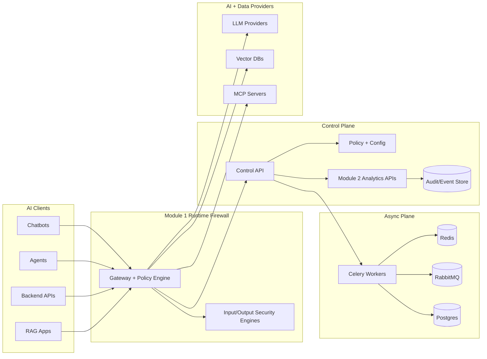
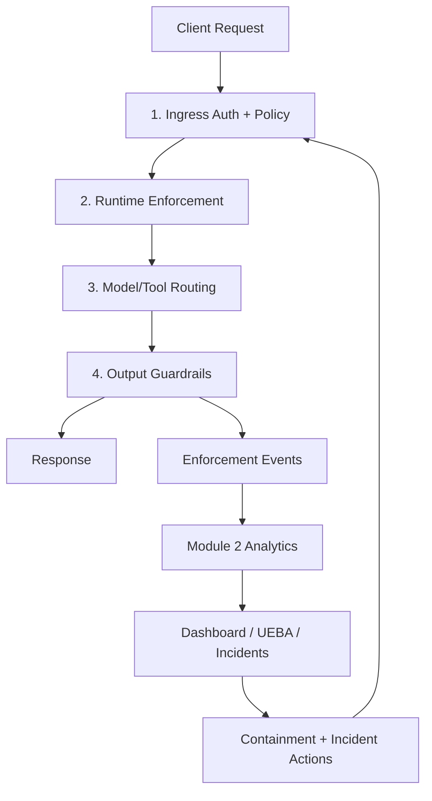
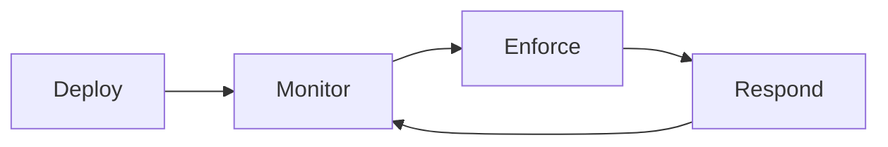

<div align="center">

# 🛡️ _ZeroShield — AI Mesh Firewall_

### _End-to-End AI Firewalling, Model Governance & SOC Operations (Module 1 + Module 2)_


_[AI Mesh Firewall](https://aisecshield.zeroshield.ai/?tab=firewall-1-4), a core module of [ZeroShield](https://zeroshield.ai)_

### Tech Stack


## 🚀 [Explore ZeroShield Solutions](https://zeroshield.ai)

</div>

---

## Table of Contents

* [About the AI Mesh Firewall](#about-the-ai-mesh-firewall)
* [System Architecture](#system-architecture)
  * [Architecture Diagram](#architecture-diagram)
  * [Request + SOC Flow](#request--soc-flow)
* [Platform Modules at a Glance](#platform-modules-at-a-glance)
  * [Module 1 — Runtime Firewall (1.1 to 1.7)](#module-1--runtime-firewall-11-to-17)
  * [Module 2 — SOC Intelligence & Response (2.1 to 2.7)](#module-2--soc-intelligence--response-21-to-27)
* [Deploy → Monitor → Enforce Lifecycle](#deploy--monitor--enforce-lifecycle)
* [Quick Start (Local)](#quick-start-local)
* [Module Documentation](#module-documentation)
* [Governance & Compliance](#governance--compliance)
* [Target Users & Real-World Scenarios](#target-users--real-world-scenarios)
* [Use Cases](#use-cases)
* [Platform Screenshots & Demo](#platform-screenshots--demo)
* [Support](#support)

---

## About the AI Mesh Firewall

ZeroShield's **AI Mesh Firewall** is a **server-side security, governance, and operations platform** for enterprise AI systems.

It secures the full runtime path (Module 1) and provides SOC-grade visibility and response workflows (Module 2):

- **Module 1** controls live traffic before and after model execution (ingress, RAG, vector, MCP, routing, kill-switch, output guardrails)
- **Module 2** provides dashboarding, UEBA, threat intel operations, incident triage, and analyst response workflows

No endpoint agent is required. Existing AI apps route through the gateway, and governance is controlled centrally from the platform UI.

### Why It Exists

| Problem | What ZeroShield Does |
|---|---|
| Prompt injection reaches models undetected | Inline detection and enforcement before model execution |
| Multi-tenant RAG leaks cross-tenant data | Vector and retrieval controls with namespace isolation |
| No unified governance across model providers | Single gateway endpoint + policy-driven model routing |
| No immediate response mechanism during incidents | Kill-switch and reroute controls at request time |
| Security team lacks operational visibility | SOC dashboards, UEBA analytics, threat intel, incidents |
| No compliance-grade traceability | Full audit trail with policy/action context |

---

## System Architecture

All AI clients call the AI Mesh Firewall gateway. The control plane manages policy, keys, and governance state, while asynchronous workers and analytics power monitoring and incident workflows.

### Architecture Diagram



### Request + SOC Flow



---

## Platform Modules at a Glance

### Module 1 — Runtime Firewall (1.1 to 1.7)

| Module | Capability |
|---|---|
| **1.1** | AI Gateway & traffic ingress |
| **1.2** | Pipeline-aware RAG firewall |
| **1.3** | Vector DB firewall |
| **1.4** | Context assembly & MCP guardrails |
| **1.5** | Multi-model governance & routing |
| **1.6** | Inline model isolation & kill-switch |
| **1.7** | Generator-level output guardrails |

### Module 2 — SOC Intelligence & Response (2.1 to 2.7)

| Module | Capability |
|---|---|
| **2.1** | Unified SOC dashboard and KPI telemetry |
| **2.2** | UEBA for API key behavioral risk and containment |
| **2.3** | Model and gateway exposure analytics |
| **2.4** | RAG lane and pipeline risk observability |
| **2.5** | MCP risk and tool governance analytics |
| **2.6** | Incident queue, detail, escalation, and resolution workflows |
| **2.7** | Threat intelligence operations and IOC-driven response |

---

## Deploy → Monitor → Enforce Lifecycle



- **Deploy:** onboard models, vector stores, API keys, and baseline policy.
- **Monitor:** observe traffic and risk posture across runtime and SOC layers.
- **Enforce:** apply block/redact/reroute controls and containment actions.
- **Respond:** investigate incidents, escalate/resolve, update threat intel.

---

## Quick Start (Local)

```bash
cp .env.sample .env
docker compose up -d postgres redis rabbitmq
docker compose up -d control workers gateway frontend
```

| Service | URL |
|---------|-----|
| UI | http://127.0.0.1:8180 |
| Control API | http://127.0.0.1:8100 |
| Gateway (direct) | http://127.0.0.1:8300 |
| RabbitMQ UI | http://127.0.0.1:15772 |

**Login (dev):** `admin@zeroshield.io` / `Adm1n!Pass#2024`

**Optional checks:**

```bash
node scripts/playwright_nine_modules.mjs
```

```powershell
cd frontend
npm run test:module2
```

```powershell
.\scripts\run-control-tests-postgres.ps1 module2.tests
```

---

## Module Documentation

### Module 1 (Runtime Firewall)

- [Architecture](docs/ARCHITECTURE.md)
- [Repository layout](docs/REPOSITORY_LAYOUT.md)
- [100k concurrency deployment](docs/DEPLOYMENT_100K.md)
- [Migration from monorepo](docs/MIGRATION_FROM_AIGUARDX.md)
- [Contracts](docs/contracts/)

### Module 2 (SOC Intelligence & Response)

- [Module 2 Docs Index](docs/MODULE2_DOCS_INDEX.md)
- [Module 2 Architecture](docs/MODULE2_ARCHITECTURE.md)
- [Module 2 GitHub Guide](docs/MODULE2_GITHUB_GUIDE.md)
- [Module 2 Product Manual (Client)](docs/MODULE2_PRODUCT_MANUAL_CLIENT.md)
- [Module 2 Technical Manual (Developers)](docs/MODULE2_TECHNICAL_MANUAL_DEVELOPERS.md)
- [Module 2 Operations Runbook](docs/MODULE2_OPERATIONS_RUNBOOK.md)
- [Module 2 Release Readiness Checklist](docs/MODULE2_RELEASE_READINESS_CHECKLIST.md)

---

## Governance & Compliance

| Area | Control |
|---|---|
| Identity & Access | API key auth, org scoping, role-gated write operations |
| Input Security | Prompt injection and sensitive-data controls |
| Retrieval Security | Namespace isolation and guarded retrieval policies |
| Model Governance | Risk-aware routing + kill-switch + fallback behavior |
| Output Security | Stream-time redaction/blocking controls |
| SOC Response | Incident workflows, threat intel operations, analyst actions |
| Auditability | Event telemetry and policy-linked audit trail |

---

## Target Users & Real-World Scenarios

| Persona | Primary Outcome |
|---|---|
| CISO / Security Teams | Centralized AI traffic control and incident response |
| Platform / DevOps Teams | Operable, policy-driven AI runtime with clear runbooks |
| Compliance Teams | Evidence-backed governance and audit readiness |
| AI/ML Teams | Safe model usage without slowing delivery |
| Product/SOC Teams | Visibility from live events to incident closure |

---

## Use Cases

- Prevent prompt injection and jailbreaks in production AI traffic
- Enforce PII/PHI and policy controls for regulated workloads
- Govern multi-tenant RAG retrieval and context assembly
- Route sensitive workloads to approved/private model lanes
- Trigger kill-switch/reroute actions for compromised providers
- Detect key misuse and high-risk patterns with UEBA
- Triage, escalate, and resolve incidents with analyst evidence
- Drive IOC-based response workflows from threat intel operations

---

## Platform Screenshots & Demo

| | |
|---|---|
| 📸 **Dashboard Overview** |  |
| 📸 **Policy Builder** |  |
| 📸 **Vector Collection Policies** |  |
| 📸 **MCP Scanner** |  |
| 📸 **Kill Switch Management** |  |
| 📸 **SOC / Incident Operations (Module 2)** |  |

🎬 **Demo Video**

https://github.com/user-attachments/assets/bc2f38f6-7123-4b56-8b79-fa0621fa4ab2

---

## Support

* 📧 **Contact**: [vartul@zeroshield.ai](mailto:vartul@zeroshield.ai)
* 📧 **Support Queries**: [support@zeroshield.ai](mailto:support@zeroshield.ai)

For enterprise deployments, integrations, or custom requirements, please reach out via the addresses above.

---

> **Value Proposition:** ZeroShield AI Mesh Firewall delivers centralized runtime protection (Module 1) plus SOC intelligence and response workflows (Module 2) in one platform, enabling secure, governable, and production-ready AI operations.

---

All rights reserved. This software and its documentation are the intellectual property of [ZeroShield](https://zeroshield.ai).
