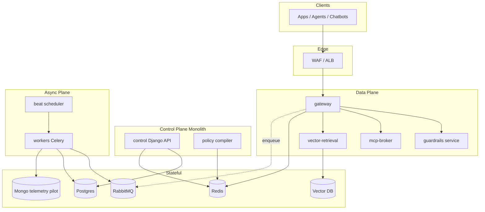

# AI Mesh Firewall — Architecture

Decision record after 5-agent triage: **hybrid split** (not pure monolith, not day-one full microservices).

## Principles

1. **Gateway never hits control-plane Postgres on the hot path** — only Redis signed policy bundles + auth cache.
2. **Control plane owns truth** — policies, orgs, API keys, model registry, kill switches.
3. **Async everything non-blocking** — telemetry, Tier-2, vector ingest, MCP audit via queues.
4. **Contracts versioned** — `PolicyBundle.v1`, `TelemetryEvent.v1`, `MCPDecision.v1`, `JobEnvelope.v1`.
5. **Extract services when measured** — queue depth, SLO miss, or team ownership conflict for 4+ weeks.

## Topology

## Celery queues (workers)

| Queue | Workload | Scale signal |
|-------|----------|--------------|
| `policy.compile` | Compile + push signed bundles | Depth > 100 for 2 min |
| `platform.batch` | Telemetry drain, gateway jobs, alerts | Oldest message age > 10s |
| `compute.heavy` | Audit cleanup, risk scores, reports | CPU-saturated workers |
| `scan.tier2` | Deferred Bedrock/ML scans | p95 task time > 30s |
| `vector.index` | Embedding ingest / pgvector batch | Backlog growth |
| `mcp.audit` | MCP tool audit fanout | Connector burst |

## Security boundaries

- North-south: API keys / JWT (clients → gateway, UI → control).
- East-west: mTLS workload identity (target); until then signed internal headers + network policies.
- Policy integrity: HMAC/Ed25519 signed bundles; gateway fail-closed if cache unsigned/unloaded.
- Tenant isolation: org-scoped Redis keys, vector namespaces, DB row-level org_id.

## SLO targets (standalone GA)

| Path | Availability | Latency added |
|------|--------------|---------------|
| Gateway enforcement | 99.95% | p95 ≤ 25 ms |
| Control API | 99.9% | — |
| Telemetry enqueue | — | p95 ≤ 5 ms |

See [DEPLOYMENT_100K.md](./DEPLOYMENT_100K.md) for instance sizing.
