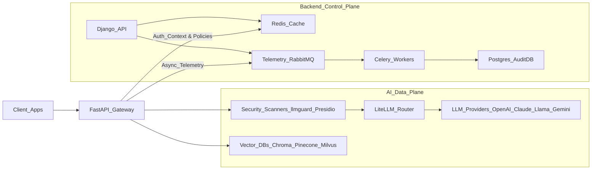
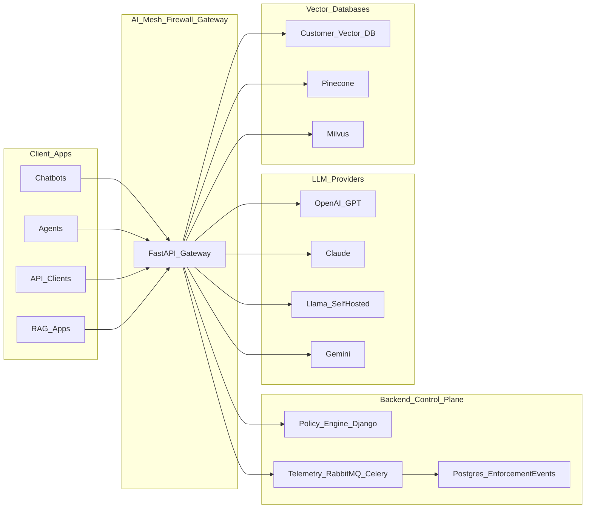
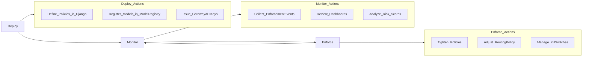
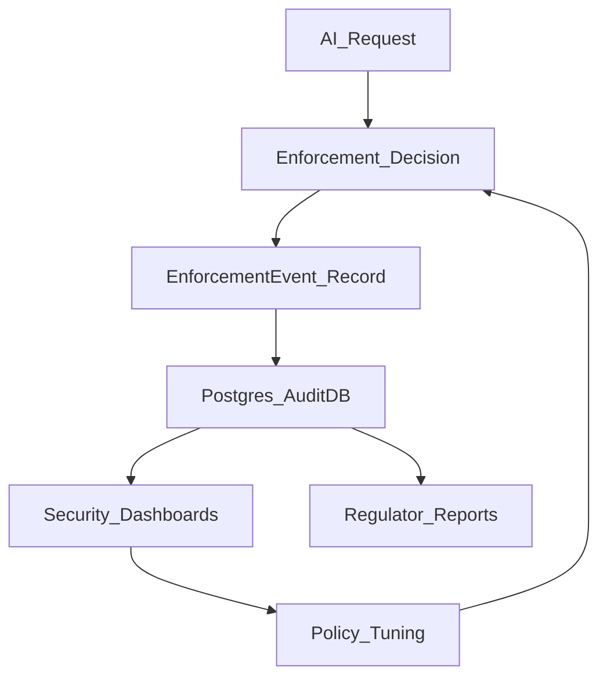

### ZeroShield Module 1 – AI Mesh Firewall

**End-to-end control, inspection, and governance for every AI request and response.**

Module 1 of the ZeroShield platform turns your AI stack into a governed, policy-aware mesh: every prompt, retrieval, and model response is inspected, enforced, and audited in real time across chatbots, agents, APIs, and RAG workloads.

---

### Table of Contents

- [About the AI Mesh Firewall (Module 1)](#about-the-ai-mesh-firewall-module-1)
- [System Architecture](#system-architecture)
  - [High-Level Components](#high-level-components)
  - [Architecture Diagram](#architecture-diagram)
- [Request Flow: Policy Check & Enforcement](#request-flow-policy-check--enforcement)
  - [1. Chat & Agent Requests](#1-chat--agent-requests)
  - [2. RAG Queries](#2-rag-queries)
  - [3. MCP / Context Injection Flows](#3-mcp--context-injection-flows)
- [Deploy → Monitor → Enforce Lifecycle](#deploy--monitor--enforce-lifecycle)
- [Core Modules (1.1 – 1.7)](#core-modules-11--17)
  - [1.1 AI Gateway & Traffic Ingress](#11-ai-gateway--traffic-ingress)
  - [1.2 Pipeline-Aware RAG Firewall](#12-pipeline-aware-rag-firewall)
  - [1.3 Vector DB Firewall](#13-vector-db-firewall)
  - [1.4 Context Assembly & MCP Guardrails](#14-context-assembly--mcp-guardrails)
  - [1.5 Multi-Model Governance & AI Mesh Routing](#15-multi-model-governance--ai-mesh-routing)
  - [1.6 Inline Model Isolation & Kill-Switch](#16-inline-model-isolation--kill-switch)
  - [1.7 Generator-Level Output Guardrails](#17-generator-level-output-guardrails)
- [Governance & Compliance](#governance--compliance)
- [Target Users & Real-World Scenarios](#target-users--real-world-scenarios)
- [Key Use Cases](#key-use-cases)
- [Getting Started (Conceptual Overview)](#getting-started-conceptual-overview)
- [Support](#support)
- [Value Proposition](#value-proposition)
- [Legal](#legal)

---

### About the AI Mesh Firewall (Module 1)

ZeroShield’s **Module 1 – AI Mesh Firewall** is a Layer 7 (L7) security and governance mesh for AI systems. It sits in front of all your models and RAG pipelines to:

- **Control** every AI request and response (chatbots, agents, APIs, RAG).
- **Inspect** prompts, retrievals, and generations for risk (prompt injection, PII, secrets, IP leakage).
- **Enforce** real-time policy decisions (block, redact, rewrite, downgrade, or route to safer models).
- **Govern** multi-model environments with per-tenant isolation, budgets, and kill-switches.

This README describes **Module 1 only (AI Mesh Firewall)**. Later modules (e.g., behavioral analytics, advanced hallucination detection) are out of scope here.

---

### System Architecture

#### High-Level Components

- **Endpoints (Clients)**  
  - Chatbots, agent frameworks, backend services, and user-facing applications.  
  - They never talk directly to LLM providers or vector databases—only to the Gateway.

- **AI Gateway / L7 Firewall (FastAPI)**  
  - Acts as the **central ingress** for all AI traffic.  
  - Enforces authentication, tenant isolation, token-aware rate limiting, and inline security scanning.  
  - Integrates **LiteLLM** for multi-model routing and **SecurityStreamingResponse** for streaming-safe responses.

- **Backend Control Plane (Django + Redis + Celery + RabbitMQ + Postgres)**  
  - **Django**: defines Projects, Tenants, API Keys, Model Registry, Rules, Kill Switches, and Enforcement Events.  
  - **Redis**: low-latency cache for auth context, policies, and model configuration, pushed from the backend.  
  - **RabbitMQ + Celery**: async telemetry pipeline for high-throughput enforcement logs and analytics.  
  - **Postgres**: system of record for policies, configuration, and audit history.

- **Downstream AI & Data Services**  
  - **LLM Providers**: OpenAI, Claude, Llama (self-hosted), Gemini, and others via LiteLLM.  
  - **Vector Databases**: Customer-managed Pinecone, Milvus, or custom providers (proxied or logically controlled).  
  - **Security Engines**: `llm-guard`, Presidio, OWASP-aligned detectors used inline for scanning.

#### Architecture Diagram



The diagram below highlights the **mesh topology** of Module 1, where each model and vector database behaves like a governed service behind the AI Mesh Firewall:



At runtime, the Gateway enforces policies and security decisions based on **pre-synchronized** rules and context from the Backend Control Plane, without touching the database on each request.

---

### Request Flow: Policy Check & Enforcement

Every AI interaction passes through the same governed pipeline, regardless of which model or provider is used.

1. **Ingress & Identity**
   - Request hits the **FastAPI Gateway** (`/v1/chat/completions`, `/v1/rag/query`, etc.).  
   - `AuthMiddleware` validates API Keys / JWTs using Redis-backed lookups.  
   - The Gateway injects identity and tenant metadata into `request.state.context` (e.g., user/agent ID, tenant ID, risk score, token budget, policy version).

2. **Policy Resolution**
   - Gateway reads **compiled policies** from its in-memory/Redis cache (pushed from Django).  
   - Policies are **pipeline-aware**: rules are scoped to stages such as INPUT, RETRIEVAL, and OUTPUT.  
   - No live SQL queries are needed, keeping decisions sub-millisecond.

3. **Input Scanning & Classification**
   - Requests are classified as **chat**, **agent task**, **RAG query**, or **MCP/context injection** based on payload structure.  
   - Inline scanners (`llm-guard`, Presidio, and custom detectors) run asynchronously to detect:
     - Prompt injections and jailbreaks (e.g., “DAN”, “Ignore previous instructions…”).  
     - PII/PHI and other sensitive entities.  
     - Credential and secret patterns.  
     - Intent (e.g., exfiltration vs normal query).  
   - Policies drive actions: **block**, **rewrite**, **mask**, or **downgrade to a safer model**.

4. **RAG-Aware Controls & Vector Firewall (If Applicable)**
   - For RAG queries, the Firewall:
     - Enforces **tenant and namespace isolation** in vector DB queries.  
     - Scans retrieved chunks for **indirect prompt injection**, toxicity, and sensitive data.  
     - Drops or redacts high-risk context before it reaches the model.

5. **Multi-Model Routing & Isolation**
   - LiteLLM acts as the unified API layer for all providers.  
   - Routing decisions consider:
     - Data sensitivity and compliance requirements.  
     - Tenant token budgets and cost controls.  
     - Latency SLAs and model risk scores.  
   - Per-model isolation and kill-switch state is checked before any downstream call.

6. **Generator-Level Output Guardrails**
   - As tokens stream back, the Gateway wraps responses in a **SecurityStreamingResponse**.  
   - Chunked content is buffered and scanned for:
     - PII/PHI and regulated data.  
     - Credential/IP leakage.  
     - Policy violations and basic hallucination risk signals.  
   - Policies can **block**, **redact**, **rewrite**, or **escalate to human review** before output reaches the client.

7. **Telemetry & Audit**
   - Each transaction emits a **structured telemetry event** (prompt hash, model, latency, risk score, policy version, action taken).  
   - Events are pushed asynchronously to RabbitMQ and processed in batches by Celery, populating the **EnforcementEvent** tables in Postgres for dashboards, investigations, and compliance reporting.

The following diagram summarizes the **end-to-end enforcement pipeline** for a single request:

```mermaid
flowchart LR
  client[Client_or_Agent] --> ingress[Gateway_Ingress]
  ingress --> authMiddleware[AuthMiddleware]
  authMiddleware --> policyEngine[PolicyEngine_Cache]
  policyEngine --> inputScanner[InputScanner_llmguard_Presidio]
  inputScanner --> decisionInput[Input_Decision]

  decisionInput -->|\"allow_chat\"| routerEntry[Route_Evaluator]
  decisionInput -->|\"allow_rag\"| ragEntry[RAG_Entry]
  decisionInput -->|\"block\"| blockReturn[HTTP_403]

  ragEntry --> ragFirewall[RAG_Firewall]
  ragFirewall --> vectorFirewall[Vector_DB_Firewall]
  vectorFirewall --> vectorDb[Vector_DB]
  vectorDb --> contextScanner[Context_Scanner]
  contextScanner --> contextAssembler[Context_Assembler]
  contextAssembler --> routerEntry

  routerEntry --> litellmRouter[LiteLLM_Router]
  litellmRouter --> killSwitchCheck[KillSwitch_Check]
  killSwitchCheck -->|\"active\"| kill503[HTTP_503_Model_Disabled]
  killSwitchCheck -->|\"ok\"| modelCall[LLM_Call]

  modelCall --> outputGuard[Output_Guardrails]
  outputGuard --> response[Response_to_Client]

  outputGuard --> telemetryEmitter[Telemetry_Emitter]
  telemetryEmitter --> rabbitMq[RabbitMQ]
  rabbitMq --> celeryWorker[Celery_Worker]
  celeryWorker --> enforcementEvents[EnforcementEvent_Postgres]
```

#### 1. Chat & Agent Requests

- Typical path for support bots, copilots, and orchestrated agents.  
- Emphasis on **prompt injection defense**, **PII redaction**, **model isolation**, and **cost controls**.  
- Policies can differentiate between end-user traffic and privileged agent traffic (service accounts).

#### 2. RAG Queries

- Includes document search, knowledge bots, and enterprise RAG APIs.  
- Emphasis on **vector firewalling**, **cross-tenant isolation**, and **context scanning** to stop poisoned or exfiltrating documents from influencing responses.  
- Retrieval and generation stages can have **separate rules** and enforcement actions.

#### 3. MCP / Context Injection Flows

- For tools and connectors (MCP-style) that pull data into model prompts.  
- Emphasis on **least-privilege context**: what context a given user/agent is allowed to see.  
- MCP guardrails enforce field-level redaction and tagging (e.g., PII, IP, regulated data) to prevent data leakage through tools and plugins.

---

### Deploy → Monitor → Enforce Lifecycle

Module 1 is designed to be adopted in stages so security teams can gain visibility before turning on strict controls.

1. **Deploy**
   - Point all AI workloads (chatbots, agents, backend services) to the **Gateway endpoints** instead of calling LLM providers directly.  
   - Onboard tenants, projects, and **Gateway API Keys** via the backend.  
   - Configure basic routing (e.g., primary and fallback models) and vector DB integrations.

2. **Monitor**
   - Enable full telemetry capture to understand:
     - Which models are being used and by whom.  
     - Where prompt injections, sensitive data, or policy violations are appearing.  
     - How tokens and budgets are being consumed across tenants.  
   - Use dashboards built from **EnforcementEvent** data to baseline normal vs risky behavior.

3. **Enforce**
   - Gradually enable stricter policies and actions:
     - Start in **monitor mode** (log-only).  
     - Move to **mask/redact** for PII/PHI and secrets.  
     - Enable **block** and **model downgrade** for high-risk prompts or tenants out of budget.  
     - Activate **kill-switch** for specific models or providers when needed.  
   - Policy updates propagate from the backend to the Gateway via Redis **in under one second**, enabling near-real-time governance.

The **Deploy → Monitor → Enforce** lifecycle can be seen as a closed feedback loop:



---

### Core Modules (1.1 – 1.7)

#### 1.1 AI Gateway & Traffic Ingress

- **What it does**: Centralizes all AI traffic—chatbots, agents, direct API calls, RAG queries, and MCP context requests—through a single FastAPI-based gateway.  
- **Where it sits**: Network entry point, fronting all LLMs and vector databases.  
- **Key capabilities**:
  - Authentication for users, services, and agents (API Keys and JWT).  
  - Tenant isolation and per-project context injection.  
  - Token-aware rate limiting and AI traffic shaping (including DDoS-style flood control).  
- **Example outcome**: A misconfigured agent cannot bypass controls by calling an LLM provider directly; it must pass through the Gateway where identity and quotas are enforced.

#### 1.2 Pipeline-Aware RAG Firewall

- **What it does**: Distinguishes between **simple chat** and **RAG pipelines**, then applies rules to each stage—Query, Retriever, Ranker, and Generator.  
- **Where it sits**: Within the Gateway’s request processing pipeline.  
- **Key capabilities**:
  - Detects prompt injections, jailbreak patterns, and malicious instructions in queries.  
  - Classifies user intent and sensitive topics before retrieval.  
  - Applies inline actions: **block, rewrite, mask, or downgrade** to a lower-risk model.  
- **Example outcome**: A user trying a “DAN” style jailbreak with embedded exfiltration instructions is blocked at the **query stage** before any retrieval or generation occurs.

RAG-aware enforcement for a retrieval flow:

```mermaid
flowchart TD
  ragClient[RAG_Client] --> gatewayRagEntry[Gateway_RAG_Endpoint]
  gatewayRagEntry --> queryScanner[Query_Scanner]
  queryScanner -->|\"clean\"| vectorFirewall[Vector_DB_Firewall]
  queryScanner -->|\"malicious\"| ragBlock[HTTP_403]

  vectorFirewall -->|\"inject_tenant_filter\"| vectorDb[Vector_DB]
  vectorDb --> retrievedChunks[Retrieved_Chunks]
  retrievedChunks --> contextScanner[Context_Scanner]
  contextScanner -->|\"drop_poison\"| contextAssembler[Context_Assembler]
  contextAssembler --> generatorStage[Generator_Stage]
  generatorStage --> outputGuardRag[Output_Guardrails]
  outputGuardRag --> ragResponse[RAG_Response]
```

#### 1.3 Vector DB Firewall

- **What it does**: Protects vector databases (Chroma, Pinecone, Milvus) from abuse and leakage.  
- **Where it sits**: Between clients and vector DBs, or as an enforcement layer on RAG payloads before generation.  
- **Key capabilities**:
  - Collection-level and namespace-level access control.  
  - Mandatory metadata filters (such as `tenant_id`) enforced for every query.  
  - Detection of **vector poisoning** and anomalous embeddings.  
  - Prevention of sensitive or cross-tenant document retrieval.  
- **Example outcome**: A query attempting to read embeddings from another tenant’s collection is automatically rejected with a 403, even if the underlying vector DB was misconfigured.

#### 1.4 Context Assembly & MCP Guardrails

- **What it does**: Controls which pieces of context are assembled into the final prompt and how MCP-style tools can access data.  
- **Where it sits**: At the context assembly layer, just before generation.  
- **Key capabilities**:
  - **Context minimization** (least privilege) to reduce over-sharing.  
  - Field-level redaction for PII, IP, and regulated attributes.  
  - Per-user and per-agent rules defining which MCP tools and data scopes are allowed.  
- **Example outcome**: An agent tool that can view ticket metadata is prevented from reading full customer PII fields unless explicitly allowed by policy.

#### 1.5 Multi-Model Governance & AI Mesh Routing

- **What it does**: Treats models as services in a mesh, routing traffic intelligently across OpenAI, Claude, Llama, Gemini, and others via LiteLLM.  
- **Where it sits**: In the Gateway’s integration with LiteLLM.  
- **Key capabilities**:
  - Dynamic routing driven by data sensitivity, compliance constraints, budgets, latency SLAs, and model risk scores.  
  - Seamless switching between providers without changing client code (OpenAI-compatible schema).  
  - Support for private/self-hosted models as first-class citizens.  
- **Example outcome**: Prompts containing PII are automatically routed to a private Llama deployment, while generic FAQs are sent to a public GPT-4 endpoint to optimize both privacy and cost.

Routing and kill-switch decisions in the mesh:

```mermaid
flowchart LR
  inboundReq[Inbound_Request] --> routingPolicy[RoutingPolicy_Evaluator]

  routingPolicy --> piiCheck[PII_Check]
  routingPolicy --> budgetCheck[Budget_Check]
  routingPolicy --> latencyCheck[Latency_Check]

  piiCheck -->|\"pii_present\"| riskHigh[Risk_High]
  piiCheck -->|\"no_pii\"| riskLow[Risk_Low]

  riskHigh --> modelPrivate[Private_Model_Llama]
  riskLow --> modelPublic[Public_Model_OpenAI]

  budgetCheck -->|\"exceeded\"| downgradeModel[Downgrade_Model_Tier]
  downgradeModel --> modelCheaper[Cheaper_Model]

  latencyCheck --> slaTarget[SLA_Target_Region_Model]

  modelPrivate --> killSwitchCheckPrivate[KillSwitch_Check_Private]
  modelPublic --> killSwitchCheckPublic[KillSwitch_Check_Public]
  modelCheaper --> killSwitchCheckCheaper[KillSwitch_Check_Cheaper]
  slaTarget --> killSwitchCheckSla[KillSwitch_Check_SLA]

  killSwitchCheckPrivate -->|\"on\"| private503[503_Private_Disabled]
  killSwitchCheckPrivate -->|\"off\"| callPrivate[Call_Private_Model]

  killSwitchCheckPublic -->|\"on\"| public503[503_Public_Disabled]
  killSwitchCheckPublic -->|\"off\"| callPublic[Call_Public_Model]

  killSwitchCheckCheaper -->|\"on\"| cheaper503[503_Cheaper_Disabled]
  killSwitchCheckCheaper -->|\"off\"| callCheaper[Call_Cheaper_Model]

  killSwitchCheckSla -->|\"on\"| sla503[503_SLA_Target_Disabled]
  killSwitchCheckSla -->|\"off\"| callSla[Call_SLA_Target_Model]
```

#### 1.6 Inline Model Isolation & Kill-Switch

- **What it does**: Isolates models logically and allows instant shutdown for any model or provider.  
- **Where it sits**: At the ingress and routing layers in the Gateway.  
- **Key capabilities**:
  - Separate credentials, rate limits, and risk scores per model.  
  - Global and per-tenant **kill-switch** flags stored in Redis and checked on every request.  
  - Automatic fallbacks to alternate models when a provider is disabled.  
- **Example outcome**: A suspected compromise of a specific model (e.g., GPT-4) can be mitigated by flipping a single kill-switch, returning a controlled error or failover route for that model across all tenants.

#### 1.7 Generator-Level Output Guardrails

- **What it does**: Inspects and governs model responses before they leave the Gateway.  
- **Where it sits**: On the response path, wrapping streaming responses and final payloads.  
- **Key capabilities**:
  - PII/PHI/PD leakage detection and redaction using Presidio and pattern-based detectors.  
  - Detection of credentials, secrets, and IP leakage.  
  - Actions: **block**, **redact**, **rewrite**, or flag for **human review**.  
  - Security incident logging for downstream SIEM and compliance workflows.  
- **Example outcome**: A model that attempts to output a secret or customer identifier is intercepted; the response is masked or blocked, and a security incident is recorded for follow-up.

---

### Governance & Compliance

Module 1 is designed for security, risk, and compliance teams who need enforceable controls over AI behavior.

- **Data Protection & DLP**
  - PII/PHI detection and masking using Microsoft Presidio and complementary pattern rules.  
  - Support for reversible pseudonymization where needed (e.g., `<PERSON_1>` tokens for internal correlation).

- **Tenant & Namespace Isolation**
  - Enforced at ingress, RAG retrieval, and context assembly layers.  
  - Mandatory filters ensure that tenants cannot read or infer each other’s data, even through embeddings.

- **Policy Versioning & Auditability**
  - Policies are compiled centrally and synchronized to Gateways.  
  - Every enforcement decision is tagged with **policy version** and **risk score**, enabling reproducible investigations.

- **Model Risk & Routing**
  - High-risk content can be directed to **lower-risk models** (e.g., private or region-locked deployments).  
  - Cost and token budgets are enforced per tenant to prevent uncontrolled spend.

- **Testing & Validation (Non‑Runtime)**
  - Tools such as **Garak** (red‑teaming) and **PromptFoo** (prompt regression) can be used against the Gateway to continually validate that policies and RAG protections are effective.  
  - These tools do not run in the live request path but are used to harden Module 1 over time.

How enforcement decisions become compliance evidence:



---

### Target Users & Real-World Scenarios

- **Security & GRC Leaders**
  - Need to prove to boards and regulators that AI systems are **controlled, auditable, and policy-driven**.  
  - Use Module 1 to centralize AI traffic, enforce data boundaries, and generate a complete audit trail of AI decisions.

- **Platform / ML Platform Teams**
  - Own the shared AI infrastructure across multiple business units.  
  - Use Module 1 to provide a **governed AI mesh** where application teams can innovate while respecting central security controls.

- **AI Product & Application Teams**
  - Build chatbots, copilots, and RAG apps.  
  - Use Module 1 as a drop-in Gateway so they do not need to re‑implement security, routing, and logging logic in each service.

**Example Scenarios**

- Launching a customer support copilot that **must not leak PII** to public LLM providers.  
- Offering “bring your own model” capabilities while still maintaining **central kill‑switch** and governance.  
- Proving to auditors that **every AI response** can be traced to its input, policy version, and model.

---

### Key Use Cases

- **Secure Enterprise RAG**: Protect retrieval queries, documents, and responses across knowledge bots and search experiences.  
- **Multi‑Tenant AI Platforms**: Enforce strong tenant and namespace isolation for SaaS-style AI offerings.  
- **Vendor Risk Control**: Safely adopt multiple LLM vendors while maintaining a single control point for routing and shutdown.  
- **Emergency Kill‑Switch Operations**: Instantly disable models or providers across all tenants in response to incidents.  
- **Regulatory & Compliance Readiness**: Provide defensible evidence of controls for data protection, AI safety, and model governance.  
- **Red‑Team & Testing Harness**: Use the Gateway as the single surface for continuous security testing and regression validation.

---

### Getting Started (Conceptual Overview)

This section provides a **high-level integration view**. For step‑by‑step setup, refer to the main project README and deployment guides.

- **1. Connect Clients to the Gateway**
  - Update chatbots, agents, and backend services to call the **Gateway endpoints** (`/v1/chat/completions`, `/v1/rag/query`, etc.) instead of direct provider URLs.  

- **2. Onboard Tenants & API Keys**
  - In the backend, create **Projects/Tenants** and issue **Gateway API Keys** for human users and machine agents.  
  - API Keys are synchronized to Redis so the Gateway can authenticate and inject identity context with near‑zero latency.

- **3. Register Models & Vector Stores**
  - Use the Model Registry to define providers (OpenAI, Claude, Llama, Gemini, etc.) and attach credentials.  
  - Configure vector databases (Chroma, Pinecone, Milvus) behind the Vector DB Firewall path where applicable.

- **4. Define Policies**
  - Create rules for each pipeline stage (Ingress, Input, Retrieval, Output):  
    - What to block, mask, rewrite, or route differently.  
    - Which tenants can access which models and collections.  
  - Policies are compiled and pushed to Redis so Gateways enforce them without per‑request database hits.

- **5. Turn On Telemetry & Iterate**
  - Enable full telemetry capture and review EnforcementEvent data to understand current risks.  
  - Gradually move from **monitor** to **enforce** modes as your risk posture matures.

---

### Support

- 📧 **Contact**: `vartul@zeroshield.ai`  
- 📧 **Support Queries**: `support@zeroshield.ai`

For enterprise deployments, integrations, or custom feature requests, please reach out to the ZeroShield team via the addresses above.

---

### Value Proposition

ZeroShield’s **AI Mesh Firewall (Module 1)** delivers:

- **Centralized control** over all AI traffic—no more unmanaged, direct-to-LLM calls.  
- **Pipeline-aware RAG firewalling** that understands and governs each stage of retrieval and generation.  
- **Multi-model governance** so you can mix and match providers without losing control.  
- **Inline model isolation and kill‑switches** to respond to incidents in real time.  
- **Compliance‑grade observability** with full audit trails of policies, prompts, responses, and actions taken.

By deploying Module 1, organizations gain a **single, enforceable security and governance layer** across their entire AI estate.

---

### Legal

All rights reserved. This software and its documentation are the intellectual property of **ZeroShield**.  
Unauthorized reproduction, distribution, or modification of this material, in whole or in part, is strictly prohibited without prior written consent from ZeroShield.

