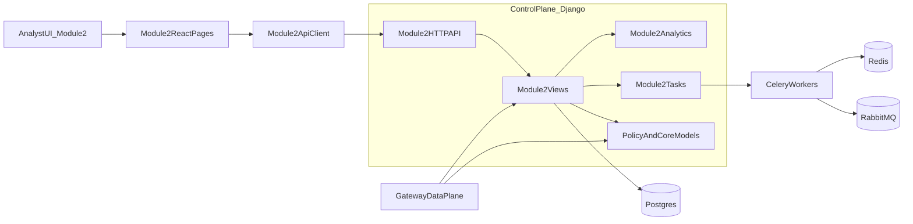
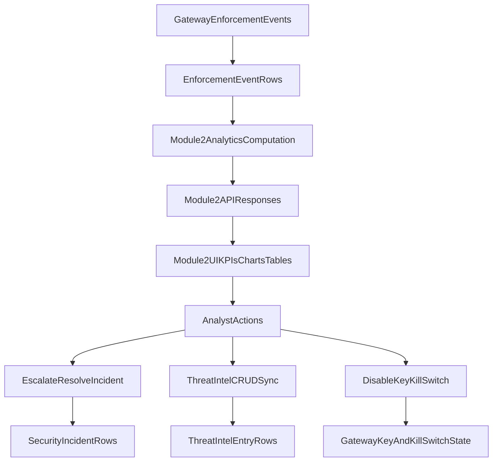

# Module 2 Architecture

## Purpose

Module 2 is the SOC intelligence and response layer of AI Mesh Firewall. It consumes enforcement telemetry and incident data, then provides analyst workflows for:

- unified dashboarding
- UEBA for API key behavior
- model/RAG/MCP risk visibility
- threat intelligence operations
- incident triage and forensics

Module 2 is independent in feature ownership, but connected to the same platform services as Module 1.

## Architecture Boundaries

### Module 2 owns

- Module 2 frontend pages under `frontend/src/pages/module2`
- Module 2 backend APIs under `control/ai_mesh_control/module2`
- Module 2 analytics and tasks under `control/ai_mesh_control/module2/analytics.py` and `tasks.py`
- Module 2 specific docs and runbooks under `docs/MODULE2_*`

### Module 2 depends on

- shared auth and org scoping (`auth`, JWT, user profile organization)
- shared policy/enforcement models (`EnforcementEvent`, `SecurityIncident`)
- shared core controls (`GatewayAPIKey`, `KillSwitch`)
- shared infra components (Postgres, Redis, RabbitMQ, Celery workers)

## High-Level Component View

## End-to-End Data Flow

## Module 2 API Surface

Module 2 routes are defined in `control/ai_mesh_control/module2/urls.py`.

Primary endpoint groups:

- `/api/module2/dashboard/`
- `/api/module2/ueba/api-keys/*`
- `/api/module2/models/exposure/`
- `/api/module2/rag/health/`
- `/api/module2/mcp/risk/`
- `/api/module2/threat-intel/*`
- `/api/module2/incidents/` and `/api/module2/incidents/{id}/`

## Frontend Integration Map

Main routes are mounted in `frontend/src/App.jsx`:

- `/dashboard`
- `/ueba/api-keys`
- `/models/exposure`
- `/mcp/risk`
- `/threat-intel`
- `/incidents`
- `/incidents/:id`

## Security and Data Protection Controls

Module 2 architecture includes these controls:

- org-scoped incident access for non-superusers
- incident timeline metadata allowlist/redaction
- threat intel write gating to admin/superuser
- strict incident filter validation with fail-fast `400`
- cache isolation by auth scope at frontend API client
- task dedupe/locking for alert/anomaly-triggered incident generation

## Reliability and Scalability Patterns

- request sequencing on data-heavy pages to prevent stale overwrite
- bounded cache TTL with mutation invalidation
- aggregated timeline generation to reduce query amplification
- async task offloading for heavy or periodic processing
- endpoint/task timing logs for production observability

## Relationship to Existing System Docs

- System-wide baseline: [Architecture](./ARCHITECTURE.md)
- AWS production topology: [AWS Deployment Architecture](./AWS_DEPLOYMENT_ARCHITECTURE.md)
- Load/deployment strategy: [Deployment 100k](./DEPLOYMENT_100K.md)
- Module 2 release status: [Module 2 Release Readiness Checklist](./MODULE2_RELEASE_READINESS_CHECKLIST.md)

## Related Module 2 Docs

- [Module 2 Docs Index](./MODULE2_DOCS_INDEX.md)
- [Module 2 Product Manual (Client)](./MODULE2_PRODUCT_MANUAL_CLIENT.md)
- [Module 2 Technical Manual (Developers)](./MODULE2_TECHNICAL_MANUAL_DEVELOPERS.md)
- [Module 2 Operations Runbook](./MODULE2_OPERATIONS_RUNBOOK.md)
- [Module 2 GitHub Guide](./MODULE2_GITHUB_GUIDE.md)

