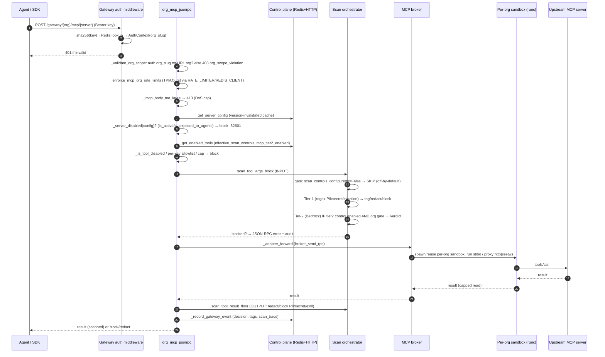
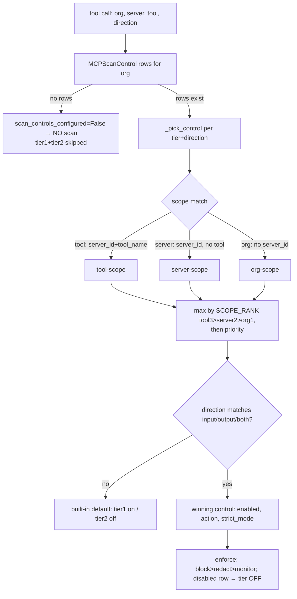
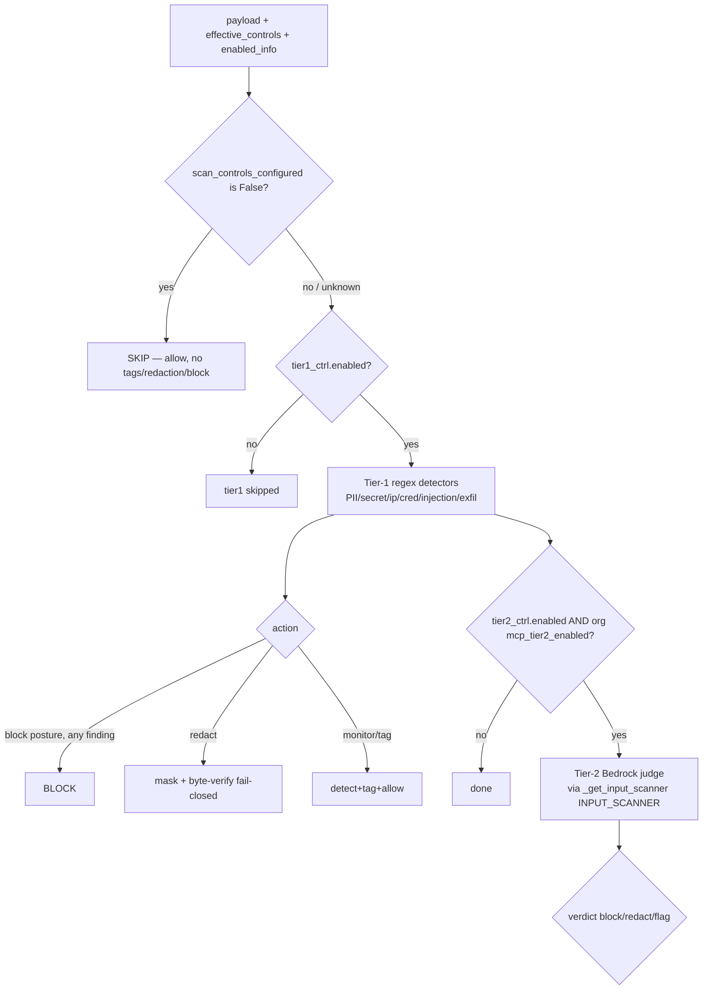
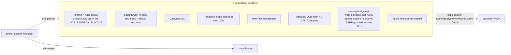
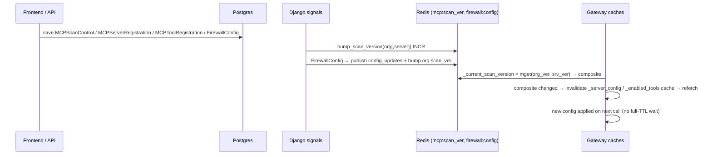

# MCP Platform — Architecture & Sequence Diagrams

Grounded in the live-validated behavior of the running stack (see
`MCP_VALIDATION_ROOTCAUSE_REPORT.md` for evidence). Code refs are to the current tree.
Components: **frontend** (React) → **control plane** (Django, `control/ai_mesh_control`) →
**gateway** (FastAPI, `gateway/ai_mesh_gateway`) → **broker** (`services/mcp-broker`) →
**per-org sandbox** (`ai-mesh/mcp-sandbox`) → upstream MCP server.

---

## 1. MCP tool-call lifecycle (Streamable-HTTP JSON-RPC route)

Note: **stdio / websocket** are always sandbox-routed; **streamable-http / sse** route via
the sandbox by default (`MCP_HTTP_VIA_SANDBOX`, default on) with a legacy direct-httpx
fallback. Internal routes `/v1/mcp/internal/tools-call` and `/discover-tools` (used by the
control-plane `MCPToolCallView`/`MCPToolListView`) apply the same `_server_disabled` +
tool-disable + scan gates.

---

## 2. Scan-control resolution & precedence

Precedence (verified live + executable probe): **tool > server > org**, higher `priority`
wins within a scope, scope dominates priority, direction filters, a winning `enabled=False`
row turns the tier OFF for that scope. Action floor: `block > redact > monitor/tag(observe)`.
Config changes bump `mcp:scan_ver:{org}[:{server}]` (Redis) → version-invalidated caches
refetch promptly.

---

## 3. Two-tier scanning decision

Off-by-default gate keys on an **affirmative** `is False`, so a control-plane outage
(flag absent) **fails safe to scanning**. Tier-2 reaches Bedrock only when a tier2 control
is enabled AND the org `mcp_tier2_enabled` gate is on (else skipped).

---

## 4. Sandbox architecture (per-org isolation)

Command allowlist blocks arbitrary executables; SSRF egress guard blocks reserved/internal
addresses on remote MCP URLs; idle reaper cleans up sandboxes. All verified live.

---

## 5. Config → behavior propagation

`_get_server_config` and `_get_enabled_tools` are both version-invalidated (the #17 fix
brought `_get_server_config` in line), so disable/enable/scan-control/Tier-2 toggles take
effect on the next call rather than after the 120s/30s TTL.
