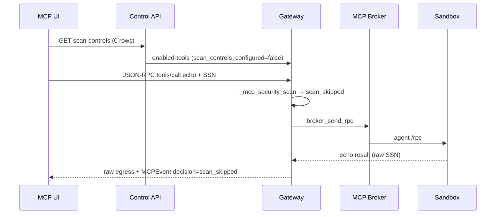

# MCP Platform Validation — Coverage Report

**Last updated:** 2026-07-09 (Ralph iterations 1–19)  
**Canonical architecture:** `docs/mcp/VALIDATION_ITER1_ARCHITECTURE.md`  
**Production readiness:** `docs/mcp/VALIDATION_PRODUCTION_READINESS.md`

## Executive summary

| Plane | Status | Evidence |
|-------|--------|----------|
| Scan controls off-by-default (org JSON-RPC) | **VERIFIED** | iter3, iter5, iter11, iter14 multi-org |
| Scan matrix (direction × action × scope) | **VERIFIED** | iter11 (11 cases), iter7/8 |
| Policy plane (control `/tools/call/`) | **VERIFIED** | iter10, iter13 policy matrix |
| Two-plane independence (F-005) | **VERIFIED** | gateway raw @ 0 scan rows; control masked when MCP policies on |
| Multi-org isolation | **VERIFIED** | iter5, iter14 cross-tenant 6/6 → 403 |
| Org-scoped scan controls | **VERIFIED** | iter14 org-a block does not affect org-b |
| Tier-2 gate | **VERIFIED** | iter4, iter11 (`tier2_skipped` when org disabled) |
| ext_mcp_proxy static floors (F-012) | **VERIFIED** | iter12 bare-proxy 60/60; iter13 live mcp-stub |
| Sandbox posture (runc) | **VERIFIED** | iter6, iter14 sandbox inspect |
| gVisor (F-007) | **BLOCKED (infra)** | runsc not installed; sandboxes use runc |
| PolicyTestView F-013 | **FIXED + VERIFIED** | `evaluation_views.py`; iter14 live `policy_id` without `policy_domain` → block |
| Image bake (F-009–F-013) | **VERIFIED** | iter17 `docker compose build` + parity post-bake |
| Transport fleet (stdio/http/sse/ws) | **VERIFIED** | iter19 **16/16 strictFleetPass** (SSE 86ms post-F-014) |
| F-014 SSE transport reliability | **FIXED** | `sse_manager.py`; iter18 8/8 + iter19 fleet |
| UI scan-off + Scan Controls tab | **VERIFIED** | iter19 Playwright iter4/iter5 |
| Final validation gate | **VERIFIED** | `mcp_validation_iter19_final_gate.py` → `iter19-final-gate.json` |

## Harness inventory

| Script | Output JSON | Purpose |
|--------|-------------|---------|
| `mcp_validation_iter3_zero_controls.py` | `iter3-zero-controls.json` | 0 scan rows → raw SSN |
| `mcp_validation_iter5_multiorg.py` | `iter5-multiorg-compliance.json` | 3 orgs + cross-tenant |
| `mcp_validation_iter6_sandbox_posture.py` | `iter6-sandbox-posture.json` | docker inspect + broker |
| `mcp_validation_iter11_combinatorial.py` | `iter11-combinatorial.json` | Full scan matrix |
| `mcp_validation_iter12_closeout.py` | `iter12-closeout.json` | F-012 + pytest + iter10/11 |
| `mcp_validation_iter13_policy_ext_live.py` | `iter13-policy-ext-live.json` | Policy matrix + ext-proxy live |
| `mcp_validation_iter14_combined.py` | `iter14-combined.json` | F-013 + multi-org + regression |
| `mcp_validation_iter17_image_bake_transport.py` | `iter17-image-bake-transport.json` | Image bake + transport fleet + iter14 |
| `mcp_validation_iter18_sse_closeout.py` | `iter18-sse-closeout.json` | F-014 SSE reliability + iter14 regression |
| `mcp_validation_iter19_final_gate.py` | `iter19-final-gate.json` | **Final gate** — iter18 + fleet 16/16 + UI + pytest + infra proof |
| `mcp_arch_fleet_execution_live.py` | `fleet-tool-execution.json` | All connected servers tool execution |

**Regression command (single gate):**

```bash
gateway/.venv/bin/python scripts/ralph/mcp_validation_iter19_final_gate.py
# legacy: gateway/.venv/bin/python scripts/ralph/mcp_validation_iter18_sse_closeout.py
```

## Findings register

| ID | Title | State | Fix / notes |
|----|-------|-------|-------------|
| F-001 | 0 scan controls → two-tier skipped | CLOSED | `_mcp_security_scan` gate |
| F-002 | ext-proxy `enabled_info=None` | DOCUMENTED | Static tier1 floors intentional; iter13 live |
| F-005 | Policy ≠ scan matrix | DOCUMENTED | Two independent planes |
| F-007 | gVisor not installed | **INFRA BLOCKER** | Requires runsc on host |
| F-009 | Output-only block baseline input tier1 | FIXED | `scan_controls._pick_control` |
| F-010 | Monitor posture + E12 floors | FIXED | `_explicit_monitor_posture` |
| F-011 | Policy list paginates 10/page | INFO | Bulk disable must paginate |
| F-012 | ext floors disabled by F-010 | FIXED | `_static_hardening_floors_enabled` |
| F-013 | PolicyTestView default domain | **FIXED** | Infer domain from `policy_id` |
| F-014 | sse-everything-stub SSE timeouts | **FIXED** | `sse_manager.py` F-014a/b/c; iter18 8/8 echo; upstream may be slow not fail |

## Scan-control precedence (verified)

```
tool (priority MARK) > server > org > none
```

Live proof: `precedence_tool_block_over_org_monitor` (iter11).

## Sequence: org gateway tool call @ 0 scan controls



## Remaining risks (honest)

1. **F-007 gVisor** — sandboxes run under runc; kernel isolation not proven on this host.
2. **Egress lockdown** — per-org NAT open; infra hardening not validated here.
3. **Image bake** — CLOSED iter17 (`docker compose build control gateway` + parity).
4. **Login rate limit** — validation harnesses must cache tokens / honor 429 Retry-After.
5. **SSE upstream latency** — `@modelcontextprotocol/server-everything` SSE POST can take 30–60s under load; agent now retries and succeeds (F-014 FIXED).
6. **Exhaustive combinatorial** — policy×scan×org×transport×SDK not one Cartesian product script (covered by layered harnesses).

## Unit / integration gates

```bash
cd gateway && ./.venv/bin/python -m pytest \
  ai_mesh_gateway/tests/test_mcp_scan_off_by_default.py \
  ai_mesh_gateway/tests/test_mcp_bare_proxy_scan.py -q
# 67 passed (iter14)
```

Control F-013 tests: `ai_mesh_control.policy.tests.test_policy_test_view_f013` (run in control container with `--keepdb`).
