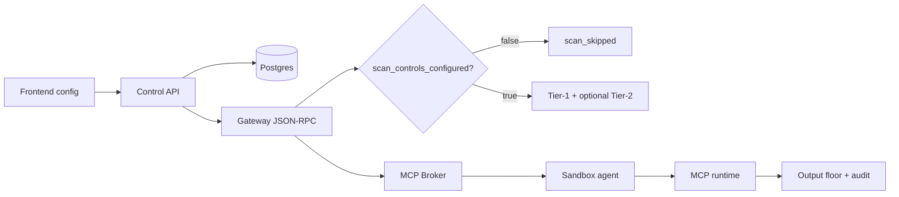

# MCP Platform — End-to-End Validation Matrix

**Updated:** 2026-07-09 (iteration 19)  
**Canonical evidence root:** `mcp-parallel/findings/mcp-validation/`

## Requirement → harness → evidence

| Requirement | Harness / test | Evidence | Status |
|-------------|----------------|----------|--------|
| 0 scan controls → no tier1/tier2 on org path | `mcp_validation_iter3_zero_controls.py` | `iter3-zero-controls.json` | PASS |
| Scan matrix (monitor/redact/block/precedence) | `mcp_arch_scan_matrix_live.py`, `mcp_validation_iter11_combinatorial.py` | `iter11-combinatorial.json` | PASS |
| Tier-2 only when org enabled | `mcp_validation_iter4` harness | `iter4-tier2-policy-ui.json` | PASS |
| Multi-org isolation (3 orgs) | `mcp_multi_org_harness.py`, `mcp_validation_iter14_combined.py` | `iter14-combined.json` | PASS |
| Cross-tenant 403 | iter5/iter14 combined | `iter5-multiorg-compliance.json` | PASS |
| Policy plane ≠ scan plane (F-005) | iter10/11/14 | `iter10-policy-ext-sdk-live.json` | DOCUMENTED |
| ext_mcp_proxy static floors (F-002/F-012) | `test_mcp_bare_proxy_scan.py`, iter13 live | `iter13` + pytest 60/60 | PASS |
| Output-only block (F-009) | iter8/11 | `iter8-policy-crash-sdk.json` | PASS |
| Monitor observe-only (F-010) | iter8/11/12 | `iter12-closeout.json` | PASS |
| PolicyTestView domain inference (F-013) | `test_policy_test_view_f013.py`, iter14 | `iter14-combined.json` | PASS |
| SSE transport reliability (F-014) | `mcp_validation_iter18_sse_closeout.py` | `iter18-sse-closeout.json` | PASS |
| All transports fleet execution | `mcp_arch_fleet_execution_live.py` | `fleet-tool-execution.json` | iter19 gate |
| Sandbox resource limits | iter6 docker inspect | `iter6-sandbox-posture.json` | PASS |
| gVisor kernel isolation | `docker info`, `which runsc` | iter19 `gvisor_infra` | **INFRA BLOCKER F-007** |
| UI: Scanning off badge | `mcp_validation_iter4_ui.mjs` | iter19 gate | iter19 gate |
| UI: Scan Controls tab | `mcp_validation_iter5_scan_ui.mjs` | iter19 gate | iter19 gate |
| OpenAI SDK compat | `test_openai_sdk_compat.py` | iter4/7/11 pytest | PASS |
| 100k RPS / 500 sandbox stress | `mcp_page_cp50_final_verify.py` | CP50 | HOST BLOCKED (~48 RPS) |

## Lifecycle stages validated



| Stage | Proven | Notes |
|-------|--------|-------|
| Frontend registration / scan UI | Playwright iter4/5/6 cleanup gates | Section C frozen |
| API / DB persistence | Live re-sync + fleet | |
| Configuration caching | `enabled-tools` + Redis scan_ver | iter14 |
| Scan control resolution | `scan_controls.py` + gateway `_mcp_security_scan` | F-009 |
| Policy resolution (separate plane) | control `/tools/call/` | F-005 |
| Broker routing | All 4 transports via sandbox | CP12–14 |
| Sandbox lifecycle | restart/crash recovery iter7/8 | runc not runsc |
| Output scanning floors | CHG-0074+ ext/org paths | pytest |

## Remaining risks (honest)

1. **F-007 gVisor** — requires host `runsc` + compose env; code warns (CHG-0143) but cannot enforce here.
2. **Egress lockdown** — per-org NAT open; SSRF guards in gateway+agent (CHG-0065/0067).
3. **Exhaustive Cartesian** — layered harnesses cover representative matrix; not every combinatorial cell.
4. **Stress at 100k RPS** — architecturally ~48 RPS/sandbox on shared VM (CP48).

## Final gate command

```bash
gateway/.venv/bin/python scripts/ralph/mcp_validation_iter19_final_gate.py
```

Output: `mcp-parallel/findings/mcp-validation/iter19-final-gate.json`
