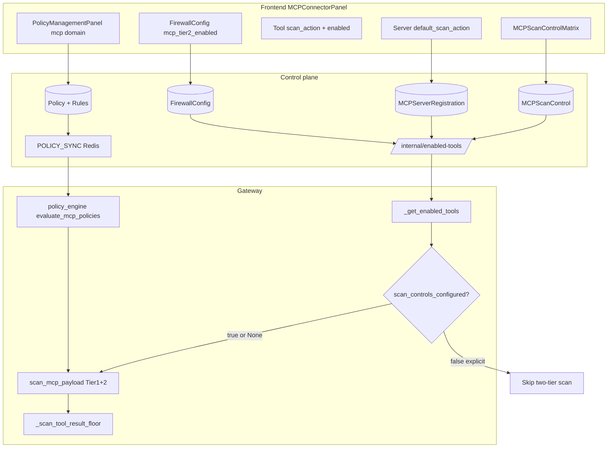

# MCP Platform Validation — Iteration 1 Architecture Map

**Ralph loop iteration:** 1  
**Date:** 2026-07-08  
**Status:** EXPLORATION (no code changes this iteration)

## Live stack (verified)

| Service | Status | Port |
|---------|--------|------|
| control | healthy | 8100 |
| frontend | up | 8180 |
| gateway | healthy | 8300 |
| mcp-broker | healthy | 8311 |
| postgres/redis | healthy | 5432/6379 |

## Iteration 7 — Expanded scan matrix + policy plane + sandbox restart (2026-07-08)

| Proof | Result | Evidence |
|-------|--------|----------|
| Matrix 8 cases (org/tool/precedence/both) | ALL PASS | `iter7-matrix-policy-sandbox.json` |
| Policy plane @ 0 controls | Gateway raw SSN; control masked (F-005) | iter7 policy_plane |
| Sandbox restart drill | healthy + echo OK (~5s cold) | iter7 sandbox |
| OpenAI SDK streaming/tool_calls | 7 passed | iter7 sdk |
| **F-009** | Output-only block + echo SSN → redact not [BLOCKED] | iter7 findings |

## Iteration 5 — Multi-org + compliance off + Scan Controls UI (2026-07-08)

| Proof | Result | Evidence |
|-------|--------|----------|
| 3 orgs × 0 scan rows | `scan_controls_configured:false`, `decision=scan_skipped`, `compliance_tags:[]`, raw SSN egress | `iter5-multiorg-compliance.json` |
| Cross-tenant 403 matrix | 6/6 attacker×victim → 403 | iter5 script |
| Multi-org harness | GREEN (ROUNDS=1) | `p8-26/multi_org_harness_report.json` |
| Scan Controls tab UI | Empty state + Tier-2 org radiogroup | `mcp_validation_iter5_scan_ui.mjs` |

**Compliance off-by-default:** When `scan_controls_configured=false`, MCPEvent carries **no** compliance tags from the two-tier orchestrator (verified all 3 orgs). UI copy in `MCPScanControlMatrix.jsx` matches: "no compliance tagging" at zero controls.

## Iteration 4 — Tier-2 gate + policy plane + SDK + UI (2026-07-08)

| Proof | Result | Evidence |
|-------|--------|----------|
| 0 controls → scan_skipped | MCPEvent `decision=scan_skipped`, trace has no tier1/tier2 | iter4 case A |
| Tier1-only row | trace has `tier1`, no `tier2` | iter4 case B |
| Tier2 row + org disabled | `tier2_skipped` / `org_mcp_tier2_disabled` | iter4 case C |
| Control tools/call | 200 + `decision` (policy plane separate) | iter4 case D |
| OpenAI SDK | 46 passed | `test_openai_sdk_compat.py` |
| UI "Scanning off" | 16 badges, select disabled @ 0 rows | `mcp_validation_iter4_ui.mjs` |

**F-002:** ext_mcp_proxy uses `enabled_info=None` — scan_controls gate never fires; static tier1 floors remain (documented, not a bug for tenant org path).

## Iteration 3 — Zero controls + matrix + transports (2026-07-08)

| Proof | Result | Evidence |
| Scan matrix 7 cases | ALL PASS | `mcp-parallel/findings/mcp-arch-validation-2026-07-08/scan_matrix_live.json` |
| Fleet 16 MCPs × tool call | 16/16 OK (stdio/http/sse/ws) | `fleet-tool-execution.json` |
| Unit regression | 4 passed | `test_mcp_scan_off_by_default.py` |

**F-001:** VERIFIED live (gateway path). **F-005:** Control `/tools/call/` still uses MCP policies separately when 0 scan controls (documented in `scan-controls-off-live-proof.json`).

**Auth:** `POST /api/auth/token/` with `{email, password}` → JWT access token.

**Live org `zeroshield`:** 1 `MCPScanControl` row (org scope, tier1, action=monitor).

| Check | Result | Evidence |
|-------|--------|----------|
| `GET /api/mcp-connector/scan-controls/` | 1 row | live API |
| `GET internal/enabled-tools` | `scan_controls_configured: true`, tier1_input enabled | headers: X-Gateway-Auth + X-Gateway-Internal-Key + X-Org-Slug |
| `tools/call echo` with email | egress masked `b***@c***.example` | `scripts/ralph/mcp_validation_iter2_live.py` |
| Zero-controls skip | 4 pytest pass | `test_mcp_scan_off_by_default.py` |

**F-006:** CLOSED (was wrong login path).  
**F-002:** OPEN — `ext_mcp_proxy` bypasses scan_controls gate by design (`enabled_info=None`); static floors still apply.

## Highest-priority: scan controls when UI shows "0 Scan Controls"

### Evidence chain

1. **Frontend** (`MCPConnectorPanel.jsx`): `scanControlsConfigured = rows.length > 0` from `GET /api/mcp-connector/scan-controls/`. When false: server scan dropdown disabled, badge "Scanning off".

2. **Control** (`views.py:2609`): `scan_controls_configured: bool(scan_rows)` on `/internal/enabled-tools/`.

3. **Gateway** (`mcp_proxy.py:1693-1715`):
   - Gate ONLY when `enabled_info is not None AND scan_controls_configured is False`
   - Returns payload unchanged, `scan_skipped: no_scan_controls_configured`
   - **No Tier-1, No Tier-2, No compliance tags from orchestrator**

4. **Regression lock:** `test_mcp_scan_off_by_default.py` — 37+ gateway tests.

### Important caveats (NOT hidden scanning)

| Path | Behavior when 0 scan controls |
|------|-------------------------------|
| Org/internal MCP routes | Two-tier scan **SKIPPED** (if enabled_info fetched) |
| `enabled_info is None` (control outage) | **FAIL-SAFE: scan still runs** |
| ext_mcp_proxy | `enabled_info=None` always → gate never fires → tier-1 **RUNS** |
| MCP security policies (mcp domain) | **Separate plane** — still evaluated via `evaluate_mcp_policies` |
| Static floors (credential-in-args, depth/block caps, E12 result floor) | Partially still apply (resource caps yes; credential floor needs scan findings) |

## Precedence (scan matrix)

**Scope:** tool > server > org (higher `priority` wins within scope)  
**Action:** per-tier `inherit` → `_effective_scan_action` → tool scan_action → server default → `"tag"`  
**Tier-2 org gate:** `FirewallConfig.mcp_tier2_enabled` + per-row tier2 controls

## Entry points (tool call)

| Route | Handler | Sandbox | Scan gate |
|-------|---------|---------|-----------|
| `POST /gateway/{org}/mcp/{server}` | org_mcp_jsonrpc | yes | enabled_info |
| `POST .../tools/call` | org_mcp_tool_call | yes | enabled_info |
| `POST /v1/mcp/internal/tools-call` | internal_tools_call | yes | enabled_info |
| `POST /v1/mcp/ext-proxy/...` | ext_mcp_proxy | N/A | **no enabled_info** |

## Sandbox routing (all 4 transports)

`_is_sandbox_routed`: stdio+ws always; http+sse when `MCP_HTTP_VIA_SANDBOX=true` (default ON).  
Chain: gateway `_adapter_forward` → `broker_send_rpc` → broker `/v1/sandbox/{org}/rpc` → agent `/rpc`.

**Infra gaps (documented, not code bugs):**
- gVisor/runsc not installed (runc default) — CHG-0143 warns once
- Per-org network `internal=false` (NAT egress)
- Deployed sandbox image may predate CHG-0142 npmrc bake

## Iteration 1 findings register

| ID | Severity | Finding | State |
|----|----------|---------|-------|
| F-001 | INFO | Zero scan controls → two-tier scan skipped (org path) | VERIFIED code+tests |
| F-002 | MEDIUM | ext_mcp_proxy always runs tier-1 (no scan_controls gate) | VERIFIED code |
| F-003 | LOW | Tier-2 header stat may show wrong source (health vs firewall config) | VERIFIED frontend gap |
| F-004 | LOW | `tag` vs `monitor` naming mismatch UI/matrix | Documented |
| F-005 | INFO | Policies are separate from scan matrix | By design |
| F-006 | BLOCKED | Live API proof of scan_controls count | Login API pending |
| F-007 | BLOCKED | gVisor live proof | Infra prerequisite |

## Next iteration plan

1. Live API: scan-controls count + enabled-tools payload + tool call with PII (0 controls vs 1 control)
2. Scan control matrix permutation harness (org/server/tool × input/output/both × actions)
3. ext_mcp_proxy scan_controls behavior decision (bug or by-design for external untrusted)
4. Sequence diagrams per flow (registration, discovery, tool call, block path)
5. Multi-org isolation live matrix
