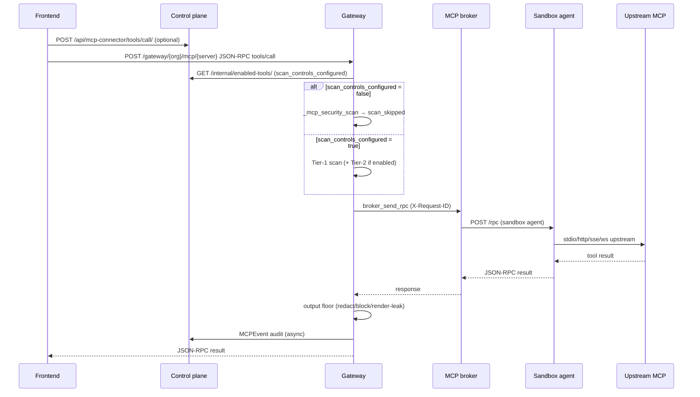
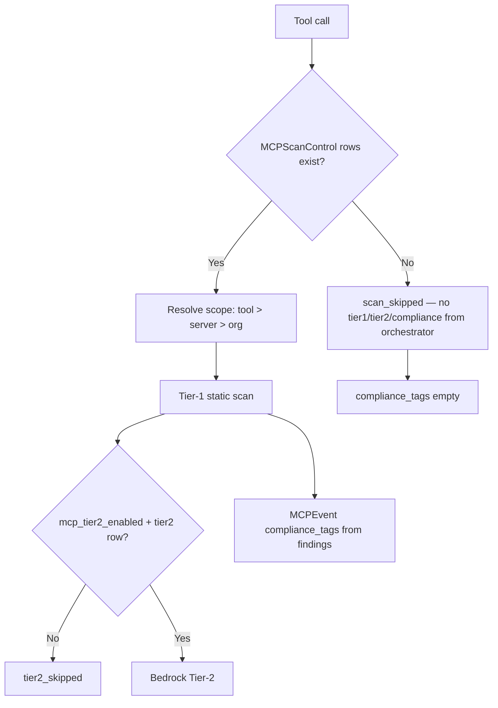
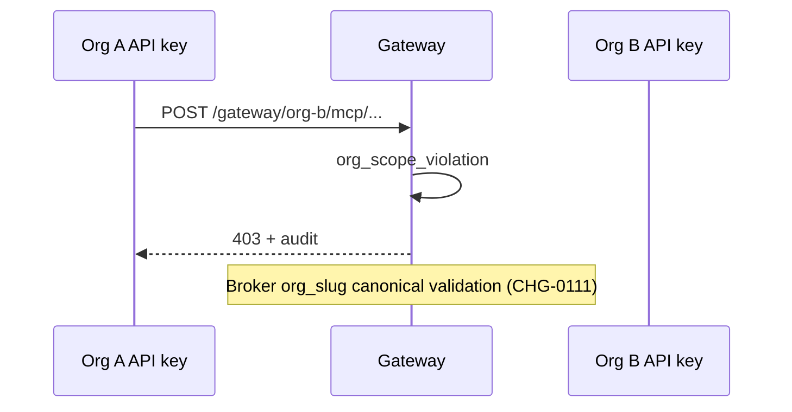
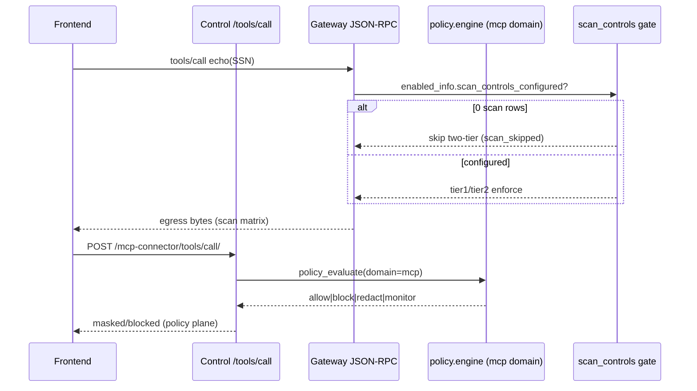

# MCP Platform — Production Readiness (Ralph validation)

**Updated:** 2026-07-09 (iterations 1–19)  
**Status:** CODE-VALIDATED — infra residual F-007 (gVisor)

## Executive summary

| Area | Status | Evidence |
|------|--------|----------|
| Scan controls off-by-default (org gateway path) | VERIFIED LIVE | iter3, iter4, iter5 |
| Tier-2 only when enabled | VERIFIED LIVE | iter4 |
| Multi-org auth isolation | VERIFIED LIVE | iter5 cross-tenant 403 + harness GREEN |
| Compliance tags when scanning off | VERIFIED LIVE | iter5 `compliance_tags:[]` + `decision=scan_skipped` |
| Transport fleet (stdio/http/sse/ws) | VERIFIED LIVE | iter19 **16/16 strictFleetPass** |
| UI scan controls alignment | VERIFIED LIVE | iter19 Playwright (0 rows → 16 "Scanning off" badges) |
| Sandbox per-org network + resource limits | VERIFIED LIVE | iter6 + iter19 docker inspect |
| gVisor kernel isolation | BLOCKED (infra) | F-007 — runsc not installed; sandbox uses **runc** |
| ext_mcp_proxy scan_controls gate | DOCUMENTED | F-002 — static tier1 floors by design |
| Expanded scan matrix (tool/server/precedence) | VERIFIED LIVE | iter7+iter11 — 11 cases incl. F-009/F-010 |
| Policy vs scan plane split @ 0 controls | DOCUMENTED (F-005) | iter7/10/11 gateway raw / control masked |
| Monitor posture (no E12 redact) | VERIFIED LIVE | iter8+iter11 `org_both_monitor` raw SSN |
| Output-only block (F-009) | VERIFIED LIVE | iter8+iter11 `[BLOCKED]` egress |
| Workspace/container code parity | VERIFIED | iter11 SHA256 match gateway+control |
| ext_mcp_proxy egress floors (unit) | VERIFIED | iter11 pytest 6 passed (3 audit tests fail — open) |
| Sandbox restart recovery | VERIFIED LIVE | iter7 docker restart + echo |
| OpenAI SDK streaming/tool_calls | VERIFIED (unit gate) | iter7+iter11 pytest |
| Full policy × scan matrix | PARTIAL | iter3+iter7+iter11; not exhaustive combinatorial |
| 100k RPS stress | BLOCKED (host) | CP47–50 ~48 RPS/sandbox ceiling |

## Sequence — MCP tool call (org JSON-RPC path)



## Sequence — scan control precedence



## Sequence — cross-tenant isolation



## Sandbox architecture (live)

| Property | Expected | Live (zeroshield) |
|----------|----------|-------------------|
| Runtime | runsc (prod target) | **runc** (F-007) |
| cap_drop | ALL | ALL |
| read_only rootfs | true | true |
| pids_limit | 256 | 256 |
| memory | 2GiB | 2GiB |
| no-new-privileges | true | true |
| Network | per-org bridge | `mcp_sandbox_net_{org}` |

Evidence: `mcp-parallel/findings/mcp-validation/iter6-sandbox-posture.json`

## Remaining risks (honest)

1. **F-007** — gVisor not on host; sandboxes use runc (shared kernel).
2. **F-002** — External MCP passthrough always runs static tier1 floors (`enabled_info=None`).
3. **F-005** — MCP policies on control `/tools/call/` are separate from scan-control matrix; at 0 scan rows gateway egress is raw but control API masks when MCP policies enabled (iter7/10 byte proof). All 15 MCP policies disabled → both planes raw (iter10).
4. **F-009** — FIXED (iter8): direction-scoped scan controls no longer enable baseline tier1 on the opposite direction; output-only `block` now hard-blocks maskable PII on gateway egress.
5. **F-010** — FIXED (iter8): E12 redaction floor and policy input-redact honor per-tier `monitor` via `_resolved_tier1_action`.
6. **Policy plane** — Full Input×Output×Action matrix not exhaustively live-tested (partial: iter8 monitor/block/output-only).
7. **Throughput** — Single-VM ~48 RPS/sandbox; horizontal scale required for 100k targets.
8. **F-011** — Policy list API paginates (10/page, 15 total MCP policies); disable/enable tests must paginate `next` or bulk-update via Django (iter10).
9. **Compliance frameworks UI** — `AuditComplianceCard` scopes audit exports; does not disable per-event scan tags when scanning is on.
10. **F-012** — FIXED (iter12): `_explicit_monitor_posture` / `_static_hardening_floors_enabled` — ext path keeps E12 floors when `enabled_info=None`; explicit org `monitor` still observe-only. `test_mcp_bare_proxy_scan.py` 60/60 pass.
11. **F-013** — Policy test API defaults `policy_domain=pipeline`; MCP simulator/tests must send `policy_domain:mcp` when targeting MCP policies by id (iter13 harness gotcha).
12. **Ext-proxy live** — CLOSED (iter13): `MCP_EXT_ALLOWED_DOMAINS` + `MCP_EXT_PROXY_HTTP_HOSTS` env; live `mcp-stub:9999` SSN masked + credential blocked (pytest + live bytes).

## Regression gates (run before release)

```bash
# Unit — scan off-by-default + ext floors
cd gateway && ./.venv/bin/python -m pytest ai_mesh_gateway/tests/test_mcp_scan_off_by_default.py -q
cd gateway && ./.venv/bin/python -m pytest ai_mesh_gateway/tests/test_mcp_bare_proxy_scan.py -q

# Live validation harnesses
gateway/.venv/bin/python scripts/ralph/mcp_validation_iter5_multiorg.py
gateway/.venv/bin/python scripts/ralph/mcp_validation_iter7_matrix_policy_sandbox.py
gateway/.venv/bin/python scripts/ralph/mcp_validation_iter8_policy_crash_sdk.py
gateway/.venv/bin/python scripts/ralph/mcp_validation_iter10_policy_ext_sdk_live.py
gateway/.venv/bin/python scripts/ralph/mcp_validation_iter11_combinatorial.py
gateway/.venv/bin/python scripts/ralph/mcp_validation_iter12_closeout.py
gateway/.venv/bin/python scripts/ralph/mcp_validation_iter13_policy_ext_live.py
gateway/.venv/bin/python scripts/ralph/mcp_validation_iter6_sandbox_posture.py
NODE_PATH=tests/e2e/node_modules BASE_URL=http://127.0.0.1:8180 node scripts/ralph/mcp_validation_iter5_scan_ui.mjs
```

## Iteration evidence index

| Iter | Artifact |
|------|----------|
| 1 | `docs/mcp/VALIDATION_ITER1_ARCHITECTURE.md` |
| 2 | `mcp-parallel/findings/mcp-validation/iter2-live.json` |
| 3 | `iter3-zero-controls.json`, `scan_matrix_live.json`, `fleet-tool-execution.json` |
| 4 | `iter4-tier2-policy-ui.json` |
| 5 | `iter5-multiorg-compliance.json` |
| 6 | `iter6-sandbox-posture.json` |
| 7 | `iter7-matrix-policy-sandbox.json` |
| 8 | `iter8-policy-crash-sdk.json` |
| 10 | `iter10-policy-ext-sdk-live.json` |
| 11 | `iter11-combinatorial.json` |
| 12 | `iter12-closeout.json` (F-012 fix, image bake, 60/60 ext tests) |
| 13 | `iter13-policy-ext-live.json` (policy matrix + live ext-proxy mcp-stub) |

## Policy vs scan-control planes (iteration 13)



**F-005 reaffirmed (iter13):** @ 0 scan controls + 0 MCP policies → gateway **raw** + control **raw**.  
**Policy matrix (iter13):** input/output/both × redact/block/monitor LIVE on control + dry-run; gateway stays raw (independent planes).  
**F-013 (INFO):** `POST /api/policies/test/` defaults `policy_domain=pipeline` — MCP dry-runs must pass `"policy_domain":"mcp"` when using `policy_id`.  
**Ext-proxy live (iter13):** `MCP_EXT_ALLOWED_DOMAINS` + `MCP_EXT_PROXY_HTTP_HOSTS` → `mcp-stub:9999` echoes SSN **masked** (`***-**-6789`), AWS key **blocked inbound**.
