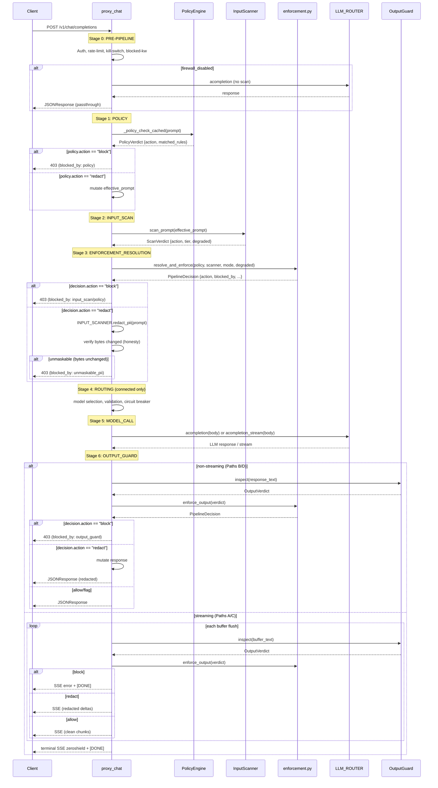

# Canonical Chat Pipeline

> **Generated**: 2026-07-03 | **Item**: P1-03 — ONE canonical pipeline, ONE enforcement authority
> **Cross-ref**: docs/pipeline/PATHS.md (P1-01), docs/pipeline/DIVERGENCES.md (P1-02),
> docs/pipeline/CHAT_PIPELINE_CONTRACT.md (FREEZE contract)

---

## 1. Design Principles

1. **One pipeline, one code path.** All four sub-paths (A/B/C/D) converge on the same
   enforcement stages. Path-specific logic is limited to the delivery adapter (streaming
   SSE vs sync JSON) and backend-connected extras (routing, model validation, circuit breaker).
2. **One enforcement authority.** Every enforcement decision flows through
   `enforcement.resolve_and_enforce()` — a single function that ingests all inputs
   (policy verdict, scanner verdict, enforcement mode, degraded state) and returns a
   terminal `PipelineDecision`. No inline ad-hoc logic in `proxy_chat`.
3. **Fail-closed by default.** A degraded scanner, unavailable guard, or unexpected
   exception produces a REDACT or BLOCK — never a raw pass-through.
4. **Block short-circuits.** A BLOCK at any stage terminates the pipeline immediately.
   The model is NEVER called after a block. No downstream stage runs.
5. **One `final_action`, one `blocked_by`.** The `PipelineDecision` is the single source
   of truth. No double-block ambiguity, no phantom redaction.
6. **Streaming = sync enforcement + streaming delivery.** The enforcement stages run
   identically; only the response delivery differs.

---

## 2. Canonical Stage Order

```
┌──────────────────────────────────────────────────────────────────┐
│                     proxy_chat (L4509)                           │
│                                                                  │
│  ┌──────────────────────────────────────────────────────────┐   │
│  │ Stage 0: PRE-PIPELINE                                    │   │
│  │   Auth → Body validation → Org config → Kill-switch      │   │
│  │   → Rate-limit (RPM/TPM) → Context minimization          │   │
│  │   → Blocked keywords                                     │   │
│  │   → firewall_disabled? → Path F (passthrough, no scan)   │   │
│  └────────────────────────┬─────────────────────────────────┘   │
│                           │                                      │
│  ┌────────────────────────▼─────────────────────────────────┐   │
│  │ Stage 1: POLICY                                          │   │
│  │   _policy_check_cached → policy verdict                  │   │
│  │   SHORT-CIRCUIT: policy action == block → 403            │   │
│  │   REDACT: policy action == redact → mutate prompt        │   │
│  └────────────────────────┬─────────────────────────────────┘   │
│                           │                                      │
│  ┌────────────────────────▼─────────────────────────────────┐   │
│  │ Stage 2: INPUT_SCAN                                      │   │
│  │   scan_prompt[_with_tier2] on effective_prompt            │   │
│  │   (post-policy redaction)                                 │   │
│  └────────────────────────┬─────────────────────────────────┘   │
│                           │                                      │
│  ┌────────────────────────▼─────────────────────────────────┐   │
│  │ Stage 3: ENFORCEMENT_RESOLUTION                          │   │
│  │   resolve_and_enforce(policy, scanner, mode, degraded)   │   │
│  │   → PipelineDecision { action, blocked_by, threat, ... } │   │
│  │   SHORT-CIRCUIT: decision.action == block → 403          │   │
│  │   REDACT: decision.action == redact → mask input         │   │
│  └────────────────────────┬─────────────────────────────────┘   │
│                           │                                      │
│  ┌────────────────────────▼─────────────────────────────────┐   │
│  │ Stage 4: ROUTING (connected paths C/D only)              │   │
│  │   Model routing → Validation → Circuit breaker           │   │
│  │   SHORT-CIRCUIT: circuit breaker OPEN → 503              │   │
│  └────────────────────────┬─────────────────────────────────┘   │
│                           │                                      │
│  ┌────────────────────────▼─────────────────────────────────┐   │
│  │ Stage 5: MODEL_CALL                                      │   │
│  │   LLM_ROUTER.acompletion / acompletion_stream            │   │
│  │   (never reached after a Stage 1/2/3 block)              │   │
│  └────────────────────────┬─────────────────────────────────┘   │
│                           │                                      │
│  ┌────────────────────────▼─────────────────────────────────┐   │
│  │ Stage 6: OUTPUT_GUARD                                    │   │
│  │   Scan full response (sync) or buffered chunks (stream)  │   │
│  │   → enforce_output(verdict) → PipelineDecision           │   │
│  │   SHORT-CIRCUIT: block → 403 / SSE error + [DONE]        │   │
│  │   REDACT: mutate response in-place / rebuild SSE deltas  │   │
│  └────────────────────────┬─────────────────────────────────┘   │
│                           │                                      │
│  ┌────────────────────────▼─────────────────────────────────┐   │
│  │ Stage 7: FINALIZE                                        │   │
│  │   Pipeline trace → Token usage → zeroshield metadata     │   │
│  │   → JSONResponse / terminal SSE frame                    │   │
│  └──────────────────────────────────────────────────────────┘   │
└──────────────────────────────────────────────────────────────────┘
```

### Short-Circuit Rules

| Stage | Condition | Result | Model Called? |
|-------|-----------|--------|---------------|
| 0 (pre) | firewall_disabled | Path F passthrough | Yes (no scan) |
| 0 (pre) | kill-switch | 403 / reroute | No / Yes (different model) |
| 0 (pre) | rate-limit exceeded | 429 | No |
| 0 (pre) | blocked keywords hit | 403 | No |
| 1 (policy) | policy action == block | 403 | No |
| 2 (input_scan) | tier2_strict + breaker OPEN | 503 | No |
| 3 (enforcement) | resolved action == block | 403 | No |
| 3 (enforcement) | unmaskable PII (redact impossible) | 403 | No |
| 4 (routing) | circuit breaker OPEN | 503 | No |
| 5 (model) | LLM error | 502/500 | Yes (failed) |
| 6 (output) | verdict action == block | 403 / SSE error | Yes (response withheld) |
| 6 (output) | guard exception (fail-closed) | 403 | Yes (response withheld) |

---

## 3. ONE Enforcement Authority

### 3.1 Current State

`enforcement.py` provides three standalone functions:
- `resolve_enforcement()` — merges policy + scanner + mode → resolved action string
- `should_hard_block()` — bool: is the resolved action "block" under "block" mode?
- `should_apply_redaction()` — bool: should PII/secret be masked?

These are called INLINE in `proxy_chat` with ~200 lines of ad-hoc branching between
them (L6435–6691). Each path (A/B/C/D) then independently implements its own output
guard logic with divergent fail-open/fail-closed behavior (D-05, D-06).

### 3.2 Canonical Design

All enforcement logic moves into `enforcement.py` behind TWO entry points:

```python
# -- enforcement.py (proposed) --

@dataclass(frozen=True)
class PipelineDecision:
    """Immutable terminal enforcement outcome for one pipeline stage."""
    action: str           # allow | monitor | flag | redact | block
    blocked_by: str | None  # "policy" | "input_scan" | "output_guard" | None
    threat_type: str | None  # pii | secret | jailbreak | prompt_injection | ...
    detection_tier: str | None  # policy | tier_1 | tier_2 | none
    matched_rules: list[str]
    matched_policy_names: list[str]
    confidence: float | None
    degraded: bool          # True when Tier-2 was unavailable
    redaction_applied: bool  # True when bytes were actually changed
    scan_text: str | None    # the scanned text (post-redaction if redacted)
    stage_latency_ms: int

    @property
    def is_terminal_block(self) -> bool:
        return self.action == "block"

    @property
    def is_redact(self) -> bool:
        return self.action == "redact"


def resolve_and_enforce(
    *,
    policy_verdict: PolicyVerdict | None,
    scanner_verdict: ScanVerdict | None,
    enforcement_mode: str,
    tier2_degraded: bool,
    redaction_possible: bool,
    threat_type: str | None = None,
) -> PipelineDecision:
    """
    Single entry point for input-side enforcement resolution.

    Merges the policy verdict and scanner verdict using the existing
    precedence lattice (policy > scanner > default) and applies the
    fail-closed contract for degraded scanners.

    Called by ALL paths (A/B/C/D) at Stage 3. Returns a frozen
    PipelineDecision — the caller short-circuits on block, applies
    redaction on redact, or continues on allow/monitor/flag.

    FAIL-CLOSED CONTRACT (new):
      If tier2_degraded AND Tier-1 detected a PII/secret threat_type:
        → action = "redact" (not "allow")
      If tier2_degraded AND Tier-1 clean:
        → action = "monitor" with degraded=True (not raw "allow")
      An exception inside this function → PipelineDecision(action="block")
    """
    ...


def enforce_output(
    *,
    output_verdict: OutputVerdict | None,
    enforcement_mode: str,
    exception: Exception | None = None,
) -> PipelineDecision:
    """
    Single entry point for output-side enforcement resolution.

    Handles the output guard verdict (sync or streaming flush) and
    applies the fail-closed contract for exceptions / degraded scans.

    Called by:
      - _apply_output_guard_nonstream (Paths B/D)
      - SecureStreamingResponse._flush_buffer (Paths A/C)

    FAIL-CLOSED CONTRACT (new):
      - verdict.action == "rewrite" + streaming → coerced to "block"
        (no mid-stream re-inference)
      - verdict.scan_degraded → action = "redact" (not raw pass-through)
      - exception (guard crash/timeout) → action = "block"
        (fixes D-05: Path B currently returns None = fail-open)
      - flag + enforcement_mode == "block" → "block" everywhere
        (fixes D-18: harmonizes streaming/non-streaming)
    """
    ...
```

### 3.3 Why Two Functions, Not One

Input and output enforcement differ in three ways:
1. **Input** merges TWO sources (policy + scanner); **output** has one (guard verdict).
2. **Input** can REDACT the prompt before sending to the model; **output** redacts the
   response before sending to the client.
3. **Output** has a streaming-specific concern (rewrite → block coercion).

A single function would need mode flags that obscure these differences. Two functions,
one shared `PipelineDecision` return type, same fail-closed contract.

### 3.4 Supporting Types

```python
@dataclass(frozen=True)
class PolicyVerdict:
    """Output from Stage 1 (policy check)."""
    action: str            # allow | monitor | flag | redact | block
    matched_rules: list[str]
    matched_policy_names: list[str]
    redacted_prompt: str | None  # if policy redacted

@dataclass(frozen=True)
class ScanVerdict:
    """Output from Stage 2 (input scan)."""
    action: str
    tier: str              # tier_1 | tier_2
    threat_type: str | None
    confidence: float | None
    degraded: bool
    degraded_reason: str | None
    redaction_possible: bool

@dataclass(frozen=True)
class OutputVerdict:
    """Output from Stage 6 (output guard)."""
    action: str            # allow | flag | redact | rewrite | block
    threat_type: str | None
    scan_degraded: bool
    redacted_text: str | None
    redaction_changed_bytes: bool
```

---

## 4. Fail-Closed Contract

Every degraded or exceptional state has a defined enforcement outcome.

| Failure Mode | Current Behavior | Canonical Behavior |
|---|---|---|
| **Tier-2 degraded, Tier-1 clean** | `allow` (fail-open, D-02) | `monitor` with `degraded=True` telemetry; if `tier2_strict=True` → 503 |
| **Tier-2 degraded, Tier-1 detected PII** | `allow` (falls through) | `redact` — mask the detected PII before model call |
| **Tier-2 degraded, Tier-1 detected injection** | `allow` | `block` (injection cannot be redacted) |
| **Output guard exception (Path B)** | `return None` → ship raw (D-05) | `block` — withhold unscanned response |
| **Output guard scan_degraded** | ship raw + telemetry (D-08) | `redact` — defensive redact_all on model output |
| **Unmaskable PII (redaction no-op)** | `block` (L6615-6691) ✓ | `block` (unchanged — already correct) |
| **Unknown/unhandled exception** | varies by path | `block` + 500 |

### Invariant: No Raw PII Past Input

```
IF detect_pii(prompt) found PII:
  THEN the prompt reaching the model MUST have that PII masked
  OR the request MUST be blocked (403)
  NEVER forward the raw PII to the model.
```

This invariant holds regardless of enforcement_mode. Even in `monitor` mode, PII is
redacted before forwarding — the "monitor" aspect is that the request is not blocked,
not that PII flows raw.

---

## 5. ONE `final_action` + `blocked_by`

### Problem (current)

The pipeline can produce conflicting signals:
- `_resolved_input_action = "block"` but `enforcement_mode = "monitor"` → logged as
  "would block" but continues → ambiguous `final_action`
- Output guard can independently block after a Stage 3 allow → two "block" events,
  different `blocked_by` sources
- The `blocked_by` field is not consistently set across paths

### Canonical Rule

The `PipelineDecision` at each stage is TERMINAL for that stage. The FINAL decision
is the LAST stage's decision (latest in the pipeline wins):

```
final_decision = stages[-1].decision   # last stage to run
```

| Scenario | Stage 3 Decision | Stage 6 Decision | Final |
|---|---|---|---|
| Input clean, output clean | allow | allow | allow |
| Input clean, output PII | allow | redact | redact |
| Input PII, redacted | redact | allow | redact (input stage controls) |
| Input block | block (model never called) | — (never runs) | block (blocked_by=input_scan) |
| Input allow, output block | allow | block (blocked_by=output_guard) | block |

`blocked_by` is set ONCE by the first stage that blocks. No double-block — once
blocked, no downstream stage runs (for input) or the output block is the final word.

The zeroshield metadata carries:
```json
{
  "action": "<final_decision.action>",
  "blocked_by": "<final_decision.blocked_by or null>",
  "stages": [ ... per-stage PipelineDecision ... ]
}
```

---

## 6. Streaming vs Sync Adapter

### Canonical Principle

Stages 0–3 (pre-pipeline through enforcement resolution) are **identical** for
streaming and non-streaming. The enforcement decision is made BEFORE the model call.
The only difference is the delivery adapter after Stage 5:

```
                    ┌─ Stage 5 ─┐
                    │ MODEL CALL │
                    └─────┬──────┘
                          │
              ┌───────────┴───────────┐
              │                       │
    ┌─────────▼──────────┐  ┌────────▼─────────┐
    │  Sync Adapter       │  │ Stream Adapter    │
    │  (Paths B/D)        │  │ (Paths A/C)       │
    │                     │  │                    │
    │  Full response      │  │ SSE chunks         │
    │  → enforce_output() │  │ → buffer → flush   │
    │  → JSONResponse     │  │ → enforce_output() │
    │                     │  │ → yield SSE        │
    └─────────────────────┘  └────────────────────┘
```

### Streaming-Specific Concerns

| Concern | How the Canonical Pipeline Handles It |
|---|---|
| **Already-emitted content** (D-17) | `SecureStreamingResponse` buffers ~4KB with 512B lookahead + secret-anchor holdback. A block verdict on flush emits SSE error + `[DONE]`, clearing the buffer. Previously-emitted clean chunks cannot be recalled — accepted trade-off. |
| **reasoning_content / tool_calls unscanned** (D-06) | FIX: `_extract_content_delta` extended to also extract `reasoning_content` deltas and `tool_calls[].function.arguments` into the content buffer for scanning. Non-content chunks still yield immediately but their scannable text is accumulated. |
| **rewrite → block coercion** (D-19) | Unchanged — no mid-stream re-inference. `enforce_output()` coerces rewrite→block for streaming. |
| **flag → block escalation** (D-18) | FIX: harmonized. `enforce_output()` applies the same escalation logic for both sync and streaming: `flag + enforcement_mode=="block" → block` everywhere (currently streaming-only). |
| **TTFT (Time to First Token)** | The input enforcement stages run synchronously before the stream starts. TTFT = time from first SSE chunk to client, NOT including input stages. Pipeline trace records `input_enforcement_ms` and `ttft_ms` separately. |
| **Terminal SSE frame** | `stream_with_finalize` emits a terminal `data: {"zeroshield": {...}}` frame carrying the full `PipelineDecision` and `stages[]` array, then `[DONE]`. |
| **Output guard fail behavior** | `enforce_output(exception=exc)` → `PipelineDecision(action="block")`. `SecureStreamingResponse.__aiter__` clears buffers + emits error SSE (already correct). The sync path (`_apply_output_guard_nonstream`) now also blocks instead of returning None (fixes D-05). |

---

## 7. Migration Map

### Which PATHS.md Paths Map to Which Canonical Hooks

| Current Code | Line Range | Canonical Stage | What Changes |
|---|---|---|---|
| `proxy_chat` pre-scan pipeline | L4509–L5869 | Stage 0 (PRE) | No change — already shared across all paths |
| `_policy_check_cached` | L6040 | Stage 1 (POLICY) | Thin wrapper → calls into policy engine, returns `PolicyVerdict` |
| `scan_prompt[_with_tier2]` | L6248–L6380 | Stage 2 (INPUT_SCAN) | Thin wrapper → returns `ScanVerdict` |
| Inline enforcement (L6435–L6691) | L6435–L6691 | Stage 3 (ENFORCEMENT) | **REPLACED** by `resolve_and_enforce()`. The ~250 lines of ad-hoc branching collapse to one call + short-circuit check. |
| `_is_tier2_degraded_verdict` fallthrough | L6383–L6433 | Stage 3 (ENFORCEMENT) | **ABSORBED** into `resolve_and_enforce()` — degraded state is an input, not a separate branch. |
| Path C/D routing + validation | L6900–L7443 | Stage 4 (ROUTING) | Thin wrapper, unchanged (backend-specific) |
| `LLM_ROUTER.acompletion` / `.acompletion_stream` | L6743/L7483 | Stage 5 (MODEL) | Unchanged |
| `_apply_output_guard_nonstream` | L1648–L1760 | Stage 6 (OUTPUT) | Calls `enforce_output()` instead of inline branching. Fail-CLOSED on exception (fixes D-05). |
| `SecureStreamingResponse._flush_buffer` | secure_streaming.py | Stage 6 (OUTPUT) | Calls `enforce_output()` for each flush decision. Already fail-closed. |
| Path D inline output guard | L7556–L7860 | Stage 6 (OUTPUT) | **REPLACED** by shared `_apply_output_guard` that calls `enforce_output()`. Eliminates the Path B vs Path D divergence. |
| Pipeline trace + zeroshield | L8423–L8521 | Stage 7 (FINALIZE) | Consumes `PipelineDecision` stages — no logic change, just reads the decisions. |

### What `main.py` Functions Shrink To

| Function | Current LOC | After Refactor |
|---|---|---|
| `proxy_chat` (L4509–L8600) | ~4000 | ~2000 (enforcement inlined → single call + if/elif) |
| Enforcement block (L6435–L6691) | ~250 | ~15 (one `resolve_and_enforce` call + `if decision.is_terminal_block: return 403`) |
| `_apply_output_guard_nonstream` | ~110 | ~40 (call `enforce_output`, handle decision) |
| Path D inline output guard (L7556–L7860) | ~300 | ~0 (replaced by shared `_apply_output_guard`) |

### Responses API (Path R)

`proxy_responses` translates the Responses API format to chat format and calls
`proxy_chat` internally. No pipeline change needed — it inherits all canonical
stages through `proxy_chat`.

---

## 8. Sequence Diagram



---

## 9. Divergence Fixes Summary

This canonical design resolves all PATHS.md/DIVERGENCES.md findings:

| Divergence | Severity | How the Canonical Pipeline Fixes It |
|---|---|---|
| **D-01** (monitor mode passes blocks) | By design | `resolve_and_enforce` still downgrades block→monitor when `enforcement_mode != "block"`. BUT: PII/secret threats trigger redaction even in monitor mode (via `should_apply_redaction`). Injection in monitor mode → logged, forwarded (intentional). |
| **D-02** (Tier-2 degraded → fail-open) | MEDIUM | `resolve_and_enforce` applies fail-closed: degraded + Tier-1 PII → redact; degraded + Tier-1 clean → monitor with `degraded=True`; `tier2_strict` → 503. Never raw allow. |
| **D-05** (Path B output guard fails OPEN) | **HIGH** | `enforce_output(exception=exc)` → `PipelineDecision(action="block")`. `_apply_output_guard_nonstream` calls it instead of returning None. |
| **D-06** (streaming skips reasoning/tool_calls) | MEDIUM | `_extract_content_delta` extended to accumulate `reasoning_content` + `tool_calls` arguments into the scan buffer. |
| **D-08** (output scan degraded → raw) | MEDIUM | `enforce_output(verdict with scan_degraded)` → `PipelineDecision(action="redact")`. Defensive redact_all before delivery. |
| **D-09** (no telemetry on output guard exception) | MEDIUM | `enforce_output` returns a `PipelineDecision` with `degraded=True` on exception → the finalize stage records it in the pipeline trace. |
| **D-17** (streaming can't retroactively block) | MEDIUM | Accepted trade-off. Buffer + lookahead + secret-anchor holdback mitigate. No architectural change. |
| **D-18** (flag→block streaming-only) | LOW | `enforce_output` applies `flag + block_mode → block` for BOTH sync and streaming. Harmonized. |
| **D-19** (rewrite → block in streaming) | LOW | Unchanged — `enforce_output` coerces rewrite→block for streaming, re-infers for sync. Intentional. |

---

## 10. Pipeline Trace Schema (Stages Array)

Each request's zeroshield metadata carries a `stages[]` array recording every
canonical stage's `PipelineDecision`:

```json
{
  "zeroshield": {
    "action": "redact",
    "blocked_by": null,
    "stages": [
      {
        "stage": "policy",
        "action": "redact",
        "detection_tier": "policy",
        "threat_type": "pii",
        "matched_rules": ["PIPE_PII_SSN"],
        "matched_policy_names": ["PII Detection Package"],
        "latency_ms": 12
      },
      {
        "stage": "input_scan",
        "action": "allow",
        "detection_tier": "tier_1",
        "threat_type": null,
        "latency_ms": 45
      },
      {
        "stage": "enforcement",
        "action": "redact",
        "blocked_by": null,
        "degraded": false,
        "redaction_applied": true,
        "latency_ms": 2
      },
      {
        "stage": "model_call",
        "action": "allow",
        "latency_ms": 7710
      },
      {
        "stage": "output_guard",
        "action": "allow",
        "detection_tier": "tier_2",
        "threat_type": null,
        "latency_ms": 340
      }
    ],
    "total_latency_ms": 8109,
    "ttft_ms": null
  }
}
```

---

## 11. Implementation Notes (for Item 04)

1. **No new files.** All new types and functions go into `enforcement.py`. It grows
   from ~147 lines to ~300 lines. The existing `resolve_enforcement`, `should_hard_block`,
   `should_apply_redaction` remain as internal helpers called by `resolve_and_enforce` /
   `enforce_output`.

2. **Backward-compatible.** The existing function signatures in `enforcement.py` are
   preserved — `resolve_enforcement()` is still callable directly for any code that
   uses it outside `proxy_chat` (e.g., test fixtures). The new entry points are additive.

3. **`proxy_chat` edits are surgical.** The ~250-line inline enforcement block (L6435–L6691)
   is replaced by:
   ```python
   decision = resolve_and_enforce(
       policy_verdict=policy_verdict,
       scanner_verdict=scanner_verdict,
       enforcement_mode=enforcement_mode,
       tier2_degraded=_is_tier2_degraded,
       redaction_possible=True,
       threat_type=threat_type,
   )
   if decision.is_terminal_block:
       return _build_block_response(403, decision)
   if decision.is_redact:
       # redact + honesty check (existing code, unchanged)
       ...
   ```

4. **`_apply_output_guard_nonstream` change.** The `except Exception: return None`
   at L1694 becomes `except Exception as exc: return enforce_output(exception=exc)`,
   and the caller checks `decision.is_terminal_block`.

5. **`SecureStreamingResponse` change.** The inline `if verdict.action == "flag" and
   self._enforcement_mode == "block": effective_action = "block"` (and similar) in
   `_flush_buffer` is replaced by `decision = enforce_output(verdict)`.

6. **Path D inline output guard (L7556–L7860).** Replaced by a call to the shared
   `_apply_output_guard` function (same one Path B uses), eliminating the code
   duplication between Path B and Path D.

---

## 12. Non-Goals (Explicitly Out of Scope)

- **MCP pipeline.** The MCP scan/enforcement chain (`mcp_proxy.py`, `mcp_scan_orchestrator.py`)
  has its own enforcement model (CHG-0001–CHG-0129). This canonical pipeline covers ONLY
  the chat pipeline (`/v1/chat/completions`, `/v1/responses`).
- **Embeddings / RAG pipelines.** Separate scan chains, not covered here.
- **Policy engine internals.** How policies are compiled, synced, and evaluated is
  unchanged. The canonical pipeline consumes policy verdicts, not policy rules.
- **Scanner internals.** How Tier-1/Tier-2 scan is unchanged. The canonical pipeline
  consumes scan verdicts.
