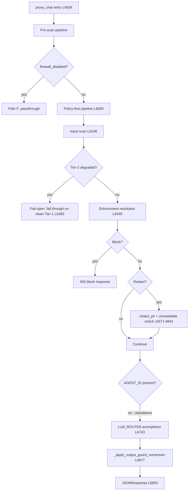

# Chat Pipeline Code Paths

> **Generated**: 2026-07-03 | **Source**: `gateway/ai_mesh_gateway/main.py` (13036 lines)
> **Item**: P1-01 — full enumeration of every chat code path with stage sequences

---

## 1. Entry Points

| # | Route | Handler | Line | Notes |
|---|-------|---------|------|-------|
| 1 | `POST /v1/chat/completions` | `proxy_chat` | 4394 / 4509 | Primary chat endpoint |
| 2 | `POST /v1/chat-completions` | `proxy_chat` | 4505 | Legacy alias (same handler) |
| 3 | `POST /v1/responses` | `proxy_responses` | 8808 | OpenAI Responses API (translates to chat internally) |
| 4 | `POST /v1/embeddings` | `proxy_embeddings` | 9062 | Embeddings (separate pipeline, own scan) |
| 5 | `POST /v1/rag/query` | — | 9676 | RAG query (separate pipeline) |
| 6 | `POST /v1/rag/ingest` | — | 10395 | RAG ingest (separate pipeline) |
| 7 | `POST /v1/policy/check` | `policy_check_endpoint` | 12299 | Policy-only eval (no LLM call) |

This document focuses on **entry points 1–3** (the chat pipeline). Embeddings/RAG/policy-check
are separate pipelines with their own scan chains.

---

## 2. `proxy_chat` — The Four Sub-Paths

`proxy_chat` (L4509) is a single 4000-line handler that branches into **four distinct
sub-paths** based on two axes:

| | **Backend absent** (`!AGENT_ID`) | **Backend present** (`AGENT_ID && backend_url`) |
|---|---|---|
| **Streaming** (`stream=true`) | Path A: Standalone Stream | Path C: Connected Stream |
| **Non-streaming** | Path B: Standalone Sync | Path D: Connected Sync |

Additionally, a **firewall-disabled fast path** (Path F) bypasses all scanning.

---

## 3. Shared Pre-Scan Pipeline (all paths)

Every request passes through these stages before the path branches:

```
L4509  proxy_chat entry
  │
  ├─ Auth middleware (external, before handler)
  ├─ L4570  JSON parse + surrogate strip
  ├─ L4590  Request body validation (_validate_chat_request_body)
  ├─ L4650  max_tokens boundary validation
  ├─ L4700  Auth context extraction (org_config, org_slug, enforcement_mode)
  │         ├─ L4720  firewall_disabled check
  │         ├─ L4760  kill-switch check (model-level + org-level)
  │         ├─ L4820  model isolation reroute
  │         └─ L4870  allowed_models / per-key allowlist enforcement
  │
  ├─ L5660  Per-key RPM rate limit
  ├─ L5740  Per-org TPM rate limit (Lua fail-closed)
  ├─ L5784  Per-key TPM rate limit
  ├─ L5830  Context minimization (max_context_tokens)
  ├─ L5837  Prompt extraction + tool-definition fold (G7/G82)
  └─ L5869  Blocked keywords check
```

At this point, the pipeline diverges based on `firewall_disabled`.

---

## 4. Path F: Firewall Disabled (L5945)

```
firewall_disabled == True
  │
  ├─ stream=true:  _launch_chat_stream_response(secure_output_scan=False)  L5956
  │                 → LLM stream with NO input scan, NO output scan
  │
  └─ stream=false: LLM_ROUTER.acompletion(body, None)  L5971
                    → zeroshield.action = "passthrough"
                    → NO output guard
```

**No fail-open risk**: scanning is explicitly OFF by operator choice.

---

## 5. Path B: Standalone Sync (no backend, non-streaming)



**Stage sequence**: Auth → Rate-limit → Blocked-kw → **Policy** → **Input scan** →
Enforcement → **LLM call** → **Output guard** (non-stream) → Response

**Key lines**:
- Policy check: L6040 (`_policy_check_cached`)
- Input scan: L6302 (`scan_prompt_with_tier2` or `scan_prompt`)
- Tier-2 degraded fail-open: L6383 (falls through, does NOT block)
- Enforcement resolution: L6479 (`_resolve_enforcement`)
- Block decision: L6486 (`_should_hard_block`)
- PII redaction: L6590 (`INPUT_SCANNER.redact_pii`)
- Unmaskable fail-closed: L6615-6691
- LLM call: L6743 (`LLM_ROUTER.acompletion`)
- Output guard: L6877 (`_apply_output_guard_nonstream`)

---

## 6. Path A: Standalone Stream (no backend, streaming)

Same as Path B through enforcement, then:

```
L6701  is_stream=True, no AGENT_ID
  │
  ├─ _launch_chat_stream_response  L6726
  │   ├─ resolve_scan_mode  L2706
  │   ├─ LLM_ROUTER.acompletion_stream  L2770
  │   ├─ SecureStreamingResponse wraps inner  L2780-2811
  │   │   ├─ OUTPUT_GUARD mode → _wrap_secure_stream_with_context  L2789
  │   │   └─ Other modes → wrap_secure_stream_if_needed  L2799
  │   └─ stream_with_finalize  L2842
  │       └─ Terminal SSE frame with zeroshield + pipeline_trace
  └─ StreamingResponse  L2855
```

**Stage sequence**: Auth → Rate-limit → Blocked-kw → **Policy** → **Input scan** →
Enforcement → **LLM stream** → **Streaming output guard** (SecureStreamingResponse) → SSE

---

## 7. Path D: Connected Sync (backend present, non-streaming)

The most complex path. After the shared enforcement resolution, it continues:

```
L6900  AGENT_ID present, backend connected
  │
  ├─ L6908  Dynamic model routing (adjudicate_model_selection)
  ├─ L7128  Routing sentinel resolution
  ├─ L7191  Compliance hard-filter (routing disabled)
  ├─ L7279  Platform model guard
  ├─ L7305  Final allowlist enforcement
  ├─ L7325  Global model isolation
  ├─ L7348  Per-model RPM rate limit
  ├─ L7382  Optional deep scan task
  ├─ L7399  Org-model ownership validation
  ├─ L7428  Circuit breaker check
  │
  ├─ L7483  LLM_ROUTER.acompletion  ← MODEL CALL
  │
  ├─ L7549  Post-response policy check (backend)
  │
  ├─ L7556  ── Output guard (non-streaming) ──
  │   ├─ L7560  _output_scan_degraded flag
  │   ├─ L7567  _output_guard_active gate
  │   ├─ L7589  OUTPUT_GUARD.inspect
  │   ├─ L7599  Degraded output scan (M11 fail-open)
  │   ├─ L7630  output_verdict.action == "block"  → 403
  │   ├─ L7700  output_verdict.action == "redact" → mutate response
  │   ├─ L7770  output_verdict.action == "rewrite" → replace text
  │   └─ L7830  output_verdict.action == "flag" → metadata only
  │
  ├─ L8181  Token usage recording + rate limit reconciliation
  ├─ L8423  Pipeline trace construction
  ├─ L8489  Client-response zeroshield redaction
  └─ L8521  JSONResponse
```

**Stage sequence**: Auth → Rate-limit → Blocked-kw → **Policy** → **Input scan** →
Enforcement → Routing → Model validation → Circuit breaker → **LLM call** →
Post-response policy → **Output guard** → Pipeline trace → Response

---

## 8. Path C: Connected Stream (backend present, streaming)

Same as Path D through circuit breaker, then:

```
L7443  is_stream=True, AGENT_ID present
  │
  ├─ _launch_chat_stream_response  L7466
  │   (identical to Path A's streaming launch — L2683)
  │   ├─ LLM_ROUTER.acompletion_stream
  │   ├─ SecureStreamingResponse (output guard)
  │   └─ stream_with_finalize (terminal zeroshield + pipeline_trace)
  └─ StreamingResponse
```

**Stage sequence**: Auth → Rate-limit → Blocked-kw → **Policy** → **Input scan** →
Enforcement → Routing → Model validation → Circuit breaker → **LLM stream** →
**Streaming output guard** → SSE

---

## 9. `proxy_responses` — Responses API (Path R)

```
L8808  proxy_responses entry
  │
  ├─ Body validation + unsupported-part reject
  ├─ previous_response_id replay (org-scoped, fail-closed)
  ├─ _responses_to_chat_body (translate to chat format)
  │
  └─ proxy_chat(translated_request)  ← delegates entirely
```

**Not a separate pipeline** — translates Responses API format to chat format and calls
`proxy_chat` internally. All chat pipeline stages apply.

---

## 10. Divergence Points — Degraded / Fail-Open

### 10.1 Input Scan Degraded (Tier-2 unavailable)

**Location**: L6383 (`_is_tier2_degraded_verdict`)

```python
if _is_tier2_degraded_verdict(verdict):
    LOG.warning("Tier-2 scanner degraded ... falling back to Tier-1 static decision (fail-open).")
    # Falls through to normal processing; Tier-1 was clean.
```

**Behavior**: When Bedrock (Tier-2) is unavailable, the verdict carries a degraded reason.
The gateway ALLOWS the request if Tier-1 passed, emitting `input_scan_degraded` telemetry.

**SUSPECTED FAIL-OPEN LEAK SITE**: If Tier-1 misses a threat that Tier-2 would catch
(e.g. a sophisticated prompt injection or PII pattern below Tier-1's regex threshold),
the request proceeds to the LLM with the raw prompt. The trace evidence showing
`input_scan` BLOCK + 7710ms `model_output` is consistent with this: Tier-1 blocked but
the degraded path overrode the block and forwarded to the model.

**However**, the code at L6383 checks `_is_tier2_degraded_verdict(verdict)`, which tests
for specific degraded reason codes (bedrock_degraded, client_error, parse_failure). A
BLOCK verdict from Tier-1 should NOT have a degraded flag — those are mutually exclusive.
The actual leak mechanism needs further investigation (item 02+).

### 10.2 Output Scan Degraded (Tier-2 output guard unavailable)

**Location**: L7560 (`_output_scan_degraded`)

```python
_output_scan_degraded = bool(getattr(output_verdict, "scan_degraded", False))
```

**Behavior**: When the output guard's Tier-2 model is unavailable, the verdict carries
`scan_degraded=True`. The response is delivered WITHOUT confident output scanning
(fail-open). `output_scan_degraded` telemetry emitted at L7601.

**Risk**: A model response containing PII/secrets passes through unscanned to the client.
Surfaced in zeroshield metadata (`output_scan_degraded: true`) so operators can detect it.

### 10.3 Tier-2 Strict Mode (fail-closed alternative)

**Location**: L6341-6379

When `tier2_strict=True` (default) and the Bedrock circuit breaker is OPEN, the handler
catches `Tier2UnavailableStrict` and returns **503** (fail-closed). This is the OPPOSITE
of the degraded path — it refuses the request entirely.

**Key distinction**: `tier2_strict` governs breaker-OPEN (service down); the degraded
path (L6383) handles per-request Tier-2 failures (auth error, parse error, transient).
These are two separate failure modes.

---

## 11. Enforcement Resolution — Where Block Decisions Can Be Overridden

**Location**: L6435-6691

```python
_resolved_input_action = _resolve_enforcement(
    _guard_rec,                    # scanner recommendation
    org_policy_action=_org_policy_action,  # policy action
    enforcement_mode=enforcement_mode,     # org enforcement mode
    redaction_possible=True,
)
_should_block_verdict = _should_hard_block(_resolved_input_action, enforcement_mode)
```

**Override points** (where a scanner BLOCK can become non-block):

1. **L6461-6467**: Injection-type threats: if `scan_block_on_injection=False` OR
   confidence < `injection_threshold`, scanner block → `monitor`
2. **L6468-6473**: PII threats with block recommendation → downgraded to `redact`
3. **L6548-6552**: `enforcement_mode != "block"` → scanner block becomes MONITOR (logged only)

**SUSPECTED LEAK SITE**: If `enforcement_mode="monitor"`, a scanner BLOCK verdict
is logged but the request proceeds to the LLM. This is by design ("monitor mode") but
means PII/injection passes through when the org is in monitor mode.

---

## 12. Summary Diagram — All Paths

```
                            proxy_chat (L4509)
                                 │
                    ┌────────────┴────────────┐
                    │   Shared Pre-Scan        │
                    │   (auth, rate-limit,      │
                    │    blocked-kw, max-tok)   │
                    └────────────┬────────────┘
                                 │
                     ┌───────────┴───────────┐
                     │  firewall_disabled?    │
                     └───┬───────────────┬───┘
                    yes  │               │  no
                         │               │
                    Path F           Policy-First
                  (passthrough)      Pipeline (L6000)
                                         │
                                    Input Scan (L6248)
                                         │
                                ┌────────┴────────┐
                                │ Tier-2 degraded? │
                                └──┬──────────┬───┘
                              yes  │          │  no
                          (fail-open)    Enforcement
                          fall-thru      Resolution
                                │         (L6435)
                                └────┬────┘
                                     │
                        ┌────────────┴────────────┐
                        │    AGENT_ID present?     │
                        └──┬──────────────────┬───┘
                      no   │                  │  yes
                    ┌──────┴──────┐    ┌──────┴──────┐
                    │ Standalone  │    │  Connected   │
                    │             │    │              │
                ┌───┴───┐   ┌───┴───┐ │  + Routing   │
                │stream │   │ sync  │ │  + Validation│
                │       │   │       │ │  + CB check  │
                │Path A │   │Path B │ └──┬───────┬──┘
                └───────┘   └───────┘ stream  │ sync
                                      │      │
                                   Path C  Path D
                                      │      │
                                    SSE    JSON
                                  + SecureStreamingResponse
                                  + stream_with_finalize
                                         │
                                    Output Guard
                                    (L7556 / L6877 /
                                     SecureStreamingResponse)
```

---

## 13. Output Guard Coverage by Path

| Path | Output Guard | Location | Mechanism |
|------|-------------|----------|-----------|
| A (standalone stream) | YES | L2780-2811 | `SecureStreamingResponse` wrapping `_provider_stream` |
| B (standalone sync) | YES | L6877 | `_apply_output_guard_nonstream` (added as fix for §1.7) |
| C (connected stream) | YES | L2780-2811 | Same as Path A |
| D (connected sync) | YES | L7556-7830 | Inline `OUTPUT_GUARD.inspect` |
| F (firewall disabled) | NO | — | `secure_output_scan=False` (by design) |

---

## 14. Non-Chat Entry Points (for completeness)

### `proxy_embeddings` (L9062)
Separate pipeline: auth → rate-limit → input scan (PII redaction on embedding inputs) →
upstream embedding call. No policy check, no output guard (embeddings have no text output
to scan). PII redaction uses the same `INPUT_SCANNER.redact_pii` as chat.

### `policy_check_endpoint` (L12299)
Policy-only evaluation: auth → rate-limit → policy check → return verdict. No LLM call,
no input scan, no output guard. Used by the operator simulator UI.

### RAG endpoints (L9676, L10395)
Separate pipelines with their own auth + scan + vector-DB interaction.

---

## 15. Suspected Fail-Open / No-Short-Circuit Sites

| # | Location | Risk | Description |
|---|----------|------|-------------|
| 1 | **L6383** | **HIGH** | Tier-2 degraded verdict → falls through on "clean Tier-1". If Tier-1 is insufficient, raw prompt reaches LLM. |
| 2 | **L6548** | MEDIUM | `enforcement_mode != "block"` → scanner BLOCK becomes MONITOR (by design, but PII egresses) |
| 3 | **L7599** | MEDIUM | Output scan degraded → response delivered UNSCANNED (fail-open, surfaced in metadata) |
| 4 | **L6256-6262** | LOW | `tier2_execution_mode=async_post_llm` with block+stream: forces sync (safe), but the comment at L6261 shows it was considered |
| 5 | **L6341** except block | LOW | Scan exception (non-Tier2UnavailableStrict) → re-raised → 500 (safe: does not forward) |
| 6 | **L1694** | MEDIUM | `_apply_output_guard_nonstream` inspect exception → returns None (fail-open), response ships without output guard |

---

## 16. Key Helper Functions

| Function | Line | Role |
|----------|------|------|
| `_launch_chat_stream_response` | 2683 | Builds streaming pipeline: scan mode → provider stream → SecureStreamingResponse → finalize |
| `_wrap_secure_stream_with_context` | 2526 | OUTPUT_GUARD streaming with org context (M-05) |
| `_apply_output_guard_nonstream` | 1648 | Runs output guard on non-streaming completions for early-return paths |
| `_build_stream_zeroshield_base` | 2597 | Terminal SSE frame metadata |
| `stream_with_finalize` | (stream_orchestration module) | Wraps streaming with telemetry + terminal frame |
| `SecureStreamingResponse` | secure_streaming.py:129 | Buffers + scans SSE chunks via OutputGuard |
| `_is_tier2_degraded_verdict` | (referenced L6383) | Checks for Bedrock degraded reason codes |
| `_resolve_enforcement` | enforcement.py | Merges scanner + policy + enforcement_mode → final action |
| `_should_hard_block` | enforcement.py | Given resolved action + mode, should we 403? |
| `_should_apply_redaction` | enforcement.py | Given resolved action + threat type, should we redact? |
