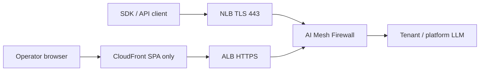
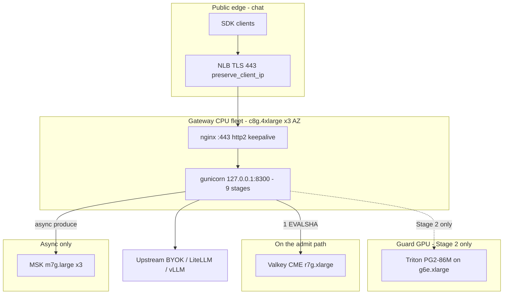
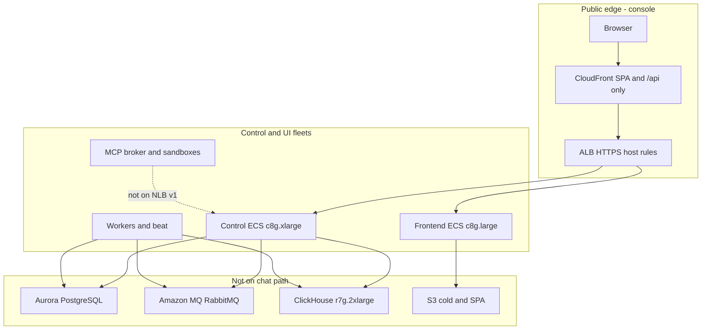
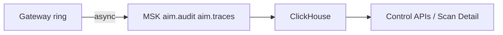
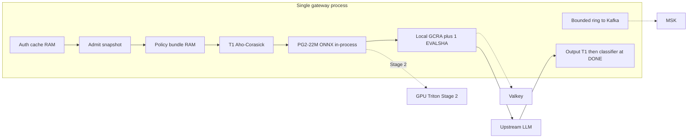
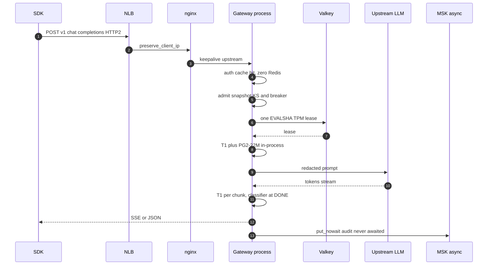
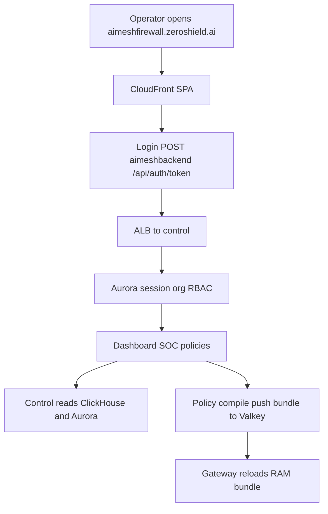
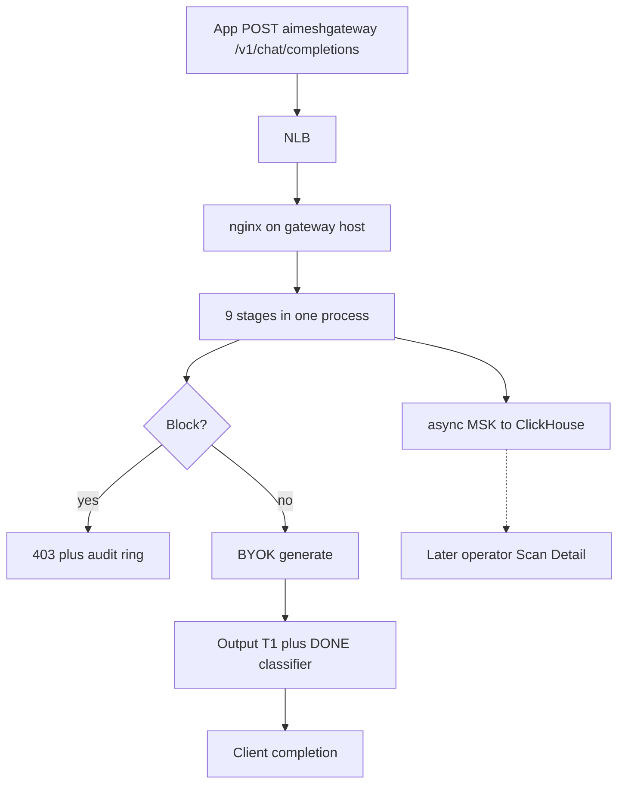
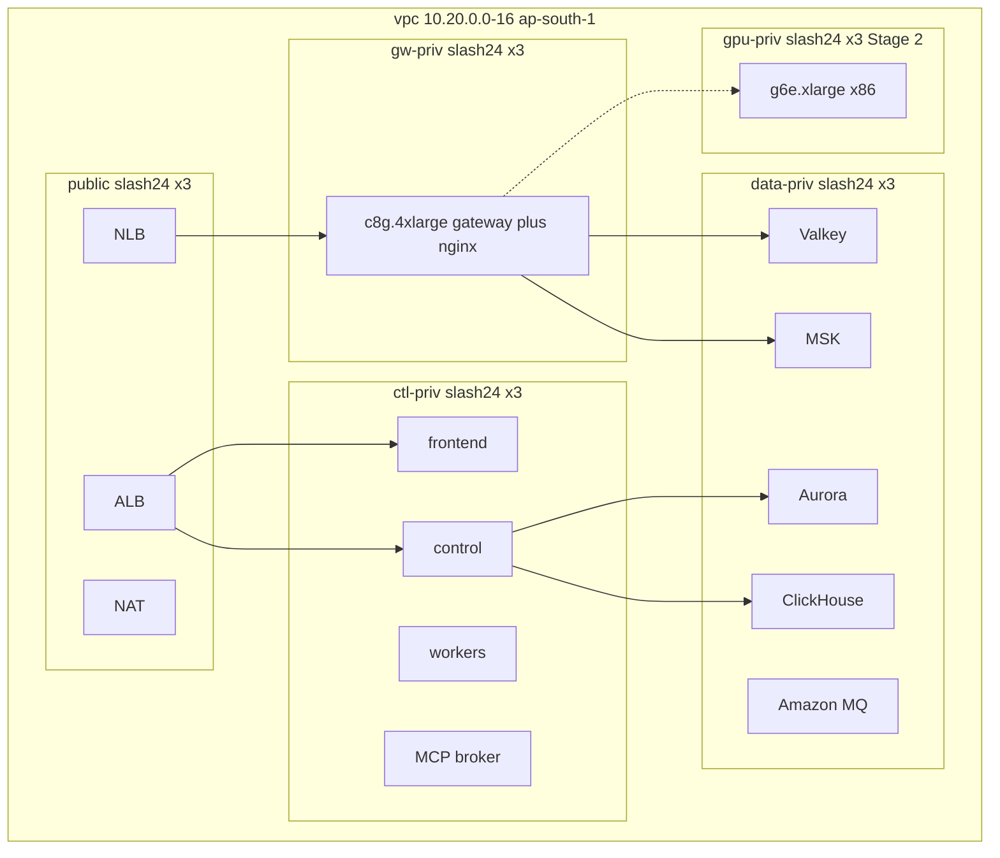
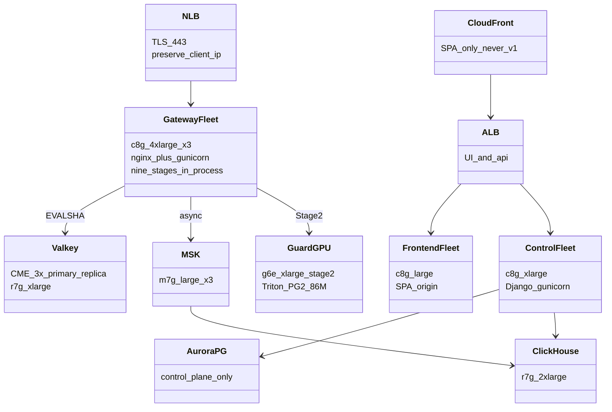

# Proposed target instance architecture — AI Mesh Firewall

> **Status:** PROPOSAL only. Derived from [`2026-08-22-MASTER-hot-path-capacity-architecture.md`](./2026-08-22-MASTER-hot-path-capacity-architecture.md) D1–D13, D8, D11.
> **Region:** `ap-south-1` (Mumbai). Three AZs.
> **Law:** split by **hardware class and failure domain**, not by business capability. Auth / policy / T1 stay **in-process** on the gateway (D1). Do not put CloudFront, ALB, API Gateway, or Kafka on `/v1/chat/*` (D11).

This document is the instance-level HLD: **what boxes exist, what they talk to, what is forbidden on the chat path.**

Diagrams below are **standard mermaid** (`graph` / `sequenceDiagram` / `classDiagram`) so they render in Cursor and GitHub preview. C4 macros, PlantUML, HTML ` `, and `{…}` / `[…]` inside sequence messages do not.

The mermaid in this file is the in-repo source of truth. Cursor’s preview renders `graph` / `sequenceDiagram` / `classDiagram`; it does not render C4 or PlantUML.

---

## 1. What we are leaving

Today production is **one** `c8g.2xlarge` running **15 containers** (gateway, control, frontend, postgres, redis, rabbitmq, nginx, workers, MCP, stubs). Terraform in `infra/terraform/envs/prod` has **never been applied**. The target is the opposite: **named fleets + managed data stores**, still a **modular monolith** for chat enforcement.

---

## 2. Instance and managed-service inventory

Sizing below is the **Phase 4 / 20 k admitted RPS** layout. Stage-1 (today’s ~30–85 RPS) can start at the “lean” column and grow without changing topology.

| # | Name | Role | SKU / service | Count (lean → 20k RPS) | AZ | On `/v1` chat path? |
|---|---|---|---|---|---|---|
| 1 | **NLB gateway** | TLS:443 SDK / API. `preserve_client_ip=true`, idle 350 s | NLB, TCP/TLS | 1 (3 AZ) | all | **Yes** (edge) |
| 2 | **ALB console** | UI + control `/api`. Host rules. HTTP→HTTPS | ALB | 1 (3 AZ) | all | **No** |
| 3 | **CloudFront** | SPA static + optional `/api` cache-bust. **Never `/v1/*`** | CloudFront | 1 | global | **No** |
| 4 | **Gateway CPU fleet** | All 9 stages, nginx sidecar, gunicorn | ECS on EC2 **c8g.4xlarge** | 1 → **3** (1/AZ) | 1a/1b/1c | **Yes** |
| 5 | **Guard GPU fleet** | PG2-86M Triton. **Stage 2 only** (~>150 classify/s/host) | ECS on EC2 **g6e.xlarge** (x86) | 0 → 9 at 20 k | 1a/1b/1c | Optional hop |
| 6 | **Frontend fleet** | SPA origin (nginx or static host) | ECS **c8g.large** | 2 (2 AZ) | 1a/1b | **No** |
| 7 | **Control plane fleet** | Django/gunicorn `/api`, admin, policy compile | ECS **c8g.xlarge** | 2 → 3 | 1a/1b/1c | **No** |
| 8 | **Control workers** | Celery worker + beat (compile, drain consumers) | ECS **c8g.xlarge** | 2 + 1 beat | 1a/1b | **No** |
| 9 | **MCP broker + sandboxes** | Per-org MCP, not chat admit | ECS + gVisor sandboxes | 1 broker + N sandboxes | 1a/1b | **No** |
| 10 | **Valkey (ElastiCache)** | Auth miss, KS truth, quota `EVALSHA`. **Not telemetry** | Valkey 8.1 CME **r7g.xlarge** | 2×(1+1) → **3×(1+1)** | 3 AZ | **Yes** (1 RTT) |
| 11 | **Aurora / RDS PostgreSQL** | Orgs, keys, policies, users. **Gateway opens 0 connections** | Aurora Serverless v2 (2×0.5 ACU) or RDS Multi-AZ `db.r7g.large` | 1 cluster | 2 AZ | **No** |
| 12 | **PgBouncer / RDS Proxy** | Control→Postgres pooling only | RDS Proxy or ECS sidecar | 1 | with control | **No** |
| 13 | **Amazon MQ (RabbitMQ)** | Control celery broker (keep; not chat) | mq.m5.large or 3.13 | 1 Multi-AZ | 2 AZ | **No** |
| 14 | **MSK (Kafka)** | `aim.audit` / `aim.traces` from gateway ring | kafka.**m7g.large** | **3 brokers** | 3 AZ | Produce only (async) |
| 15 | **ClickHouse** | Analytics / Scan Detail rehydrate | EC2 **r7g.2xlarge** + 2 TB gp3 | 1 → 3 | 1a | **No** |
| 16 | **S3** | Cold traces, CH backups, SPA assets | Standard | 2 buckets | region | **No** |
| 17 | **ECR** | Gateway arm64 + GPU x86 images | Private | 1 registry, 2 tags | region | pull only |

**Retired:** in-box Redis 768 MB, in-box Postgres, Mongo telemetry pilot, `guardrails` / `vector-retrieval` / `telemetry-ingest` stubs as production processes, single-node Memorystore 1 GiB.

---

## 3. DNS and edge (must stay split)

| Hostname | Target | Why |
|---|---|---|
| `aimeshfirewall.zeroshield.ai` | CloudFront → ALB → **frontend** | Console SPA |
| `aimeshbackend.zeroshield.ai` | ALB → **control** | `/api`, admin, policy compile, WS |
| `aimeshgateway.zeroshield.ai` | **NLB** → nginx → **gateway :8300** | `/v1/chat/completions`, `/health` |

Do **not** add an ALB host rule for the gateway name. Do **not** send 9-stage traffic through CloudFront.

---

## 4. System context — who talks to what

---

## 5. Deployment — instance structure

Split into three graphs so the preview layout stays readable. Chat and console **do not share an edge**.

### 5.1 Chat hot path (SDK only)

### 5.2 Console path (UI + control — never /v1)

### 5.3 Trace / audit pipe (after the response)

---

## 6. Component — gateway process (still one process)

No `auth-svc` / `policy-svc` / `scan-svc`. The only permitted extra hop is **Stage 2 GPU**.

---

## 7. Sequence — one allow-path chat (hot path)

Curly braces and square brackets in messages are mermaid syntax (loops / notes). They are written in plain words here so the diagram parses.

Postgres, ClickHouse, control HTTP, CloudFront, and ALB **do not appear** on this sequence.

---

## 8. User flows — two products, two edges

### 8.1 Operator console (not the 12 ms SLO)

### 8.2 Tenant SDK chat (SLO F/G)

---

## 9. Data-store ownership (who may touch what)

| Store | Writer | Reader on chat path | Forbidden |
|---|---|---|---|
| Valkey | Gateway (quota, KS), control (bundle publish) | Gateway: miss + 1 EVALSHA | Telemetry LPUSH, 17× PUBLISH per log |
| Aurora | Control + workers only | **None** | Gateway ORM |
| MSK | Gateway ring, MCP audit | Workers / CH ingest | Awaited produce on request |
| ClickHouse | MSK consumers | Control APIs / UI | Gateway SELECT |
| RabbitMQ | Control / workers | Workers | Gateway chat |
| S3 | CH backups, SPA, spill files | Control, CloudFront | Request-path GET |

---

## 10. VPC sketch (3 AZ)

Security groups (intent):

- NLB SG → gateway nginx **443 only** (not world `:8300`).
- ALB SG → frontend 80 + control 8000.
- Gateway SG → Valkey 6379, MSK 9092, BYOK 443, (Stage 2) GPU 8001. **No Aurora.**
- Control SG → Aurora 5432, MQ, Valkey (publish), ClickHouse 8123.
- SSH/RDP: operator prefix lists only.

---

## 11. Stage-1 vs Stage-2 hardware (same topology)

| Phase | Gateway | GPU | Valkey | Why |
|---|---|---|---|---|
| **Stage 1** (now → ~500 RPS) | 1–3 × c8g.4xlarge, **PG2-22M in-process** | **0** | 2 shards × (1+1) r7g.large/xlarge | No arm64 GPU in Mumbai; volume does not pay for L40S |
| **Stage 2** (≥~500 RPS or p99 gone) | scale c8g.4xlarge | g6e.xlarge Triton PG2-86M | 3×(1+1) r7g.xlarge | Only way to keep 86M ≤8 ms |

---

## 12. Cost snapshot (MASTER, ap-south-1, not a quote)

At **today’s traffic**, incremental vs one-box compose ≈ **$1.4 k/month** (Valkey ~$1.07 k + MSK ~$0.32 k + ClickHouse ~$0.4 k, Mongo retired).

At **20 k admitted RPS**: 3 × c8g.4xlarge ≈ $1.30/h; GPU pool ~9 × g6e ≈ **$15 k/month** extra. SLO C (100 k **completed** chats) is a **GPU purchase**, not this diagram.

---

## 13. Non-goals (do not draw these boxes on `/v1`)

- Auth / policy / scan as separate ECS services
- API Gateway, ALB, or CloudFront in front of chat
- Bigger single Redis as a latency fix
- ClickHouse or Aurora on the admit path
- Memorystore 1 GiB BASIC as prod cache
- Llama Guard 3 1B on the synchronous admit path

---

## 14. Fleet UML (class view)

Same boxes as §5, as a class diagram. Cursor renders `classDiagram`; it does not render PlantUML.

---

## 15. Mapping from today’s compose

| Today (one VM) | Target |
|---|---|
| `gateway` + host `:8300` | Gateway fleet behind NLB; gunicorn loopback; nginx public |
| `nginx` UI/API vhosts | ALB + frontend + control; **also** nginx on `/v1` |
| `control` + `workers` + `beat` | Control ECS + worker ECS |
| `frontend` | Frontend ECS + CloudFront |
| `postgres` + `pgbouncer` | Aurora + RDS Proxy / pgbouncer |
| `redis` | ElastiCache Valkey CME |
| `rabbitmq` | Amazon MQ |
| telemetry via Redis LIST | MSK → ClickHouse |
| `mcp-broker` + sandboxes | MCP ECS pool (unchanged isolation story) |
| `guardrails` stub container | Deleted; PG2 in-process then GPU |
| `demo` | Optional, not prod |
| node-exporter / cadvisor | ECS + Container Insights / CH metrics |
