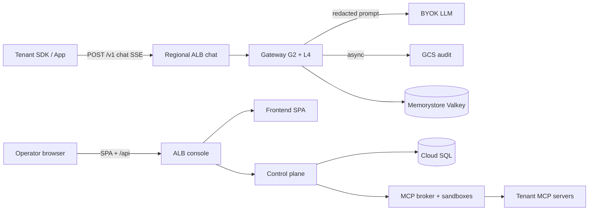
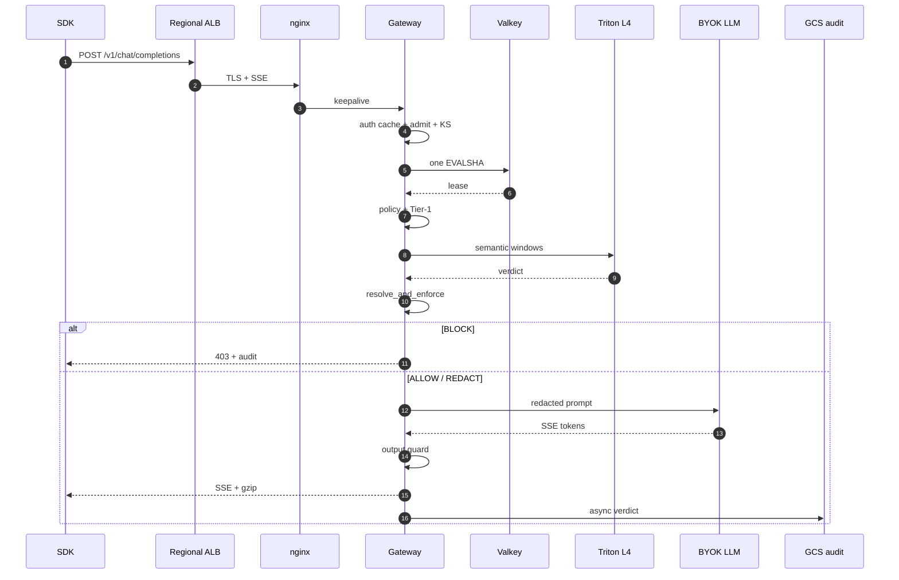

# AI Mesh Firewall — End-to-End Architecture HLD

> **Audience:** technical managers, architects, senior engineers  
> **Source of truth:** [`2026-08-27-FINAL-evidence-based-hot-path-plan.md`](./2026-08-27-FINAL-evidence-based-hot-path-plan.md) §11–§12 + [`2026-09-02-hot-path-cost-matrix.md`](./2026-09-02-hot-path-cost-matrix.md)  
> **Status:** PLAN / TARGET architecture (GCP `asia-south1`). Not authorised as an infra change.  
> **Operating point (Posture A):** 4 × `g2-standard-24` · 8 × NVIDIA L4 · **1,064 RPS** · **~$4,561/mo** · ≤$5,000 budget  
> **Eraser (live, new file):** [AI Mesh Firewall — Complete End-to-End Architecture HLD](https://app.eraser.io/workspace/AJjiHM3GU7BmVD72EbbC) — publicly viewable. Free-plan AI credits were exhausted, so diagrams were written as Eraser DSL (not AI-generated). The previous incomplete HLD file was archived and not reused.

---

## 0 · One-slide product picture

| Dimension | Number |
|---|---|
| What it is | Multi-tenant **AI security gateway** — scans every chat/MCP call before/after the tenant’s model |
| Region | **GCP asia-south1** (Mumbai), 3 zones |
| Hot path SLO | **≈4.1–5.9 ms p50** added latency ≤1,024 tokens (in-process L4). p99 ≈18 ms @1,064 RPS |
| Throughput on $5k | **1,064 RPS** (GPU quota + budget bind together) |
| Volume | **2.76 B requests/month** |
| Unit cost | **$1.65 / M requests** (BYOK LLM tokens **not** in bill) |
| Binding constraint | `NVIDIA_L4_GPUS = 8` **and** $5k — raising quota alone buys **0** RPS inside budget |

**Two public edges (never mixed):**

1. **Chat / SDK** → Regional ALB → Gateway (9-stage pipeline + L4 semantic scan) → tenant BYOK LLM  
2. **Operator console** → Frontend SPA + Control `/api` (policies, SOC, MCP UI) — **not** on the 12 ms path

---

## 1 · System context (who talks to what)

```eraser
direction right
colorMode pastel
styleMode plain
typeface clean

SDK [icon: user, label: "Tenant SDK / App", color: blue]
Operator [icon: user, label: "Operator browser", color: green]
BYOK [icon: openai, label: "Tenant BYOK LLM\n(OpenAI / Anthropic / …)", color: orange]
UpstreamMCP [icon: server, label: "Tenant MCP servers\n(stdio / http / sse / ws)", color: orange]

AIMesh [icon: gcp-cloud-generic, label: "AI Mesh Firewall\nGCP asia-south1", color: purple] {
  ChatEdge [icon: gcp-cloud-load-balancing, label: "Chat edge\nRegional ALB /v1"]
  ConsoleEdge [icon: gcp-cloud-load-balancing, label: "Console edge\nALB /api + SPA"]
  Product [icon: gcp-google-kubernetes-engine, label: "Gateway + Control + MCP"]
}

Audit [icon: gcp-cloud-storage, label: "Audit / verdicts\nGCS sink", color: gray]
Metrics [icon: gcp-cloud-monitoring, label: "Cloud Monitoring\n(cardinality-capped)", color: gray]

SDK > ChatEdge: "POST /v1/chat/completions\nSSE or JSON"
Operator > ConsoleEdge: "HTTPS SPA + /api"
ChatEdge > Product
ConsoleEdge > Product
Product > BYOK: "redacted prompt\n(over internet)"
Product > UpstreamMCP: "via per-org sandbox"
Product --> Audit: "async verdict"
Product --> Metrics: "fleet + GPU"

legend [position: bottom] {
  [color: blue, label: "Tenant traffic (SLO)"]
  [color: green, label: "Operator / control"]
  [color: orange, label: "External (BYOK / MCP)"]
  [color: purple, label: "AI Mesh product"]
}
```

### Mermaid twin (renders in Cursor / GitHub)



---

## 2 · Cloud HLD — full GCP footprint (Posture A)

Everything below is what **$4,561/mo** buys. Lines marked **$0** ride spare G2 vCPU (CPU capacity ~26k RPS vs GPU 1,064 RPS).

```eraser
direction down
colorMode pastel
styleMode plain
typeface clean

Internet [icon: globe, label: "Internet", color: gray]

GCP [icon: gcp-cloud-generic, label: "GCP asia-south1 · 3 zones a/b/c", color: blue] {

  Edge [icon: gcp-cloud-network, label: "Edge · Standard Network Tier", color: blue] {
    ALB [icon: gcp-cloud-load-balancing, label: "Regional external ALB\nTLS · SSE · idle ≥350s\n$18.25"]
    ExtIP [icon: gcp-cloud-external-ip-addresses, label: "External IPs\n(no Cloud NAT)\n$15"]
    DNS [icon: gcp-cloud-dns, label: "Cloud DNS\nhostnames"]
  }

  GKE [icon: gcp-google-kubernetes-engine, label: "GKE regional cluster · $73", color: purple] {

    GPUPool [icon: gcp-cloud-gpu, label: "GPU node pool — THE HOT PATH", color: red] {
      G2 [icon: gcp-compute-engine, label: "4 × g2-standard-24\n96 vCPU · 384 GB\n8 × NVIDIA L4\n$2,736.76"]
      Gateway [icon: server, label: "Gateway pods\nproxy_chat 9 stages"]
      Triton [icon: gcp-ai-platform, label: "Triton + TensorRT\nPG2-22M in-process\nshared GPU queue"]
      Nginx [icon: nginx, label: "nginx sidecar\nHTTP/2 keepalive"]
      Control [icon: django, label: "Control / Celery / PgBouncer\n$0 spare CPU"]
      Frontend [icon: react, label: "SPA + nginx\n$0 spare CPU"]
      MCPBroker [icon: server, label: "MCP broker\n$0 spare CPU"]
      Sandboxes [icon: docker, label: "Per-org MCP sandboxes\ngVisor target"]
      Mongo [icon: mongodb, label: "Mongo telemetry\n$0 · disk below"]
      Chroma [icon: database, label: "Chroma RAG\n$0 · not on /v1"]
    }
  }

  Managed [icon: gcp-cloud-generic, label: "Managed data plane", color: green] {
    SQL [icon: gcp-cloud-sql, label: "Cloud SQL Postgres HA\n4 vCPU / 16 GiB / 100 GiB\n$273.91 + $15 backup"]
    Valkey [icon: gcp-memorystore, label: "Memorystore Valkey HA\n2 × 13 GB highmem-medium\n$175.20"]
    PD [icon: gcp-persistent-disk, label: "Persistent disks\n4×100 boot + 250 data\n$68"]
  }

  Ops [icon: gcp-cloud-ops, label: "Platform / ops", color: orange] {
    AR [icon: gcp-artifact-registry, label: "Artifact Registry\n~$10"]
    GCS [icon: gcp-cloud-storage, label: "GCS audit sink\nLog Router · $53"]
    Mon [icon: gcp-cloud-monitoring, label: "Cloud Monitoring\nhealth only · $15"]
    Snap [icon: gcp-persistent-disk, label: "Disk snapshots\n$18"]
  }

  NotBought [icon: ban, label: "Deliberately NOT bought", color: gray] {
    NAT [icon: gcp-cloud-nat, label: "Cloud NAT — $0\nwould bill ~87 KiB provider body"]
    Armor [icon: gcp-cloud-armor, label: "Cloud Armor — $0\n$15,180/mo = 3× budget"]
    Kafka [icon: kafka, label: "Kafka / ClickHouse /\nBigQuery / Vertex — $0"]
  }
}

BYOK [icon: openai, label: "Tenant model provider\nNO asia-south1 endpoint\n→ prompt-leg egress", color: orange]
TenantMCP [icon: server, label: "Tenant MCP upstreams", color: orange]

Internet > DNS > ALB
ALB > Nginx > Gateway
Gateway > Triton: "localhost C API\nzero network hop"
Gateway > Valkey: "1 EVALSHA / req\n+ kill-switch"
Gateway > BYOK: "egress $1,090\n(prompt + SSE)"
Gateway --> GCS: "async verdict"
Control > SQL: "orgs · keys · policies"
Control > Valkey: "policy bundle push"
MCPBroker > Sandboxes > TenantMCP
Gateway --> Mongo: "async telemetry"
Frontend - Control: "same ALB host rules"

legend [position: bottom] {
  [color: red, label: "Hot path / SLO"]
  [color: green, label: "Managed state"]
  [color: orange, label: "Ops / external"]
  [color: gray, label: "Explicitly excluded"]
}
```

### Cost roll-up (living numbers)

| Bucket | $/mo | Why |
|---|---:|---|
| G2 ×4 + 8 L4 | 2,737 | Only topology that hits &lt;12 ms (in-process GPU) |
| Egress + LB | **1,090** | Client SSE + **prompt to provider over internet** — not §12’s $460 |
| Cloud SQL HA + backup | 289 | Control plane only; chat opens **0** DB connections |
| Valkey HA | 175 | Kill-switch + quota; HA or every failover = 503 |
| Disks + ALB + IPs + GKE + AR + GCS + Mon + snaps | 270 | Platform |
| FE / Control / MCP / Mongo / Chroma | **0** | Spare vCPU |
| **Total** | **4,561** | **$439 headroom** |

---

## 3 · Request sequence — one ALLOW chat (hot path)

**What is NOT on this path:** Cloud SQL, frontend, Celery, MCP, Chroma, Cloud Monitoring cardinality, Kafka.

```eraser
Client [icon: user]
ALB [icon: gcp-cloud-load-balancing]
Nginx [icon: nginx]
Gateway [icon: server]
Valkey [icon: gcp-memorystore]
Triton [icon: gcp-ai-platform]
LLM [icon: openai]
GCS [icon: gcp-cloud-storage]

Client > ALB: "POST /v1/chat/completions\nAuthorization: Bearer <org key>"
ALB > Nginx: "TLS terminated · preserve IP"
Nginx > Gateway: "HTTP/2 keepalive → :8300"

activate Gateway
Gateway > Gateway: "Auth RAM cache hit\n(org / key / roles)"
Gateway > Gateway: "Admit · kill-switch snapshot"
Gateway > Valkey: "EVALSHA TPM / burst lease"
Valkey --> Gateway: "lease OK"
Gateway > Gateway: "Policy bundle (RAM)\nredact-before-block if needed"
Gateway > Gateway: "Tier-1 Hyperscan gate\nPII / secrets / injection signal"
Gateway > Triton: "PG2-22M windows\nTensorRT · shared queue"
Triton --> Gateway: "injection verdict"
Gateway > Gateway: "resolve_and_enforce()\nBLOCK short-circuits HERE"

Gateway > LLM: "redacted prompt\nover internet"
activate LLM
LLM --> Gateway: "SSE tokens"
deactivate LLM

Gateway > Gateway: "Output T1 per coalesce\nclassifier at DONE\nenforce_output()"
Gateway --> Client: "SSE chunks + gzip\ntrace_id (no fat pipeline_trace)"
Gateway --> GCS: "async audit put_nowait"
deactivate Gateway
```

### Mermaid twin



---

## 4 · Canonical pipeline stages (inside `proxy_chat`)

```eraser
direction down
colorMode pastel
styleMode plain
typeface clean

S0 [icon: lock, label: "0 PRE\nAuth · body · org · KS\nRPM/TPM · keywords", color: blue]
S1 [icon: file-text, label: "1 POLICY\n_policy_check_cached\nredact-before-block", color: blue]
S2 [icon: search, label: "2 INPUT_SCAN\nTier-1 + Tier-2 L4\non effective_prompt", color: red]
S3 [icon: shield, label: "3 ENFORCE\nresolve_and_enforce()\nPipelineDecision", color: red]
S4 [icon: git-branch, label: "4 ROUTING\n(connected paths)\ncircuit breaker", color: purple]
S5 [icon: openai, label: "5 MODEL_CALL\nnever after BLOCK", color: orange]
S6 [icon: shield, label: "6 OUTPUT_GUARD\nenforce_output()\nfail-closed", color: red]
S7 [icon: check, label: "7 FINALIZE\ntrace_id · usage\nSSE terminal / JSON", color: green]

Block [icon: x-circle, label: "403 terminal\nmodel NEVER called", color: red]
Pass [icon: arrow-right, label: "continue", color: green]

S0 > S1 > S2 > S3
S3 > Block: "is_terminal_block"
S3 > S4: "allow / redact"
S4 > S5 > S6 > S7
S6 > Block: "output block"

legend [position: bottom] {
  [color: red, label: "Security / short-circuit"]
  [color: blue, label: "Admit / policy"]
  [color: orange, label: "Provider"]
  [color: green, label: "Delivery"]
}
```

### Fail-closed rules (manager-readable)

| Event | Behaviour |
|---|---|
| Policy / scanner / output **BLOCK** | Immediate 403; **model not called** (input) or withheld (output) |
| Scanner **degraded** + PII | **REDACT** (or BLOCK if unmaskable) — never raw to model |
| Output guard exception | **Fail-closed BLOCK** |
| Valkey HA failover | Kill-switch fails closed → product **503** unless grace designed |
| Off-box GPU | **≥16.1 ms RTT** — cannot meet 12 ms; hence in-process G2 |

---

## 5 · Dual product edges — console vs chat

```eraser
direction right
colorMode pastel
styleMode plain
typeface clean

Browser [icon: globe, label: "Operator"]
SDK [icon: code, label: "Tenant SDK"]

Console [icon: monitor, label: "CONSOLE PATH\n(not 12 ms SLO)", color: green] {
  SPA [icon: react, label: "Frontend SPA"]
  API [icon: django, label: "Control /api"]
  SQL2 [icon: gcp-cloud-sql, label: "Cloud SQL"]
  Workers [icon: settings, label: "Celery · rollups\npolicy compile"]
  MCPUI [icon: tool, label: "MCP register / sync / policies"]
}

Chat [icon: zap, label: "CHAT PATH\n(12 ms SLO)", color: red] {
  ALB2 [icon: gcp-cloud-load-balancing, label: "Regional ALB /v1"]
  GW2 [icon: server, label: "Gateway 9 stages + L4"]
  VK2 [icon: gcp-memorystore, label: "Valkey 1 RTT"]
  LLM2 [icon: openai, label: "BYOK"]
}

Browser > SPA > API
API > SQL2
API > Workers
API > MCPUI
Workers --> VK2: "push policy bundle"
SDK > ALB2 > GW2
GW2 > VK2
GW2 > LLM2
```

**DNS split (required):**

| Hostname pattern | Target | On `/v1`? |
|---|---|---|
| Console / firewall UI | Frontend + Control ALB | **No** |
| `…gateway…` / SDK base URL | Regional ALB → gateway | **Yes** |

Do **not** put Cloud CDN / Cloud Armor / Cloud NAT on the chat admit path at this budget.

---

## 6 · MCP path (Context Assembly — module 1.4)

All four transports (stdio, streamable-http, SSE, websocket) egress via **per-org sandbox**; gateway never dials upstream directly (when `MCP_HTTP_VIA_SANDBOX=true`).

```eraser
direction right
colorMode pastel
styleMode plain
typeface clean

Client2 [icon: user, label: "SDK or Control"]
GW3 [icon: server, label: "Gateway mcp_proxy"]
Scan [icon: shield, label: "1.4 scan floor\nargs + result\nPII/secret/IP/exfil"]
Broker [icon: server, label: "MCP broker"]
Sandbox [icon: docker, label: "Per-org sandbox\nagent + gVisor"]
Up [icon: server, label: "Upstream MCP"]
Audit2 [icon: gcp-cloud-storage, label: "MCPEvent audit"]

Client2 > GW3: "JSON-RPC / REST tools/call"
GW3 > Scan: "inbound args"
Scan > Broker: "broker_send_rpc\nX-Request-ID"
Broker > Sandbox: "org-scoped"
Sandbox > Up: "allowlisted host\nSSRF-checked"
Up --> Sandbox --> Broker --> Scan: "result / error envelope"
Scan > Client2: "masked or [BLOCKED]"
Scan --> Audit2: "decision + tags"
```

---

## 7 · Data ownership (who may touch what)

| Store | Writer | On chat path? | Forbidden |
|---|---|---|---|
| **Valkey** | Gateway (quota/KS), Control (bundle publish) | **Yes — 1 EVALSHA** | Telemetry LPUSH, chat ORM |
| **Cloud SQL** | Control + workers only | **No** (0 connections from chat) | Gateway SELECT/INSERT |
| **GCS audit** | Gateway async / Log Router | Produce only | Awaited write on request |
| **Mongo** | Gateway async telemetry | Produce only | Sync read on admit |
| **Chroma** | Control / RAG connectors | **No** | `/v1` vector lookup |
| **Persistent disks** | VMs / Mongo / Chroma | Boot only | — |

---

## 8 · Capacity & latency (what this architecture delivers)

```eraser
direction down
colorMode pastel
styleMode plain
typeface clean

Budget [icon: dollar-sign, label: "$5,000 / mo lock", color: green]
Buy [icon: gcp-cloud-gpu, label: "Buy Posture A\n1,064 RPS\n8 × L4\n$4,561", color: blue]
Lat [icon: clock, label: "≤1024 tok\n~4.1–5.9 ms p50\n~18 ms p99", color: blue]
Over [icon: alert-triangle, label: "14 L4 / 1,862 RPS\n~$7,229 — OVER", color: red]
Risk [icon: alert-triangle, label: "Risk-gate 26%\n2,361 RPS same $\nbut weak T1-only", color: orange]

Budget > Buy > Lat
Budget > Over
Budget > Risk
```

| Band | p50 added | &lt;12 ms? |
|---|---:|---|
| ≤512 tok · 1 window | ≈4.1 ms | yes |
| ≤1,024 tok · 2 windows | ≈5.9 ms | yes |
| 10k-char prose | ≈10.8 ms | yes |
| 10k-char markdown/code | ≈17.2 ms | **no** |
| CPU-only semantic today | 159 ms | no |
| Split GPU | ≥16.1 ms RTT | no |

| RPS claim | Value | Binds on |
|---|---:|---|
| **Plan on this** | **1,064** | 8 L4 + $5k |
| Practical CPU / vCPU | 277 | unused (GPU binds first) |
| Theoretical CPU / vCPU | 461 | physics |
| Today measured / vCPU | 0.17–5.4 | current code |
| A′ 14 L4 | 1,862 | **budget** (~$7.2k) |

---

## 9 · Caveats that outrank the diagram

1. **74% of GPU latency is derived** — not measured on our L4. Gate: `$7` / 30 min `trtexec` bake-off.  
2. **Deterministic Tier-1 alone does not detect paraphrased injections** (0/10) and hard-blocks benign backticks (5/5) until Gate 0 + demotion.  
3. **Per-request FPR ≈1.99%** at 2 windows (Meta’s 1% is **per window**). Must be published before customer SLO.  
4. **Egress $460 in PDF §12 is wrong** — response-only / in-region assumption. Plan on **~$1,090**.  
5. **Streaming benches today measure provider TTFT** (`addon = TTFT`) until Gate 1 instrument fix.

---

## 10 · How to render in Eraser

### Option A — MCP (preferred once connected)

1. Cursor Settings → MCP → confirm **eraser** (`https://app.eraser.io/api/mcp`)  
2. Complete **OAuth** when prompted (or set `ERASER_API_TOKEN` from Eraser → Settings → API Tokens)  
3. Ask the agent: *“Render diagram §2 from `docs/plans/2026-09-07-end-to-end-architecture-hld.md` via Eraser”*

Config already added to `~/.cursor/mcp.json`:

```json
"eraser": {
  "url": "https://app.eraser.io/api/mcp"
}
```

### Option B — paste DSL

1. Open [app.eraser.io](https://app.eraser.io) → New file  
2. Add diagram → **Cloud architecture** / **Sequence** / **Flowchart**  
3. Paste the matching `eraser` code block from §§1–8  
4. Export PNG/PDF for the management deck

### Option C — Mermaid in this repo

Use the Mermaid twins in §§1 and 3 for PR / GitHub review without Eraser.

---

## 11 · Diagram inventory (for the deck)

| # | Title | Type | Section |
|---|---|---|---|
| D1 | System context | Cloud arch | §1 |
| D2 | Full GCP HLD + cost | Cloud arch | §2 |
| D3 | Allow-path chat sequence | Sequence | §3 |
| D4 | Canonical 9-stage pipeline | Flow / arch | §4 |
| D5 | Console vs chat edges | Cloud arch | §5 |
| D6 | MCP sandbox path | Cloud arch | §6 |
| D7 | Budget → RPS → latency | Cloud arch | §8 |

**Recommended presentation order:** D1 → D2 → D3 → D4 → D7 → caveats (§9).
