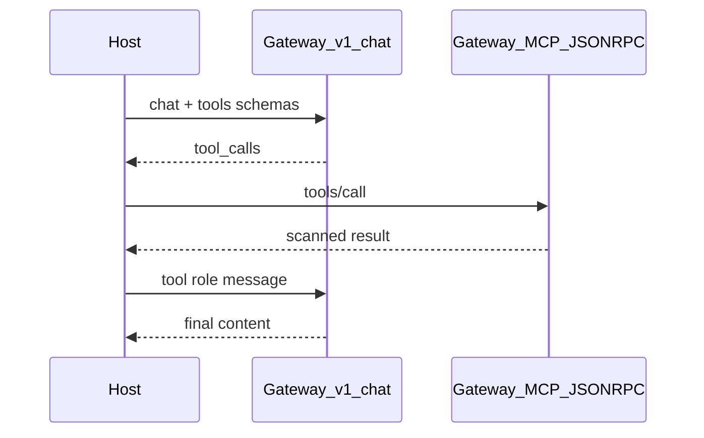

# MCP Integration Patterns — ZeroShield

This demo teaches **two different “MCP” concepts**. Confusing them is the usual
reason someone looks for a server/tool picker on the **MCP Context** tab and
doesn’t find one.

| Concept | What it is | Where you pick server/tool |
|---------|------------|----------------------------|
| **Context injection** (`mcp_context`) | Structured CRM/customer JSON on a **chat** request | Nowhere — there is no MCP server |
| **MCP Protocol tools** | Real `tools/list` / `tools/call` via the gateway | Console simulator, control API, or MCP Client SDK |

```text
OpenAI SDK  →  /v1/chat/completions  (+ optional extra_body.mcp_context)
MCP Client  →  /gateway/{org}/mcp/{server}  (JSON-RPC: initialize / tools/list / tools/call)
```

stdio and SSE transports run **inside** the per-org sandbox. Your host app talks
HTTP JSON-RPC to the gateway; the gateway never expects you to spawn upstream
MCP servers yourself in production.

---

## Pattern A — Context injection (`extra_body.mcp_context`)

**Purpose:** Fold structured agent/CRM context into the **chat** input scanner
(PII/secrets/policies) without invoking an MCP server.

```python
from openai import OpenAI

client = OpenAI(api_key="<ORG_GATEWAY_KEY>", base_url="http://gateway:8300/v1")
resp = client.chat.completions.create(
    model="auto",
    messages=[{"role": "user", "content": "Write a customer summary."}],
    extra_body={
        "mcp_context": {
            "customer_id": "C-10293",
            "plan": "Enterprise",
            "open_tickets": 2,
            "sentiment": "frustrated",
        }
    },
)
```

Gateway treats `mcp_context` identically to `agent_data` (see
`_extract_agent_data` in `gateway/ai_mesh_gateway/main.py`).

**Demo UI:** MCP tab → **Context injection** section → “Run with context”.

---

## Pattern B — Direct tool call (console / control API)

**Purpose:** Invoke a registered org MCP tool with firewall scan on args + result.

**Console UI (already exists):**

1. Open the main ZeroShield console → Firewall → **1.4 Context Assembly & MCP**.
2. Use **MCP Guardrail Simulator** (server dropdown + tool dropdown), or the
   Connector panel **Tool Execution** tab.
3. Dry-Run → `POST /api/policies/test/` (no execution).
4. Live → `POST /api/mcp-connector/tools/call/`.

**API shape:**

```http
POST /api/mcp-connector/tools/call/
Authorization: Bearer <control JWT>
Content-Type: application/json

{
  "server_slug": "everything-1",
  "name": "echo",
  "arguments": { "message": "hello" }
}
```

**Demo UI:** MCP tab → **Tool execution** section (proxies the same control API;
gateway key stays on the demo server).

---

## Pattern C — MCP Client SDK (gateway JSON-RPC)

**Purpose:** Industry-standard host + MCP Client + MCP Server loop, with
ZeroShield as the authenticated MCP endpoint.

| Piece | Value |
|-------|-------|
| URL | `{GATEWAY_HOST}/gateway/{org_slug}/mcp/{server_slug}` |
| Auth | `Authorization: Bearer {org_gateway_key}` |
| Protocol | JSON-RPC 2.0 Streamable HTTP (`initialize` → `tools/list` → `tools/call`) |

**Not** `base_url=…/v1` — that path is OpenAI-compatible chat only.

Sample script (httpx JSON-RPC; optional `mcp` package):

```bash
export ZEROSHIELD_API_KEY=...
export ZEROSHIELD_ORG_SLUG=zeroshield
export MCP_SERVER_SLUG=everything-1
export GATEWAY_HOST=http://127.0.0.1:8300   # no /v1
python examples/zeroshield-openai-demo/mcp_gateway_client.py
```

See [`mcp_gateway_client.py`](../mcp_gateway_client.py).

---

## Pattern D — Full agent loop

Gateway does **not** auto-map OpenAI `tools=` onto registered MCP servers today.
Your host owns the loop:

1. Call the LLM via OpenAI SDK (`/v1`) with tool schemas from Pattern C `tools/list`.
2. If the model returns `tool_calls`, execute via Pattern B or C.
3. Append the tool result and call the LLM again for the final answer.



---

## Quick answers

**Where do I select a specific MCP server or tool?**

- Main console Guardrail Simulator / Connector UI, **or**
- Demo MCP tab → Tool execution, **or**
- Path parameter `{server_slug}` + JSON-RPC `params.name` on the gateway MCP URL.

**Why doesn’t the MCP Context tab have a server picker?**

Because that tab is Pattern A (structured context on chat), not Pattern B/C
(tool execution).
