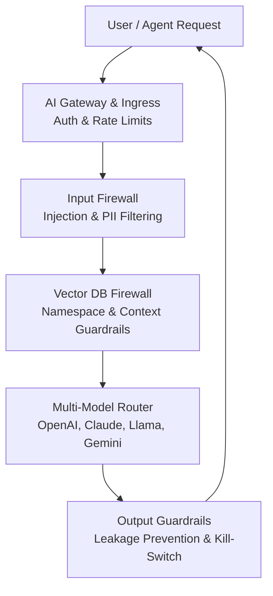

# 🛡️ _ZeroShield - AI Mesh Firewall & Multi-Model Governance_

### _The Unified Security Control Plane for Enterprise AI — Real-Time Redaction, Injection Defense, and Multi-Model Orchestration_

### Tech Stack

# 🛡️ _ZeroShield - AI Mesh Firewall & Multi-Model Governance_

### _The Unified Security Control Plane for Enterprise AI — Real-Time Redaction, Injection Defense, and Multi-Model Orchestration_

### Tech Stack

## 🚀 [Explore ZeroShield Solutions](https://zeroshield.ai)

## Table of Contents
* [About AI Mesh Firewall](#about-ai-mesh-firewall)
* [System Architecture](#system-architecture)
* [Core Capabilities](#core-capabilities)
* [Technical Performance Metrics](#technical-performance-metrics)
* [Advanced Platform Features](#advanced-platform-features)
* [Use Cases](#use-cases)
* [Implementation Roadmap](#implementation-roadmap)
* [Complete Product Video](#complete-product-video)
* [Support](#support)

---

## About AI Mesh Firewall

The **ZeroShield AI Mesh Firewall** is a centralized security control plane designed to govern every AI request and response in real-time. It acts as an invisible, zero-latency shield that sits in front of all corporate AI activity, including LLMs, RAG pipelines, AI Agents, and Vector Databases. ZeroShield ensures that Intellectual Property (IP), personally identifiable information (PII), and internal credentials never leak to external AI providers.

---

## System Architecture

ZeroShield follows a **Secure → Sanitize → Route** lifecycle:

1. **AI Gateway & Ingress**: Centralized enforcement of authentication and tenant isolation.
2. **Pipeline-Aware Firewall**: Explicit enforcement across Query, Retriever, and Generator stages.
3. **Multi-Model Routing**: Dynamic routing across OpenAI, Claude, Llama, and Gemini based on policy.

ZeroShield Module 1 follows a **Secure → Sanitize → Route** lifecycle:

1. **AI Gateway & Ingress**: Centralized enforcement of authentication and tenant isolation.
2. **Pipeline-Aware Firewall**: Explicit enforcement across Query, Retriever, and Generator stages.
3. **Multi-Model Routing**: Dynamic routing across OpenAI, Claude, Llama, and Gemini based on policy.

## High-Level System View
ZeroShield is a Unified AI Security Control Plane that sits in front of and around all AI activity. Acting as an AI Mesh Firewall and Multi-Model Governance engine, it provides real-time control over:
* LLMs
* RAG pipelines
* Agents
* Vector DBs
* AI APIs & Infrastructure

---

## 🎥 Platform Demo
[Click here to watch the ZeroShield dashboard Video]()

---

## Core Capabilities

### 1. Real-Time AI Traffic Firewall
*Prevents threats before they reach the AI model.*
* **Prompt Injection & Jailbreak Defense:** Automatically intercepts and blocks malicious user prompts designed to manipulate AI models (e.g., blocking "DAN" attacks).
* **Data Loss Prevention (DLP):** Scans all outgoing queries in real-time to redact or block sensitive information like credit card numbers, PII, and PHI before it leaves your network.
* **Dynamic Model Routing:** Intelligently routes queries based on sensitivity. For example, generic requests can be routed to OpenAI, while requests containing PII are automatically re-routed to a secure, local Llama model.

### 2. Comprehensive Policy & Rule Enforcement (MCP)
*Granular control over who can do what, and what the AI can access.*
* **Model Context Protocol (MCP) Guardrails:** Enforces strict "least-privilege" context. ZeroShield restricts what context is allowed per user or agent to prevent data leakage.
* **Inline Policy Decisions:** Utilizing Open Policy Agent (OPA), ZeroShield makes rapid decisions to allow, block, or rewrite data based on customizable policies.
* **Output Guardrails:** Inspects the AI's generated responses to prevent IP leakage and ensure no internal secrets or credentials are exposed.

### 3. Vector DB & Data Protection
* **Namespace Isolation:** Secure coverage for Chroma, Pinecone, and Milvus with collection-level access control.
* **Retrieval Safety:** Prevents vector poisoning attempts and sensitive document retrieval to stop cross-tenant data leakage.

### 4. Multi-Model Governance & Mesh Routing
* **Unified Routing:** Supports OpenAI, Claude, Llama (self-hosted), and Gemini.
* **Policy-Based Logic:** Dynamic routing based on data sensitivity, cost, token budgets, and model risk scores.
* **Model Isolation:** Models behave like isolated services in a mesh, each with independent credentials and rate limits.

### 5. Emergency Controls & Output Guardrails
* **Kill-Switch:** Immediate logical isolation per model with the ability to disable a model or auto-reroute to a fallback.
* **Output Inspection:** Final-stage scanning for PII leakage, IP exposure, and hallucination risks before a response reaches the user.

---

## Technical Performance Metrics

* **Secure Ingress:** Established FastAPI Gateway with Identity Awareness and Redis-based Token Bucket Rate Limiting.
* **High-Speed Validation:** Achieves JWT/API Key validation latency of **<5ms** via Redis cache.
* **Policy Propagation:** Security rules propagate from the Admin panel to the Gateway in **<1 second**.
* **Advanced Protection:** Successfully blocks "DAN" (Do Anything Now) jailbreak attempts and redacts credit card numbers in prompt streams.
* **Isolation Verification:** Blocks queries attempting to access data collections outside the user's authorized tenant.

---

## Advanced Platform Features (Performance & Scale)
*Built for enterprise architecture, ZeroShield delivers maximum security with zero compromise on speed.*

* **Lightning-Fast Identity Gateway:** Validates API keys and authentication tokens in **under 5 milliseconds**, ensuring your AI applications remain highly responsive while fully protected by intelligent rate limiting.
* **Global Policy Synchronization:** When your security team updates a rule, the policy compiles and propagates across your entire gateway network in **under 1 second**.
* **Workflow-Aware Input Filtering:** The firewall intelligently differentiates between standard chat requests and complex RAG queries, applying the exact right level of scanning based on the payload structure.
* **Cross-Tenant Database Isolation:** Secures the data retrieval stage by enforcing strict namespace isolation. ZeroShield actively intercepts database calls to block any query attempting to access a collection outside the user's authorized tenant.
* **Dynamic Cost-vs-Privacy Routing:** Automatically routes requests based on customizable policies. It handles AI provider failovers automatically to guarantee 100% uptime for your users.
* **Zero-Latency Emergency Kill Switch:** If a specific model is compromised (e.g., GPT-4), administrators can trigger an instant kill switch resulting in immediate isolation across all tenants, with a **0ms latency impact** on standard traffic.

---

## Use Cases

* **PII & Secret Redaction:** Automatically identify and mask Social Security Numbers (SSNs), API keys, and corporate secrets at the gateway layer before they reach external LLM providers.
* **Infrastructure Governance:** Secure AI-powered development tools (e.g., Cursor, GitHub Copilot) to ensure proprietary source code and internal database schemas are not leaked to public models.
* **Multi-Tenant Data Isolation:** Enforce strict boundaries in RAG (Retrieval-Augmented Generation) environments, preventing users from retrieving sensitive documents outside their authorized department or namespace.
* **Adversarial Defense:** Proactively block "jailbreak" attempts and prompt injection attacks designed to bypass standard AI safety guardrails.
* **Dynamic Cost & Privacy Control:** Automatically route sensitive data to local, secure models while sending generic tasks to cost-effective public APIs based on real-time policy rules.

---

## Implementation Roadmap

ZeroShield AI Mesh Firewall is deployed as a centralized security mesh that intercepts and sanitizes all AI-related traffic.

### 1. Gateway & Identity Integration
Establish the **AI Gateway** as a secure Policy Enforcement Point (PEP). This involves integrating identity-aware authentication and configuring Redis-based rate limiting to ensure sub-5ms validation latency for all incoming requests.

### 2. Security Engine Configuration
Configure the **Pipeline-Aware Firewall** by integrating security scanners (such as regex detectors and llm-guard). This stage focuses on defining regex patterns, keyword lists, and injection defense rules that scan prompts at the Ingress and Input stages.

### 3. Data Layer Isolation
Implement **Namespace Isolation** for your Vector Databases (Chroma, Pinecone, or Milvus). This ensures that retrieval calls are intercepted and validated against the user's tenant permissions, preventing unauthorized context from being fed into the LLM.

### 4. Mesh Routing & Output Guardrails
Deploy the **Multi-Model Router** to abstract providers like OpenAI and Claude. Finally, enable **Output Guardrails** and the **Emergency Kill-Switch** to provide a last line of defense against data leakage and model hallucinations, ensuring 0ms latency impact on standard operations.

---

## Complete Product Video

*(Insert Link to Product Video Here)*

---

## Support

* 📧 **Contact:** [vartul@zeroshield.ai](mailto:vartul@zeroshield.ai)
* 📧 **Support Queries:** [support@zeroshield.ai](mailto:support@zeroshield.ai)

---

> **Value Proposition:** The **ZeroShield AI Mesh Firewall** delivers **loss prevention** for LLM providers, agents, and RAG pipelines. By enforcing policy at the mesh layer, it turns ungoverned corporate AI usage into a controlled, auditable environment—enabling privacy-preserving AI productivity without data risk.

---

All rights reserved. This software and its documentation are the intellectual property of [ZeroShield](https://zeroshield.ai).

