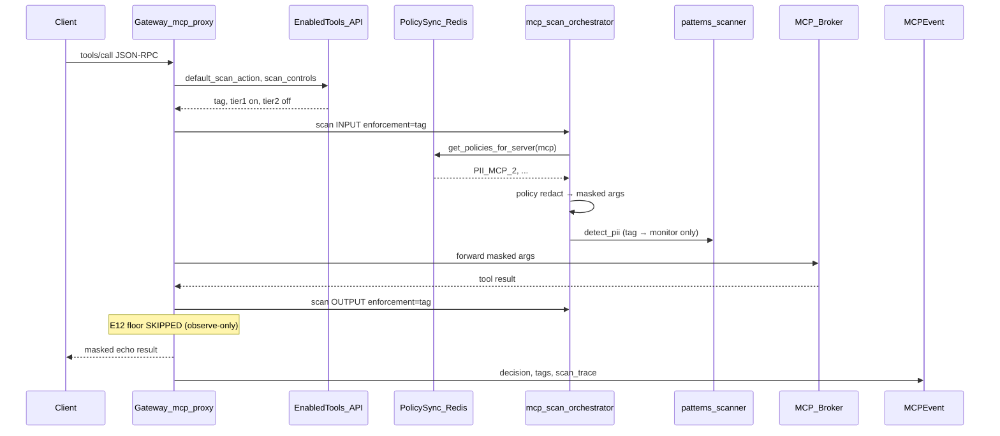
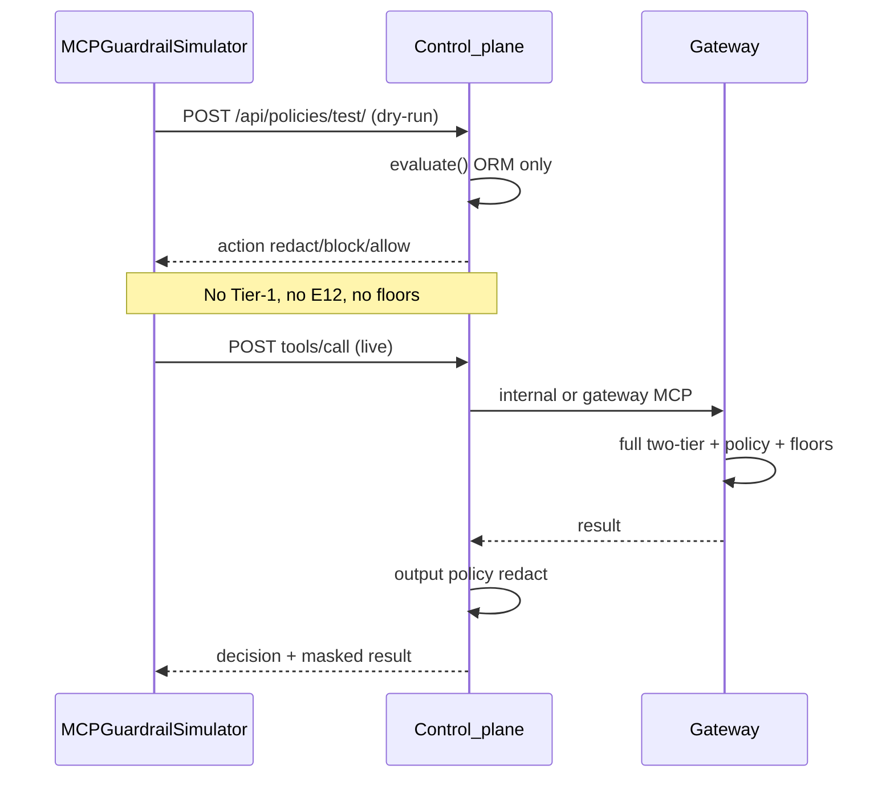

# MCP Scanning & Policy Enforcement Audit — Findings (2026-07-07)

Org: **zeroshield** | Server: **everything-1** (posture `tag`) | Evidence: `audit_results.json`, `state_snapshot.json`

## Executive summary

With **zero** `MCPScanControl` rows, enforcement still runs: built-in Tier-1 defaults, server posture (`default_scan_action`, mostly `tag`), Redis MCP policies, static detectors, and hardcoded floors (E12, credential block).

**Three bugs were confirmed and fixed:**

| ID | Bug | Impact | Fix |
|----|-----|--------|-----|
| **B1** | `tag` treated as enforceable for E12/credential/depth floors (`!= "monitor"` only) | Block/redact under UI “observe” defaults | `_is_observe_only_posture()` — `tag` ≡ `monitor` for static floors |
| **B2** | Policy redact mutation skipped (`entity_type == "policy_match"` never true) | Policy redact rules never applied to args/results | `_policy_driven_redact` uses `threat_type == "redact"` |
| **B3** | `_get_policy_sync()` imported `main`, gunicorn loads `ai_mesh_gateway.main` | **All gateway MCP policy eval silently disabled** | Resolve `POLICY_SYNC` from `sys.modules["ai_mesh_gateway.main"]` |

Live proof after fixes: SSN in `echo` args → gateway egress `Echo: SSN ***-**-9012` (policy `PII_MCP_2`), baseline allow unchanged.

---

## Q1 — No scan controls: what actually runs?

| Layer | Runs? | Evidence |
|-------|-------|----------|
| Scan control resolution | Yes — `DEFAULT_TIER1` enabled, `DEFAULT_TIER2` disabled | `scan_controls.py` L96–100; live `scan_control_rows: 0` |
| Tier-1 static gate | Yes | `scan_trace` shows `tier1` input+output on every call |
| Tier-2 Bedrock | No | `tier2_*` disabled in defaults + org scan rows |
| Policy engine (gateway) | Yes **after B3** | Redis bundle v510, 15 MCP policies for server |
| Hardcoded floors | Only when **not** observe-only | E12/credential gated on `_is_observe_only_posture` |
| Compliance detection tags | Always on match | Independent of `compliance_frameworks` toggle |
| UI `scan_controls_configured` | **Was misleading** | Fixed: `false` when `rows==0` |

---

## Q2 — Why blocked?

Under default `tag` **after B1**: static injection/encoded-exfil no longer blocks unless posture is `block` or explicit **policy block** rule matches.

Block reasons (unchanged paths):

- `credential_blocked_inbound` — credential floor when posture is `redact`/`block`
- `pii_blocked_outbound` / `RESOURCE_LIMIT` — depth/block-count/resource caps
- Policy block — `evaluate_mcp_policies` with `action=block` honored under `tag`, not `monitor`

Live: `injection_plain` → allow on gateway+control; dry-run allow (no matching policy rule).

---

## Q3 — Why redaction?

| Source | Under `tag` (post-fix) |
|--------|------------------------|
| Policy redact (gateway) | **Yes** — inbound args masked before forward (B2+B3) |
| Policy redact (control output) | Yes — `redact_structured` on tool result |
| E12 static floor | **No** — observe-only |
| Static `redact_all` in orchestrator | No — only when posture `redact` |
| Dry-run simulator | Policy-only redact hints (no static/floors) |

Live `ssn_in_args`: gateway `Echo: SSN ***-**-6789`, control `[REDACTED_SSN]`, dry-run `redact` / `PII_MCP_2`.

---

## Q4 — Compliance tagging with frameworks

`FirewallConfig.compliance_frameworks` = `['SOC2', 'ISO27001']` (live). **Detection tags** (`GDPR-PII`, `HIPAA-PHI`) still emitted from `get_compliance_tags()` on PII match; normalized via `to_catalog_codes()` at audit ingest. Frameworks toggle controls output-guard catalog floors, **not** MCP detection tag emission.

---

## Q5 — MCP policies (5 surfaces)

| Surface | Policy eval | Static scan | Floors |
|---------|-------------|-------------|--------|
| Gateway JSON-RPC | Redis bundle (fixed B3) | Tier-1 | E12/credential when not observe-only |
| Control tools/call | Django ORM | Via gateway forward | Output redact/block gate |
| Guardrail dry-run | Django ORM only | **No** | **No** |
| Guardrail live | Control → gateway | Yes | Yes |
| Chat → `internal_tools_call` | Same as gateway | Yes | Yes |

**Dry-run vs live divergence** is intentional: dry-run = policy rules only.

**AWS key dry-run block** (`PKG2_MCP_EMAIL_COMMS`) vs live allow: dry-run matches loose email-comms rule on flat prompt; live gateway policy path evaluates tool-call context (different rule activation) — document as policy authoring/targeting issue, not scan bypass.

---

## Q6 — Precedence chain

```
tool scan_action (if not inherit)
  → server default_scan_action (default "tag")
  → MCPScanControl tier action (if row exists)
  → DEFAULT_TIER1/TIER2 built-ins
```

Within tier-1 scan:

1. Policy eval (block honored under `tag`; redact applies when matched)
2. Static detectors (PII/secrets/IP/cred/injection)
3. Floors in `mcp_proxy` (E12, credential) — **skipped** for `tag`/`monitor`
4. Control output pass — policy redact on structured result

---

## Q7 — Source attribution (live SSN scenario)

| Observation | Primary source |
|-------------|----------------|
| Gateway masks SSN in echo | `policy_rule_PII_MCP_2` (inbound redact) |
| Compliance tags on event | `compliance_detection_tag_only` + static `ssn` finding |
| No E12 floor | `server_posture_tag` (observe-only floors) |
| Tier-2 absent | `tier2_skipped` |
| Dry-run redact | `policy_rule_PII_MCP_2` (ORM path) |

---

## Q8 — Sequence diagrams

### Gateway tenant path (`org_mcp_jsonrpc`)



### Control + simulator split



---

## Q9 — Fixes shipped

### P0 — `tag` / `monitor` semantic alignment
- `mcp_scan_orchestrator._is_observe_only_posture()`
- `mcp_proxy` floor gates use observe-only helper
- Tests: `test_mcp_tag_monitor_observe_only.py`, updated `test_e12_result_redaction.py`

### P1 — Policy parity
- Policy redact applies when matched (not only `enforcement=="redact"`)
- Policy mutation wired via `threat_type == "redact"`
- **B3**: `_get_policy_sync()` module resolution
- Control output: policy redact under `tag`; field RBAC still suppressed under `monitor`/`tag` observe-only
- `scan_controls_configured: bool(rows)` in control + gateway enabled-tools cache

### P2 — Operator clarity
- `scan_controls_configured: false` when no rows (API + gateway cache passthrough)

---

## Verification

- **Live harness**: 12 scenarios — `scripts/ralph/mcp_enforcement_audit_live.py` → `audit_results.json`
- **State snapshot**: `scripts/ralph/mcp_enforcement_state_snapshot.py` → `state_snapshot.json`
- **Targeted pytest**: 57 passed (tag/monitor, E12, policy sync resolution, orchestrator)
- **Full gateway suite**: 1939 passed; 167 failures pre-existing (unrelated chat/vector/hidden-failure tests)

---

## Key files changed

- `gateway/ai_mesh_gateway/mcp_scan_orchestrator.py`
- `gateway/ai_mesh_gateway/mcp_proxy.py`
- `control/ai_mesh_control/mcp_connector/scan_controls.py`
- `control/ai_mesh_control/mcp_connector/views.py`
- `gateway/ai_mesh_gateway/tests/test_mcp_tag_monitor_observe_only.py`
- `gateway/ai_mesh_gateway/tests/test_mcp_policy_sync_module_resolution.py`
- `control/ai_mesh_control/mcp_connector/tests/test_scan_controls.py`
